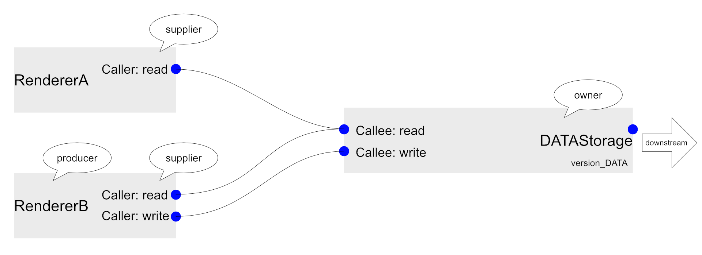

# MegaMol Developer Guide

This guide is intended to give MegaMol developers a useful insight into the internal structure of MegaMol.

<!-- TOC -->

## Contents

- [MegaMol Developer Guide](#megamol-developer-guide)
  - [Contents](#contents)
  - [Create new Plugin](#create-new-plugin)
    - [Add own plugin using the template](#add-own-plugin-using-the-template)
  - [Create GLSL Shader with utility classes](#create-glsl-shader-with-utility-classes)
  - [Bi-Directional Communication across Modules](#bi-directional-communication-across-modules)
    - [Definitions](#definitions)
    - [Recipe](#recipe)
      - [Interaction with the ```DATA``` from outside:](#interaction-with-the-data-from-outside)
      - [*owner* Module:](#owner-module)
  - [Synchronized Selection across Modules](#synchronized-selection-across-modules)
    - [FlagStorage](#flagstorage)
    - [FlagStorage_GL](#flagstorage_gl)
  - [1D Transfer Function](#1d-transfer-function)
    - [Usage](#usage)
  - [Graph Manipulation](#graph-manipulation)
    - [Graph Manipulation Queues](#graph-manipulation-queues)
  - [Build System](#build-system)
    - [External dependencies](#external-dependencies)
      - [Using external dependencies](#using-external-dependencies)
      - [Adding new external dependencies](#adding-new-external-dependencies)
        - [Header-only libraries](#header-only-libraries)
        - [Built libraries](#built-libraries)
  - [GUI](#gui)
    - [Parameter Widgets](#parameter-widgets)
    - [Window/PopUp/Notification for Frontend Service](#windowpopupnotification-for-frontend-service)

<!-- TODO
- Add section describing all available LUA commands
- Add section describing remote console usage
-->

<!-- /TOC -->


<!-- ###################################################################### -->
-----
## Create new Plugin

### Add own plugin using the template

1. Copy the template folder `plugins/doc_template`.
2. Rename the copied folder to the intended plugin name (style guide: only lower case letters, numbers, and underscore).
3. Rename the `src/MegaMolPlugin.cpp` to your plugin name (file name can be arbitrary). Within the file change the following:
    1. Use a unique namespace `megamol::pluginname`. (style guide: same as folder name)
    2. Change the plugin name and description in the parameters of the constructor.
    3. The class name can be changed to any name, but it must be set accordingly in the `REGISTERPLUGIN()` macro.
4. Open the `CMakeLists.txt` file and to the following changes:
    1. Set the name of the target at the beginning of `megamol_plugin()`. (style guide: same as folder name)
    2. List the targets of other plugin dependencies after `DEPENDS_PLUGINS`[*].
    3. List the targets of external dependencies after `DEPENDS_EXTERNALS`[*]. Do not define new externals within the plugin CMake! Use the global externals file `externals/CMakeExternals.cmake`.
    4. If additional custom CMake settings are required they can be put within `if (megamolplugin_PLUGIN_ENABLED)`. The variable defined at the beginning of `megamol_plugin()` is a regular CMake target that can be used.
5. Add libraries/dependencies to `CMakeLists.txt` (optional, see [external dependencies](#external-dependencies)).
6. Implement the content of your plugin.
    1. The private implementation should be in the `<pluginname>/src` directory. Source files are added automatically within CMake.
    2. If the plugin has a public interface, add the headers in the `<pluginname>/include` directory (set visibility of dependencies accordingly, see [*]).
    3. If the plugin uses shaders, add them into the `<pluginname>/shaders/<pluginname>` directory (see shader guide for more details).
    4. If the plugin uses resources, add them to `<pluginname>/resources`.
7. Write a `README.md` for your plugin (mandatory).

[*] You can prefix the dependency targets with the keywords `PUBLIC`, `PRIVATE`, or `INTERFACE` the same way `target_link_libraries()` works. Defaults to `PRIVATE` if nothing is set.

<!-- ###################################################################### -->
-----

## Create GLSL Shader with utility classes

### Shader files

Shaders are stored as regular text files containing GLSL code, but we additionally are using a shader factory that supports and include directives similar to C/C++.
This allows a better organization of large shaders and reusing of common shader snippets.

Shader files must be located either in the `core/shaders/core` directory or in the shader directory of the corresponding plugin `<pluginname>/shaders/<pluginname>`.
Please note the additional subfolder within each `shaders` directory!
It is required for our include system and to avoid collision when installing all shaders to a single shader-installation-directory.

Full shaders must use the filename pattern `<path>/<name>.<type>.glsl`.
We use the filename to determine the type of a shader.
The following types are allowed:

| Type | Shader Stage            |
| ---- | ----------------------- |
| vert | Vertex                  |
| tesc | Tessellation Control    |
| tese | Tessellation Evaluation |
| geom | Geometry                |
| frag | Fragment                |
| comp | Compute                 |

Shader snippets meant for inclusion within other shaders must not use a type in their extension, but they should still have a `.glsl` extension.

Within shader files, includes can be defined in standard C style: `#include "common.h"`.
Thereby, `core/shaders` and all `<pluginname>/shaders` directories are added as include search paths.
Therefore, shaders can be included with a path relative to these directories. (This is also the reason why we need the additional subdirectories as mentioned above).
Some examples:
```glsl
#include "core/phong.glsl"
#include "pluginname/foo/bar.glsl"
```

In addition, inclusion relative to the current shader file is supported, but only for snippets within the same shader directory.

### C++ Code

Required headers:
- `mmcore/CoreInstance.h`
- `mmcore/utility/ShaderFactory.h`

Before creating a shader program with this wrapper, `compiler_options` need to be retrieved from the `CoreInstance`.
This `compiler_options` instance contains default shader paths and default options.
Additional include paths and definitions can be added before program creation.
The constructor of the wrapper requires paths to source files of all shader stages in the form: `<path>/<name>.<type>.glsl`.

Here is a full example:
```cpp
const auto shader_options = msf::ShaderFactoryOptionsOpenGL(this->GetCoreInstance()->GetShaderPaths());
auto program = core::utility::make_glowl_shader("name", shader_options, "pluginname/shader.comp.glsl");
```

The `make_glowl_shader()` helper function returns a glowl `GLSLProgram` wrapped in a unique pointer.
A variant `make_shared_glowl_shader()` exists to use a shared pointer instead.
Both functions are variadic, so any number of shaders can be combined into a single program (as long as the shader combination makes sense from the OpenGL perspective).

## Bi-Directional Communication across Modules

Bi-Directional Communication, while in principle enabled on any Call in MegaMol, has severe implications when data can be changed at an arbitrary end and multiple Modules work on the data that is passed around. The current state of knowledge is described here and should be used for any and all Calls moving forward.
You can have a look for an example in the ```FlagStorage_GL``` together with the ```FlagCall_GL``` and ```GlyphRenderer``` (among others).

We refer to the data passed around simply as ```DATA```, you can think of this as a struct containing everything changed by the corresponding Call.
To properly track changes across several Modules, you need to follow the recipe.

### Definitions
- There is one Module holding and owning the ```DATA```. It is also responsible for resizing it (e.g. in occasion of an incoming update) and disposing it (on destruction). This is the *owner*. It can have a notion of what it is holding and manipulate the ```DATA```, but this is not necessary. It can also just be a container that is talked to by other modules.
- There can be several Modules that read the ```DATA```. These are *consumer*s.
- There can be several Modules that write/update the ```DATA```. These are *supplier*s.
- Note that Modules that are *supplier*s automatically have *consumer* status as well, otherwise updates are lost.
### Recipe
Split up the data flow for each direction, one call for reading only, one call for writing only.
Keep in mind that the caller by definition is "left" in the module graph and the callee is "right". The callee is the end of a callback, but for this pattern this has nothing to do with the direction the data flows in, which results in the rules defined below.



- set up a ```uint32_t version_DATA``` in the *owner*
- Create a ```DATACallRead``` either instancing the ```core::GenericVersionedCall``` template, or making sure that the call can distinguish between the ```DATA``` version that was last **set** into the Call and that which was last **got** out of the Call
- Create a ```DATACallWrite``` along the same lines
- create a ```CalleeSlot``` each for ```DATACallRead``` and ```DATACallWrite``` for the *owner*
- create a ```CallerSlot``` for ```DATACallRead``` for *consumer*s
- create a ```CallerSlot``` for ```DATACallWrite``` for *supplier*s

#### Interaction with the ```DATA``` from outside:
This must always follow the same order to avoid inconsistencies.

The following 'block' must be executed without the control flow leaving the current module, i.e. the only calls that are executed are the ones connected to the owner module that are part of the bidirectional flow.
- if *consumer*: execute the reading:
  - issue the Call ```(*call)(DATACallRead::CallGetData)``` or your specialized version
  - check if something new is available: ```call::hasUpdate()```
  - overwrite/replace what notion you had of ```DATA``` if there is an incoming update
  - take note of the ```call::version()``` *V* of the incoming update.
- if (also) *supplier*:
  - if you need to modify the ```DATA``` (parameters, other incoming data, or user input cause this, for example)
    - write the update
    - increase *V*
  - **ALWAYS** set the ```DATA``` in the ```DATACallWrite```, supplying *V*
  - **ALWAYS** issue the Call: ```(*call)(DATACallWrite::CallGetData)``` or your specialized version

Since this should take place in the same callback, *V* **must** not be kept around beyond that, it must be re-fetched in the next cycle anyway: any calls that go downstream before or after the above block could potentially alter the ```DATA``` in the *owner*.

#### *owner* Module:

Usage: ```DATACallRead```
- In the ```GetData``` callback, make sure you can **supply unchanged data very cheaply**.
  - If parameters or incoming data (downstream) have changed, modify your ```DATA``` accordingly, **increasing** ```version_DATA```.
  - **ALWAYS** set the data in the call, supplying the version.
  
Usage: ```DataCallWrite```
- In the ```GetData``` callback
  - If the incoming set data is newer than what you last got: ```call::hasUpdate()```
    - Fetch the data
    - fast-forward version to the available one ```version_DATA = call::version()```


<!-- ###################################################################### -->
-----
## Synchronized Selection across Modules

You can and should use one of the ```FlagStorage``` variants to handle selection. These modules provide an array of ```uint32_t``` that is implicitly index-synchronized (think row, record, item) to the data available to a renderer. Indices are accumulated across primitives and primitive groups, so if you employ these, you need to take care yourself that you always handle Sum_Items flags and apply proper **offsets** across, e.g., particle lists.

### FlagStorage

The flags here are stored uniquely, resembling a unique pointer or Rust-like memory handover. A unique pointer still cannot be used with the current Call mechanisms (specifically, the leftCall = rightCall paradigm). So, unlike any other modules, asking for Flags via ```CallMapFlags``` will **remove** the flags from the FlagStorage and place them in the ```FlagCall```. In the same way, if you ```GetFlags```, you will own them and **need to give them back** when finished operating on them (```SetFlags```, then ```CallUnmapFlags```). Any other way of using them will **crash** other modules that operate on the same flags (meaning the FlagStorage tries to tell you that you are using them inappropriately).

***TODO: this still requires the new Bi-Directional Communication paradigm.***

### FlagStorage_GL

This FlagStorage variant relies on a shader storage buffer and does not move any data around. It is implicitly synchronized by single-threaded execution in OpenGL. You still need to synchronize with the host if you want to download the data though. It still keeps track of proper versions so you can detect and act on changes, for example when synchronizing a FlagStorage and a FlagStorage_GL.


<!-- ###################################################################### -->
-----
## 1D Transfer Function

***... TODO ...***

<!--

The whole functionality of a 1D transfer function is provided via the module `TransferFunction` which holds the actual `TransferFunctionParam` parameter.

If you want to use a transfer function in you renderer module you have to create a caller slot, which is compatible to the call `CallGetTransferFunction`:
```C++
    this->tfSlot.SetCompatibleCall<core::view::CallGetTransferFunctionDescription>();
    this->MakeSlotAvailable(&this->tfSlot);
```

The description of the transfer function is encoded in a string in JSON format, see header `TransferFunctionParam.h`.

-->
### Usage

***... TODO ...***

<!--
See the header file of the call `CallGetTransferFunction` for a more detailed interface description of the available functions.
The renderer modules `SimpleSphereRenderer` or `ScatterplotMatrixRenderer2D`can be looked at for a example implementation of the transfer function.

-->

<!-- ###################################################################### -->
-----
## Graph Manipulation

There are appropriate methods in the ```megamol::core::CoreInstance``` to traverse, search, and manipulate the graph.
**Locking the graph** is only required for code that runs **concurrently**.
At this point, MegaMol graph execution happens sequentially, so any Module code can only run concurrently when you split off a thread yourself.
Services (children of ```megamol::core::AbstractService```), on the other hand, always run concurrently, so they need to lock the graph.
All graph manipulation needs to be requested and is buffered, as described in the following section.

### Graph Manipulation Queues

Graph manipulation requests are queued and executed between two frames in the main thread.
There are different queues for different types of requests:

| Name                         | Description                                                | Entry Type                               |
| ---------------------------- | ---------------------------------------------------------- | ---------------------------------------- |
| pendingViewInstRequests      | Views to be instantiated                                   | ViewInstanceRequest                      |
| pendingJobInstRequests       | Jobs to be instantiated                                    | JobInstanceRequest                       |
| pendingCallInstRequests      | Requests to instantiate calls (from, to)                   | CallInstanceRequest                      |
| pendingChainCallInstRequests | Requests to instantiate chain calls (from chain start, to) | CallInstanceRequest                      |
| pendingModuleInstRequests    | Modules to be instantiated                                 | ModuleInstanceRequest                    |
| pendingCallDelRequests       | Calls to be deleted                                        | ASCII string (from), ASCII string (to)   |
| pendingModuleDelRequests     | Modules to be deleted                                      | ASCII string (id)                        |
| pendingParamSetRequests      | Requests to set parameters                                 | Pair of ASCII strings (parameter, value) |
| pendingGroupParamSetRequests | Requests to create parameter group                         | Pair of ASCII string (id) and ParamGroup |

For each of this queues, there is a list with indices into the respective queue pointing to the last queued event before a flush.
It causes the graph updater to stop at the indicated event and delay further graph updates to the next frame.

| Name                              |
| --------------------------------- |
| viewInstRequestsFlushIndices      |
| jobInstRequestsFlushIndices       |
| callInstRequestsFlushIndices      |
| chainCallInstRequestsFlushIndices |
| moduleInstRequestsFlushIndices    |
| callDelRequestsFlushIndices       |
| moduleDelRequestsFlushIndices     |
| paramSetRequestsFlushIndices      |
| groupParamSetRequestsFlushIndices |


<!-- ###################################################################### -->
-----
## Module Behavior

A module should always try to do its work, even with missing resources.
Examples:
- All views should clear themselves to their internal background color, even if no other module is connected.

TODO: Module behavior in case of missing resources or call connections.

<!-- ###################################################################### -->
-----
## Build System

For building MegaMol, CMake is used. For developers, two aspects are of importance: [adding new plugins](#create-new-plugin), and [adding and using external dependencies](#external-dependencies).

### External dependencies

**All externals must be build STATIC now!**
The installation of shared libraries was removed, therefore the megamol binary will not find the so/dll files of externals if they are used as SHARED library.

The system for including external dependencies in MegaMol is a process split into two phases, corresponding to CMake configuration and the build process.

In the CMake configuration run, in which the external is first requested, it is downloaded from a git repository by providing a URL and tag (or commit hash), and configured in a separate process and folder. 
This is done to prevent global CMake options from clashing. 
In later CMake configuration runs, this configuration of the external dependencies is not re-run, except when manually requested by setting the appropriate CMake cache variable ```EXTERNAL_<NAME>_NEW_VERSION``` to ```TRUE```, or when the URL, tag or build type change.

When building MegaMol, all external dependencies are only built if they have not been built before. 
Afterwards, only by setting ```EXTERNAL_<NAME>_NEW_VERSION``` to ```TRUE``` can the build process be triggered again. 
This ensures that they are not rebuilt unnecessarily, but built when their version change.

#### Using external dependencies

External dependencies are split into two categories: header-only libraries and libraries that have to be built into a static (```.a```/```.lib```) library. 
Both kinds are defined in the ```CMakeExternals.cmake``` file in the MegaMol main directory and can be requested in the plugins using the command ```require_external(<NAME>)```. 
Generally, this command makes available the target ```<NAME>```, which provides all necessary information on where to find the library and include files.

#### Adding new external dependencies

The setup for header-only and built libraries need different parameters and commands.

##### Header-only libraries

For setting up a header-only library, the following command is used:

```
add_external_headeronly_project(<NAME>
   GIT_REPOSITORY <GIT_REPOSITORY>
  [GIT_TAG <GIT_TAG>]
  [INCLUDE_DIR <INCLUDE_DIR>]
  [DEPENDS <DEPENDS>...])
```

| Parameter              | Description                                                                                                               |
| ---------------------- | ------------------------------------------------------------------------------------------------------------------------- |
| ```<NAME>```           | Target name, usually the official name of the library or its abbreviation.                                                |
| ```<GIT_REPOSITORY>``` | URL of the git repository.                                                                                                |
| ```<GIT_TAG>```        | Tag or commit hash for getting a specific version, ensuring compatibility. Default behavior is to get the latest version. |
| ```<INCLUDE_DIR>```    | Relative directory where the include files can be found, usually ```include```. Defaults to the main source directory.    |
| ```<DEPENDS>```        | Targets this library depends on, if any.                                                                                  |

In the following example, the library Delaunator is downloaded from ```https://github.com/delfrrr/delaunator-cpp.git``` in its version ```v0.4.0```. 
The header files can be found in the folder ```include```.

```
add_external_headeronly_project(Delaunator
  GIT_REPOSITORY https://github.com/delfrrr/delaunator-cpp.git
  GIT_TAG "v0.4.0"
  INCLUDE_DIR "include")
```

For more examples on how to include header-only libraries, see the ```CMakeExternals.cmake``` file in the MegaMol main directory.

Additionally, information about the header-only libraries can be queried with the command ```external_get_property(<NAME> <VARIABLE>)```, where variable has to be one of the provided variables in the following table, and at the same time is used as local variable name for storing the queried results.

| Variable       | Description                                           |
| -------------- | ----------------------------------------------------- |
| GIT_REPOSITORY | The URL of the git repository.                        |
| GIT_TAG        | The git tag or commit hash of the downloaded library. |
| SOURCE_DIR     | Source directory, where the downloaded files reside.  |

##### Built libraries

Libraries that are built into static libraries, follow a process executing two different commands. 
The first command is responsible for setting up the project, while the second command creates the interface targets.

Similarly to the header-only libraries, the setup uses a command specifying the source and type of the library, additionally providing information for the configuration and build processes:

```
add_external_project(<NAME> STATIC
   GIT_REPOSITORY <GIT_REPOSITORY>
  [GIT_TAG <GIT_TAG>]
  [PATCH_COMMAND <PATCH_COMMAND>...]
  [CMAKE_ARGS <CMAKE_ARGUMENTS>...]
  BUILD_BYPRODUCTS <OUTPUT_LIBRARIES>...
  [COMMANDS <INSTALL_COMMANDS>...]
  [DEBUG_SUFFIX <DEBUG_SUFFIX>]
  [DEPENDS <DEPENDS>...])
```

| Parameter                     | Description |
| ----------------------------- | ----------- |
| ```<NAME>```                  | Project name, usually the official name of the library or its abbreviation. |
| ```STATIC```                  | Indicate to build a static (```.a```/```.lib```) library. Static libraries are always built according to user selection. |
| ```<GIT_REPOSITORY>```        | URL of the git repository. |
| ```<GIT_TAG>```               | Tag or commit hash for getting a specific version, ensuring compatibility. Default behavior is to get the latest version. |
| ```<PATCH_COMMAND>```         | Command that is run before the configuration step and is mostly used to apply patches or providing a modified ```CMakeLists.txt``` file. |
| ```<CMAKE_ARGS>```            | Arguments that are passed to CMake for the configuration of the external library. |
| ```<BUILD_BYPRODUCTS>```      | Specifies the output libraries, which are automatically installed if it is a dynamic library. This must include the import library on Windows systems. |
| ```<COMMANDS>```              | Commands that are executed after the build process finished, allowing for custom install commands. |
| ```<DEBUG_SUFFIX>```          | Specify a suffix for the debug version of the library. The position of this suffix has to be specified by providing ```<SUFFIX>``` in the library name. |
| ```<DEPENDS>```               | Targets this library depends on, if any. |

The second command creates the actual interface targets. Note that for some libraries, multiple targets have to be created.

```
add_external_library(<NAME> [PROJECT <PROJECT>]
   LIBRARY <LIBRARY>
  [IMPORT_LIBRARY <IMPORT_LIBRARY>]
  [INTERFACE_LIBRARIES <INTERFACE_LIBRARIES>...]
  [DEBUG_SUFFIX <DEBUG_SUFFIX>])
```

| Parameter                     | Description |
| ----------------------------- | ----------- |
| ```<NAME>```                  | Target name, for the main target this is usually the official name of the library or its abbreviation. |
| ```<PROJECT>```               | If the target name does not match the name provided in the ```add_external_project``` command, the project has to be set accordingly. |
| ```<LIBRARY>```               | The created library file, in case of a shared library a ```.so``` or ```.dll``` file, or ```.a``` or ```.lib``` for a static library. |
| ```<INTERFACE_LIBRARIES>```   | Additional libraries the external library depends on. |
| ```<DEBUG_SUFFIX>```          | Specify a suffix for the debug version of the library. The position of this suffix has to be specified by providing ```<SUFFIX>``` in the library name and has to match the debug suffix provided to the ```add_external_project``` command. |

An example for a static library is as follows, where the ```tracking``` library ```v2.0``` is defined as a static library and downloaded from the VISUS github repository at ```https://github.com/UniStuttgart-VISUS/mm-tracking```. 
It builds two libraries, ```tracking``` and ```NatNetLib```, and uses the CMake flag ```-DCREATE_TRACKING_TEST_PROGRAM=OFF``` to prevent the building of a test program. 
Both libraries are created providing the paths to the respective import libraries. 
Note that only the ```NatNetLib``` has to specify the project as its name does not match the external library.

```
    set(TRACKING_LIB "lib/tracking.lib")
    set(TRACKING_NATNET_LIB "lib/NatNetLib.lib")

    add_external_project(tracking STATIC
      GIT_REPOSITORY https://github.com/UniStuttgart-VISUS/mm-tracking.git
      GIT_TAG "v2.0"
      BUILD_BYPRODUCTS
        "<INSTALL_DIR>/${TRACKING_LIB}"
        "<INSTALL_DIR>/${TRACKING_NATNET_LIB}"
      CMAKE_ARGS
        -DCREATE_TRACKING_TEST_PROGRAM=OFF)

    add_external_library(tracking
      LIBRARY ${TRACKING_LIB})

    add_external_library(natnet
      PROJECT tracking
      LIBRARY ${TRACKING_NATNET_LIB})
```

Further examples on how to include static libraries can be found in the ```CMakeExternals.cmake``` file in the MegaMol main directory.

Additionally, information about the libraries can be queried with the command ```external_get_property(<NAME> <VARIABLE>)```, where variable has to be one of the provided variables in the following table, and at the same time is used as local variable name for storing the queried results.

| Variable       | Description                                                                                                                                                                 |
| -------------- | --------------------------------------------------------------------------------------------------------------------------------------------------------------------------- |
| GIT_REPOSITORY | The URL of the git repository.                                                                                                                                              |
| GIT_TAG        | The git tag or commit hash of the downloaded library.                                                                                                                       |
| SOURCE_DIR     | Source directory, where the downloaded files reside.                                                                                                                        |
| BINARY_DIR     | Directory of the CMake configuration files.                                                                                                                                 |
| INSTALL_DIR    | Target directory for the local installation. Note that for multi-configuration systems, the built static libraries are in a subdirectory corresponding to their build type. |
| SHARED         | Indicates that the library was built as a dynamic library if ```TRUE```, or a static library otherwise.                                                                     |
| BUILD_TYPE     | Build type of the output library on single-configuration systems.                                                                                                           |


<!-- ###################################################################### -->
-----
## GUI

### Parameter Widgets

See [developer information for GUI Service](../../frontend/services/gui#new-parameter-widgets).

### Window/PopUp/Notification for other Frontend Services

See [developer information for GUI Service](../../frontend/services/gui#gui-windowpopupnotification-for-frontend-service).
