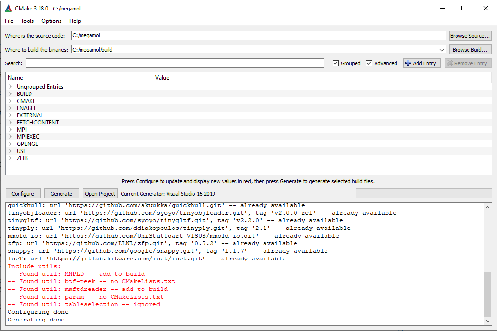
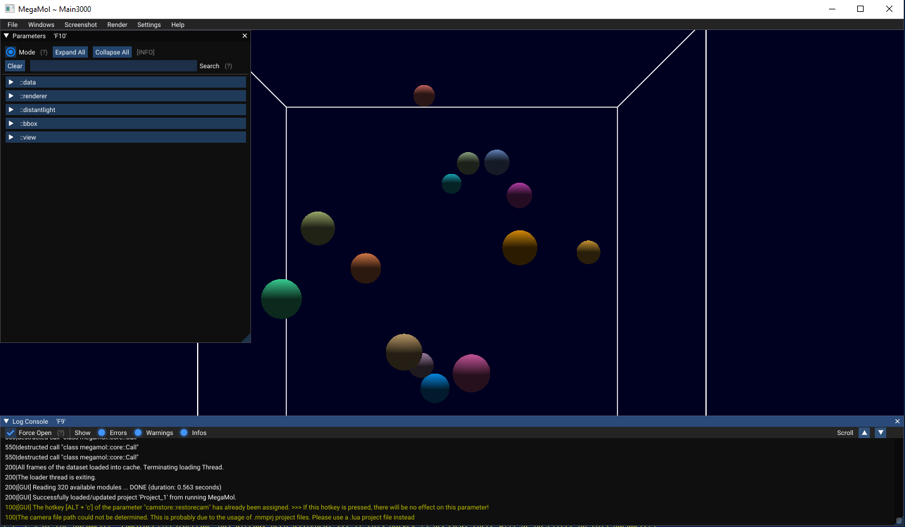
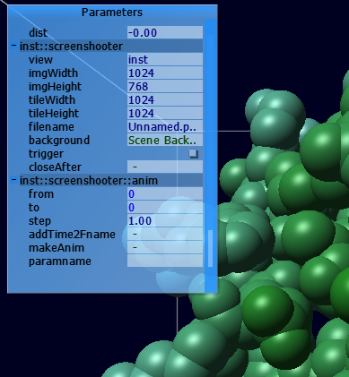
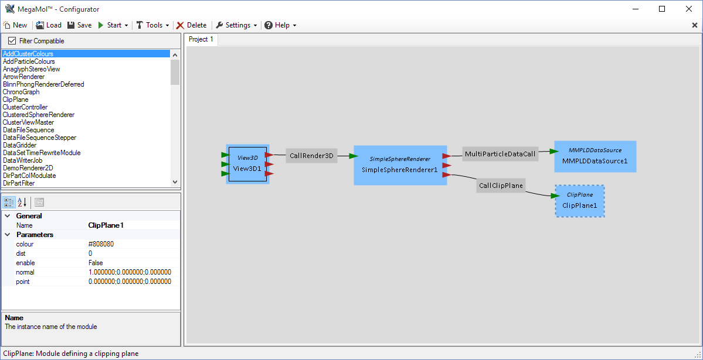
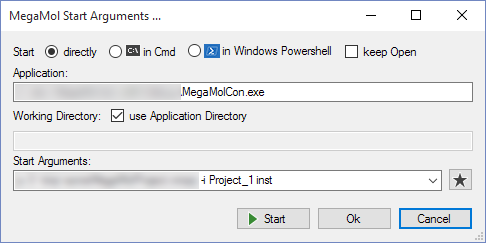

# MegaMol Manual

<!-- TOC -->

## Contents

- [Contents](#contents)
    - [Overview](#overview)
    - [Installation and Setup](#installation-and-setup)
    - [Viewing Data Sets](#viewing-data-sets)
    - [Jobs: Converting Data](#jobs)
    - [Advanced Usage](#advanced-usage)

<!-- /TOC -->

<a name="overview"></a>

## Overview

MegaMol is a visualization middleware used to visualize point-based molecular datasets.
The MegaMol project was started in the Collaborative Research Center 716, subproject D.3, at the Visualization Research Center (VISUS), University of Stuttgart, Germany.
Today, it is governed by a number of teams at the TU Dresden and the University of Stuttgart.

The goal of the project is to provide a software base for visualization research and to provide a stable environment to deploy newest visualization prototypes to application domain researchers. MegaMol is not a visualization tool. MegaMol is a platform for visualization research.
Visit the project [website](https://github.com/UniStuttgart-VISUS/megamol.git "Megamol homepage") for downloads and more information.

### License

MegaMol is freely and publicly available as open source following the therms of the BSD License.
Copyright (c) 2015, MegaMol Team TU Dresden, Germany Visualization Research Center, University of Stuttgart (VISUS), Germany
Alle Rechte vorbehalten.
All rights reserved.
Redistribution and use in source and binary forms, with or without modification, are permitted
provided that the following conditions are met:
- Redistributions of source code must retain the above copyright notice, this list of conditions and the following disclaimer.
- Redistributions in binary form must reproduce the above copyright notice, this list of conditions and the following disclaimer in the documentation and/or other materials provided with the distribution.
- Neither the name of the MegaMol Team, TU Dresden, University of Stuttgart, nor the names of its contributors may be used to endorse or promote products derived from this software without specific prior written permission.

THIS SOFTWARE IS PROVIDED BY THE MEGAMOL TEAM "AS IS" AND ANY EXPRESS OR IMPLIED WARRANTIES, INCLUDING, BUT NOT LIMITED TO, THE IMPLIED WARRANTIES OF MERCHANTABILITY AND FITNESS FOR A PARTICULAR PURPOSE ARE DISCLAIMED. IN NO EVENT SHALL THE MEGAMOL TEAM BE LIABLE FOR ANY DIRECT, INDIRECT, INCIDENTAL, SPECIAL, EXEMPLARY, OR CONSEQUENTIAL DAMAGES (INCLUDING, BUT NOT LIMITED TO, PROCUREMENT OF SUBSTITUTE GOODS OR SERVICES; LOSS OF USE, DATA, OR PROFITS; OR BUSINESS INTERRUPTION) HOWEVER CAUSED AND ON ANY THEORY OF LIABILITY, WHETHER IN CONTRACT, STRICT LIABILITY, OR TORT INCLUDING NEGLIGENCE OR OTHERWISE) ARISING IN ANY WAY OUT OF THE USE OF THIS SOFTWARE, EVEN IF ADVISED OF THE POSSIBILITY OF SUCH DAMAGE.

<a name="installation-and-setup"></a>

## Installation and Setup

This chapter discusses installation and setup of MegaMol , either from the pre-built binary packages or the source code.
The latter is, however, meant for experienced users. MegaMol targets Microsoft Windows (Windows 7 or newer, x86 and x64) and Linux (x64) as supported environments.
Currently, Ubuntu is used as Linux distribution for development.
Further platforms are not considered during the development. While MegaMol might work on further platforms, the development team will currently not grant any support for problems with these environments.

### Building from Source

#### Windows

For Windows, you have to install (CMake)[https://cmake.org/], and load the `CMakeLists.txt` present in the root directory of the repository. 
Next, click `Configure` a few times (until all red entries disappear).
Then click `Generate` to generate the build files.

<center>
<a name="cmake_windows"></a>

<p style="width: 768px;">
Screenshot of `cmake-gui` after generating build files.
</p>
</center>

<b>Note</b>: the *OSPRay plugin* is currently disabled by default, since you need to install its dependencies manually and locate them manually as well. Ideally, you just download [OSPRay](https://www.ospray.org/downloads.html) and adjust the `CMAKE_PREFIX_PATH`. However, if you want to compile OSPRay yourself, you need to install [ISPC](https://ispc.github.io/), [TBB](https://www.threadingbuildingblocks.org/), and [Embree](https://embree.github.io/) first (binary versions are okay).

#### Linux

Tested with:

    $ cat /proc/version
    Linux version 4.4.0-93-generic (buildd@lgw01-03) (gcc version 5.4.0 20160609 (Ubuntu 5.4.0-6ubuntu1~16.04.4) ) #116-Ubuntu SMP Fri Aug 11 21:17:51 UTC 2017

As prerequisites, following packages from the repository are required:

    $ sudo apt install cmake-curses-gui git libgl1-mesa-dev libncurses5-dev \
                       uuid-dev libexpat-dev libunwind-dev libxrandr-dev \
                       libxinerama-dev libxcursor-dev libxi-dev libglu1-mesa-dev


First, download the software package from GitHub:

    $ git clone https://github.com/UniStuttgart-VISUS/megamol.git

Create a build folder and switch to it:

    $ mkdir build; cd build

Start the ncurses gui for cmake:

    $ ccmake ../

Hit `c` a couple of times until the screen does not change, then hit `g` to generate build files.
On the console prompt, start `make`:

    $ make

### Configuration

After successfully installing or compiling MegaMol you should have all executable files inside your bin folder. Some setup still needs to be done.
Create a file `megamolconfig.lua` in this bin directory, with the following content (it may already exist). You will need to adjust the paths accordingly:

```lua
    print('Hi, I am the megamolconfig.lua!')

    mmSetAppDir(".")

    mmSetLogFile("")
    mmSetLogLevel(0)
    mmSetEchoLevel('*')

    mmAddShaderDir("U:/home/user/src/megamol-dev/share/shaders")
    mmAddResourceDir("U:/home/user/src/megamol-dev/share/resources")

    mmPluginLoaderInfo("U:/home/user/src/megamol-dev/bin", "*.mmplg", "include")

    mmSetConfigValue("*-window", "w720h720")
    mmSetConfigValue("consolegui", "on")

    mmSetConfigValue("LRHostEnable", "true")

    return "Done with megamolconfig.lua. Bye!"
```

The following paragraphs explain the essential steps of preparing a script in more detail.

#### General Settings

Locate line 3 containing the tag `mmSetAppDir`. Both relative and absolute path should work here fine, it is recommended to change the path in this line to the global path to the MegaMol application bin directory, e.g.:

```lua
    mmSetAppDir("U:/home/user/src/megamol-dev/bin")
```
#### Logging

Line 6-8 configures the logging mechanism of MegaMol . Adjusting the value of *EchoLevel* changes the amount of log information printed on the console. Specifying a log file and the level informs MegaMol to write a log file and print the messages of the requested level into that file. The *LogLevel* is a numeric value. All messages with lower numeric values will be printed (or saved). The asterisk `*` stands for the highest numeric value, thus printing all messages.

```lua
    mmSetLogFile("")
    mmSetLogLevel(0)
    mmSetEchoLevel('*')
```

#### Shaders and Resources

Line 9+10 show how to set your shader and resource directories.

```lua
    mmAddShaderDir("U:/home/user/src/megamol-dev/share/shaders")
    mmAddResourceDir("U:/home/user/src/megamol-dev/share/resources")
```

The *AddDir* commands set the paths for the respective resources.

#### Plugins

Extend the configuration if you introduce new plugins into your installation. Although there are different ways to specify the plugins to be loaded, the tags in the example configuration file are the most secure way. Each `mmPluginLoaderInfo` tag requires three attributes:

- `path` should be the path to find the plugin. The example configuration file assumes
to find the plugins in the same directory as the MegaMol executable (which is the
case for Windows installations. On Linux systems, you need to change this path, e.g., to `../../lib/megamol`.
- `name` is the file name of the plugin.
- `action` refers to an internal parameter of MegaMol and should always be included.

Rendering modules from plugins require shader codes to function. MegaMol searches these codes in all registered shader directories. To register a shader directory, add a corresponding tag to the configuration file.

```lua
    mmPluginLoaderInfo("U:/home/user/src/megamol-dev/bin", "*.mmplg", "include")
```

#### Global Settings

The configuration file also specifies global settings variables which can modify the behavior of different modules. Two such variables are set in the example configuration file.
In line 14 the variable `*-window` is set. This variable specifies the default position and size for all rendering windows MegaMol will create. The asterisk represents any window name. If you set a variable with a specific name, windows with exactly this name will respect the settings variable. For example, `test-window` will specify the value for the window created by the view instance test.

```lua
    mmSetConfigValue("*-window", "w720h720")
```

The value itself contains five variables:
- The first two variables are prefixed with `x` and `y` and specify the location of the window in screen pixel coordinates.
- The second two variables are prefixed with `w` and `h` and specify the size of the client area of the window in pixels.
- The last variable `nd` (stands for no decorations) will remove all window decorations, buttons, and border from the created window. 
This variable allows us to create borderless windows filling the complete screen for full-screen rendering.

The second settings variable, specified on line 15, activates (or deactivates) the GUI of the console front end, that is the AntTweakBar.

```lua
    mmSetConfigValue("consolegui", "on")
```

This concludes the building and configuring of MegaMol .
Test your installation following the description in the following section.

<a name="tests"></a>

### Tests

The test MegaMol simple start the front end executable. Open a console and change your working directory to the MegaMol install directory. Start
the MegaMol start script:

    ./megamol.sh

The resulting output should look something like this:

    0200|MegaMol� Console
    0200|Console: (Ver.: 1.2.cef9ff221ce4-dirty) 64 Bit Linux
    0300|MegaMol Core API "cef9ff221ce4-dirty"; 
    0200|Core "MegaMol Core (Evolution Chamber)" (Ver.: 1.2.cef9ff221ce4-dirty) 64 Bit Linux
    0300|
    0200|Started Fri Sep 29 14:31:38 2017

        MegaMol� Console
        Copyright (c) 2006 - 2017 by MegaMol Team: VISUS (Universitaet Stuttgart, Germany), TU Dresden (Dresden, Germany)
        Alle Rechte vorbehalten.
        All rights reserved.
        
    0200|Called: /nethome/user/software/megamol/bin/mmconsole
    250|Path "/nethome/user/software/megamol/share/shaders" added as shader search path.
    250|Configuration value "*-window" set to "w1280h720".
    250|Configuration value "consolegui" set to "on".
    350|Directory "application" is "/nethome/user/software/megamol/bin"
    200|Configuration sucessfully loaded from "/nethome/user/software/megamol/bin/megamol.cfg"
    200|Default LRHostAddress = "tcp://*:33333"
    200|Default LRHostEnable = "true"
    200|Installed service "LuaRemote" [1]
    200|LRH Server socket opened on "tcp://*:33333"
    200|Auto-enabled service "LuaRemote" [1]
    200|Plugin CinematicCamera loaded: 4 Modules, 1 Calls
    200|Plugin "CinematicCamera" (/nethome/user/software/megamol/lib/libcinematiccamera.mmplg) loaded: 4 Modules, 1 Calls registered
    200|Plugin infovis loaded: 3 Modules, 2 Calls
    200|Plugin "infovis" (/nethome/user/software/megamol/lib/libinfovis.mmplg) loaded: 3 Modules, 2 Calls registered
    200|Plugin mdao2 loaded: 1 Modules, 0 Calls
    200|Plugin "mdao2" (/nethome/user/software/megamol/lib/libmdao2.mmplg) loaded: 1 Modules, 0 Calls registered
    200|Plugin mmstd_datatools loaded: 43 Modules, 4 Calls
    200|Plugin "mmstd_datatools" (/nethome/user/software/megamol/lib/libmmstd_datatools.mmplg) loaded: 43 Modules, 4 Calls registered
    200|Plugin mmstd_moldyn loaded: 16 Modules, 1 Calls
    200|Plugin "mmstd_moldyn" (/nethome/user/software/megamol/lib/libmmstd_moldyn.mmplg) loaded: 16 Modules, 1 Calls registered
    200|Plugin mmstd_trisoup loaded: 12 Modules, 4 Calls
    200|Plugin "mmstd_trisoup" (/nethome/user/software/megamol/lib/libmmstd_trisoup.mmplg) loaded: 12 Modules, 4 Calls registered
    200|Plugin "mmstd.volume" (/nethome/user/software/megamol/lib/libmmstd_volume.mmplg) loaded: 7 Modules, 0 Calls registered
    200|Plugin Protein loaded: 55 Modules, 9 Calls
    200|Plugin "Protein" (/nethome/user/software/megamol/lib/libprotein.mmplg) loaded: 55 Modules, 9 Calls registered
    200|Plugin Protein_Calls loaded: 0 Modules, 10 Calls
    200|Plugin "Protein_Calls" (/nethome/user/software/megamol/lib/libprotein_calls.mmplg) loaded: 0 Modules, 10 Calls registered
    200|Core Instance destroyed
    200|LRH Server socket closed

Alternatively, you can descend into the bin directory and start the front end directly. Doing so, you must ensure that the additional shared objects can be found and loaded. Enter the commands. To test this, try:

    cd bin
    LD_LIBRARY_PATH=../lib ./mmconsole

This direct invocation is not recommended. Thus, the remaining examples in this manual will assume that you use the start shell script. MegaMol should start and print several messages to the console. The leading number of each line is the log level. There should be no output of warnings (log level of 100 or less) or errors (log level 1). The output should match the one above. For a better test, you should invoke MegaMol requesting a simple rendering. Then you can be sure that the graphics drivers, graphics libraries, and shader codes are correctly found and are working. To do this, try: 

    $ ./megamol.sh -i testspheres inst

<center>
<a name="testrunpic"></a>

<p style="text-align: left; width: 768px;">
Screenshot MegaMol running the test spheres instance. 
The highlighted option in the AntTweak-Bar on the right side of the window adjusts the animation speed.
</p>
</center>

Do not mind the `Ignoring Xlib error: error code n request code m` messages.
MegaMol should now open a rendering window showing a generated dataset with several colored spheres. Hitting the `space` key starts and stops the animation playback. In the *AntTweakBar*, on the left side of the window, you can adjust all parameters of the running MegaMol instance. For example, you can find the parameter `Speed` in the group `inst::view::anim` (cf. [test run figure](#testrunpic)). With this parameter, you can adjust the playback speed of the animation.

<a name="viewing-data-sets"></a>

## Viewing Data Sets

In this chapter, we discuss the principle usage of the prepared project files for data set viewing. This project script files are available in the *script and example* package from the MegaMol project website.

<a name="modules-views-calls"></a>

### Modules, Views and Calls

The runtime functionality of MegaMol is constructed by *modules* and *calls*. These two type of objects are instantiated at runtime, interconnected and build the *module graph*. The figure [Example Graph](#examplegraph) shows an example module graph containing a rendering content of a window *view*, a *renderer*, a *data source*, and two modules providing additional information for the renderer. The modules, shown as blue boxes, are interconnected by *call* objects, shown as gray boxes. The connection endpoints at the modules are *CallerSlots*, shown as red triangles, and *CalleeSlots* shown as green triangles.

<center>
<a name="examplegraph"></a>

<p style="text-align: left; width: 1024px;">
An example module graph. Left-most module view of class View3D represents the rendering content of a window. The center module renderer of class SimpleSphereRenderer is called by the window using the corresponding call of type CallRenderer3D. The right modules provide data and additional information for the renderer, namely a color map function and a clip plane.An example module graph.
</p>
</center>

The module graph follows the pull pattern. This means that modules request function invocation by other modules. For example, the *view* module needs to update the window content. The *view* module thus invokes the *renderer* module to provide a new rendering. The *renderer* calls the data source if new data is available or to provide the old cached data.

#### Modules and calls

*Modules* are the functional entities of MegaMol . They provide several programmatic access points, the *slots*. Two types of these slots are shown in figure [Example Graph](#examplegraph) as colored arrowheads.

*CalleeSlots* are access points of modules, through which these can be called to perform a function. For example, modules of class `SimpleSphereRenderer` provide a CalleeSlot rendering through which the rendering function can be invoked.The counterparts are CallerSlots which are outgoing access points. These allow modules to call other modules. Modules of class `View3D` provide a corresponding slot `rendering` to call a connected renderer.
These two types of slots are connected using objects of *call* classes. These are shown as gray boxes in figure [Example Graph](#examplegraph). Both *CalleeSlots* and *CallerSlots* specify types of calls they are compatible with. In the case of the above examples of renderings-relates slots, this is the type `CallRender3D`.

*Calls* should be lightweight. Instead, they are thin interfaces meant for data transport. For example, data to be visualized is loaded by data source modules. In [Example Graph](#examplegraph) the module *data* of class *MMPLDDataSource* loads a specified data set into main memory and provides the data through its  CalleeSlot*. The data is accessed through a *MultiParticleDataCall*. The call, however, does not copy the data but provides access to the data in terms of memory pointers, and metadata. This avoidance of copy operations is most important and one of the core design ideas of MegaMol .

*Parameter slots* are the third type of slots. These are access points to exposed parameters controlling the functionality. Such parameters are automatically included in the front end’s GUI. Examples of such parameters are the setup of the virtual camera and light source in modules of type `View3D` or the dataset file name in data source modules.  

The *module graph* is configured for MegaMol using a project file. These files define modules
and interconnecting calls for different instance specifications. There are two types of instances:
views (see section [Views](#views)) and jobs (see section [Jobs](#jobs)). The starting command line of the console front-end loads project files (using `-p`) and requests instantiation of views and jobs (using `-i`).

#### Views 
<a name=views></a>

*Views* are one of the two instance types MegaMol can run. They are specified by the corresponding tag in a MegaMol project file (see section [Project Files](#project-files)). When a view is instantiated, a corresponding namespace will be created, and all modules instantiated as part of the view will be created inside this namespace. For example, the project file seen in next section ([Project Files](#project-files)) defines the module data as part of the view dataview. If this view is instantiated by the command line note (note that files might need some path adjustments):

    $ ./megamol.sh -p ../docs/samples/projects/pdbcartoonview.mmprj -i pdbcartoonview pv --paramfile ../docs/samples/projects/pdbmolview02.param -v ::pdbdata::pdbFilename ../docs/samples/sampledata/1m40_sim.pdb -v ::pdbdata::xtcFilename ../docs/samples/sampledata/1m40_100frames.xtc

Then the module will be created with the full name `::inst::data`. Correspondingly, it’s parameter slot `filename` can be globally addressed by `::inst::data::filename`. This allows for the instantiation of several independent view instances. For each view instance, a rendering window will be created. To provide the content for the rendering window, each view instance description needs to provide a *default view*, usually via the `viewmod` attribute of the view tag in the MegaMol project file. The value of this attribute is the name for the view module to be called by the window management code. This module class must be implemented by deriving from `::megamol::core::view::AbstractView`. Typically, you use `View3D` or `View2D`.
MegaMol provides some internal description of views which can be instantiated without loading a project file first. The view description *TestSpheres* used in section [Test](#tests) is one example of such a built-in description.

<a name="project-files"></a>

### Project Files

Project files are the primary method to start up MegaMol . The snippets below show the content of the project file `simple_siff.mmprj` and `pdbcartoonview.mmprj` which can be used to view the sample particle datasets.

Although, it is possible to host multiple instance descriptions in a single project file it is recommended to only have one description per file. Both files define a *view*, which is the only node in the top level node `MegaMol`. The other keywords describe the behavior of this view.

Example 1: `simple_siff.mmprj`
```xml
    <?xml version="1.0" encoding="utf-8"?>
    <MegaMol type="project" version="1.3">
    <!--Use this command line arguments to start MegaMol
        -p mmpld-view.mmprj -i mmpldview inst -v inst::data::filename 1OGZ.mmpld
    -->
    <view name="dataview" viewmod="view">
        <!-- data loader -->
        <module class="SIFFDataSource" name="data" />
        <!-- renderer -->
        <module class="SimpleSphereRenderer" name="renderer" />
        <!-- view & setup -->
        <module class="View3D" name="view" />
        <module class="LinearTransferFunction" name="colors">
                <param name="mincolour" value="forestgreen" />
                <param name="maxcolour" value="lightskyblue" />
        </module>
        <module class="ClipPlane" name="clipplane">
                <param name="colour" value="#80808000" />
        </module>
        <!-- screenshooter -->
        <module class="ScreenShooter" name="screenshooter">
                <param name="view" value="inst" />
        </module>
        <!-- connecting calls -->
        <call class="MultiParticleDataCall" from="renderer::getdata" to="data::getdata" />
        <call class="CallRender3D" from="view::rendering" to="renderer::rendering" />
        <call class="CallGetTransferFunction" from="renderer::gettransferfunction" to="colors::gettransferfunction" />
        <call class="CallClipPlane" from="renderer::getclipplane" to="clipplane::getclipplane" />
    </view>
    </MegaMol>
```

Example 2: `pdbcartoonview.mmprj`
```xml
    <?xml version="1.0" encoding="utf-8"?>
    <MegaMol type="project" version="1.3">
    <!-- view definition starts here -->
    <view name="pdbcartoonview" viewmod="view3d">
        <!-- data loader -->
        <module class="PDBLoader" name="::pdbdata" />
        <!-- renderer -->
        <module class="MoleculeCartoonRenderer" name="cartoonren" />
        <!-- view setup -->
        <module class="View3d" name="view3d" />
        <!-- connecting calls -->
        <call class="CallRender3D" from="view3d::rendering" to="cartoonren::rendering" />
        <call class="MolecularDataCall" from="cartoonren::getdata" to="::pdbdata::dataout" />
    </view>
    </MegaMol>

```

### Code Walkthrough

After the data sources, the renderer is defined:

```xml
        <!-- renderer pdbcartoonview.mmprj-->
        <module class="MoleculeCartoonRenderer" name="cartoonren" />
        <!-- renderer simple_siff.mmprj-->
        <module class="SimpleSphereRenderer" name="renderer" />
```

After this, the *view* module is specified.
All used data source modules use mainly slots with the same names, i.e. a *ParameterSlot* named `filename` and a *CalleeSlot* named `getdata`, compatible with MultiParticleDataCall, providing access to the loaded data. Specifying the right config set variable thus allows the caller to use data sets from different file formats with this project file. See the online documentation for more information on these file formats. The recommended file format for MegaMol currently is <b>MMPLD</b>, and the corresponding data source module is thus the default module.

```xml
        <!-- view setup pdbcartoonview.mmprj -->
        <module class="View3d" name="view3d" />
        <!-- view setup simple_siff.mmprj -->
        <module class="View3D" name="view" />
        <module class="LinearTransferFunction" name="colors">
                <param name="mincolour" value="forestgreen" />
                <param name="maxcolour" value="lightskyblue" />
        </module>
        <module class="ClipPlane" name="clipplane">
                <param name="colour" value="#80808000" />
        </module>
```

One important function of project files can be seen in the code for `simple_siff.mmprj`: specifying parameter values. You can specify values for parameter slots of modules using the `<param>` tag inside the `<module>` tag. Use attributes to select the name and value for the corresponding parameter.

The following block deals with the modules being interconnected using call objects. The corresponding tags specify the class of the call, the source *CallerSlot* to connect `from`, and the targetted *CalleeSlot* to connect `to`. The slot identifiers consist of module instance name (as defined in the project file, here its `cartoonren` and `::pdbdata`, while the slot name is as defined by the implementation (i.e. `rendering`, `getdata` and `dataout`). Specifying the full name would require the instance name this view will be instantiated as. Searching for the slots does, therefore, work using relative names.

```xml
        <!-- connecting calls pdbcartoonview.mmprj -->
        <call class="CallRender3D" from="view3d::rendering" to="cartoonren::rendering" />
        <call class="MolecularDataCall" from="cartoonren::getdata" to="::pdbdata::dataout" />
        <!-- connecting calls simple_siff.mmprj -->
        <call class="MultiParticleDataCall" from="renderer::getdata" to="data::getdata" />
        <call class="CallRender3D" from="view::rendering" to="renderer::rendering" />
        <call class="CallGetTransferFunction" from="renderer::gettransferfunction" to="colors::gettransferfunction" />
        <call class="CallClipPlane" from="renderer::getclipplane" to="clipplane::getclipplane" />
```

Additionally, the `simple_siff.mmprj` project includes the module *ScreenShooter*. As parameters, the connected view must be specified, which is done by setting the `view` parameter to `inst` which is the name of the view instance given on the command line.

```xml
        <!-- screenshooter -->
        <module class="ScreenShooter" name="screenshooter">
                <param name="view" value="inst" />
        </module>
```

<b>Note</b>: If you experience problems with one of the renderers, for example, due to problems with your graphics card or graphics driver, try to select another one by specifying it in line 7, i.e., change the *class* value from `SimpleSphereRenderer` to `SimpleGeoSphereRenderer`.

### View Interaction

The primary interaction with a view is controlling the camera with mouse and keyboard. The keyboard mapping is implemented by button parameters of the view module, also available in the GUI. Most parameters can be found in the sub-namespace `viewKey` inside the view name, e.g. `RotLeft`. Hovering with the mouse over the corresponding button reveals the associated hot key in the GUI’s status text line.
Some useful controls:
- Hitting *Home* (aka *Pos1*) is associated with the button *resetView*. This function resets the view to default.
- Hold the *left mouse button* and move your mouse to rotate the view around the look-at point. The look-at point initially is placed in the center of the bounding box of the data set.
- Hold *shift* while holding and dragging the *left mouse button* rolls the camera around the viewing direction.
- Hold *control* while holding and dragging the *left mouse button* rotates the camera around its center point.
- Hold *alt* while holding and dragging the *left mouse button* moves the camera orthogonally to the viewing direction.
- Hold the *middle mouse button* and move your mouse up or down to zoom the view by move the camera forwards or backwards. Note that if you zoom in too much, parts of the data set will be clipped by the near-clipping plane.
- Hold *alt* while holding and dragging the *middle mouse button* zoom the view by changing the opening angle of the camera.
- Hold *control* while holding and dragging the *middle mouse button* moves the look-at point forwards or backwards, changing the center of the corresponding rotation. Use the parameter
`showLookAt` of the view to visualize the look-at point for better adjustment.

<a name="makescreenshot"></a>

### Making High-Resolution Screenshots

MegaMol has special functions to create high-resolution screen shoots of any rendering, namely the `ScreenShooter` module. The provided starting scripts add this module. If you create a project file of your own, remember to add the `ScreenShooter` module. The corresponding settings can be found in the AntTweakBar in the groups `inst::screenshooter` and `inst::screenshooter::anim` (see figure [ScreenShooter](#screenshooter)).

To connect the `ScreenShooter` with your view, you need to set the instance name of your view instance in the corresponding variable `inst::screenshooter::anim` (e.g. to `inst`). When making single screen shots, set the option `makeAnim` in the group `inst::screenshooter::anim` to `disabled`, as shown in the figure. Ignore the remaining options in that group. These options will be explained in section [Making Simple Videos](#makevideo), as they are used to produce videos.

The parameters `imgWidth` and `imgHeight` specify the size of the screenshot to be rendered. These values are not limited to the window size and can be, in theory, arbitrarily large. If these values are getting large, the image can be rendered in several tiles, i.e., sub-images. The size for these tiles is specified by `tileWidth` and `tileHeight`. However, many renderers have problems with producing these tiled images. It is, thus, recommended to set `tileWidth` and `tileHeight` to be at least as large as `imgWidth` and `imgHeight`. The values for `tileWidth` and `tileHeight` are limited by the maximum texture size, maximum frame buffer object size and graphics memory size of your graphics card. Thus, these values are often limited.

<center>
<a name="screenshooter"></a>

<p style="text-align: left; width: 512px;">
The parameter filename specifies the path to the image file to be created. MegaMol only creates PNG files. Hit the button trigger to have MegaMol create the requested screenshot.
</p>
</center>

### Reproducibility

MegaMol stores the active project and all parameter settings in the EXIF field of the saved screenshots. Please note that this field currently contains a simple zero-terminated string with the LUA code required to reproduce the state when the screenshot is taken, and **not** valid EXIF data. Such a project can be restored by just loading the PNG:
```
$ mmconsole -p something.png
```
Also note that only Views with direct access to camera parameters (like View3D2, but unlike the original View3D, which requires explicit serialization of camera parameters) can be properly restored.

<a name="makevideo"></a>

### Making simple Videos

MegaMol cannot create video files directly. However, MegaMol can create a sequence of screenshots of a time-dependent data set showing the different points-in-time. Adjust the parameters in the group `inst::screenshooter::anim` in addition to the parameters for simple screenshots ([ScreenShots](#makescreenshot)).
Enable the option `makeAnim` to make a screenshot sequence.

The parameters `from` and `to` specify the time codes to start and end the animation. The parameter `step` specifies the time code increment between two screenshots.
For example, if you specify `from=0`, `to=100`, and `step= 10` (assuming the dataset stores enough time frames), 11 screenshots will be created and stored. These will show the data set at times 0, 10, 20, ... , 90, and 100. The screenshot files names will be extended by an increasing number: e.g. `test.00000.png`, `test.00001.png`, `test.00002.png`, ...
This sequence of image files can then be merged to produce a video file, e.g. using avconv:

    $ avconv -r 30 -i test.%05d.png test.mp4

<b>KNOWN BUG</b>: several renderers will request the best data they can get. As usually data is loaded asynchronously, the correct data is often not available yet, and the best data is the data from a slightly wrong time. While this is not a big deal for viewing data, it is fatal when rendering images for videos. Many renderers thus expose a parameter `forceTime`, or with a similar name. Set this parameter to `true` and the renderer will always show the correct data. It will need to wait if the correct data is not available, yet, which can reduce the overall performance.

<a name="jobs"></a>

## Jobs

This chapter discusses the job concept available in MegaMol . Especially, how jobs can be used for data conversion. Examples are based on the project script files available in the *script and example* package from the MegaMol project website.

### Job instance

Jobs are the second type of instances available at the MegaMol runtime (compare view instances in section [Views](#views)). The primary difference is the `<job>` tag as primary instance tag. Similarly to the viewmod attribute, the `<job>` tag specifies a jobmod module as entry module.

```xml
    <job name="convjob" jobmod="job">
```

One significant limitation of this release is that the MegaMol Configurator is only able to edit view instance descriptions, see section [Configurator](#configurator). If you want graphical assistance in creating a job description, the recommended way is to create a view instance description with all required modules and calls. Use a `DataWriterJob` module as an entry point. Save the corresponding project file and edit it manually with a text editor. Replace the `<view>` tags with the similarly behaving
`<job>` tags and adjust the corresponding attributes.

### Converting to MMPLD

The MegaMol Particle List Data file format (MMPLD) is a very fast loading binary memory dump of MegaMol meant for small and mid-sized datasets (1-10 mio. particles). MegaMol can convert most of it’s supported file formats to MMPLD file format. More precisely, all file formats which are loaded by a MegaMol module supporting the `MultiParticleDataCall` can be converted to MMPLD. For this, specify a converter job using a `DataWriterJob` module and a `MMPLDWriter` module. The content of the project file `makemmpld.mmprj` which can be used to convert data into the MMPLD file format, is shown below.

```xml
    <?xml version="1.0" encoding="utf-8"?>
    <MegaMol type="project" version="1.3">
    <!--Use this command line arguments to start MegaMol™
        -p mmpld-view.mmprj -i mmpldview inst -v inst::data::filename 1OGZ.mmpld
    -->
    <job name="convjob" jobmod="job">
        <!-- -->
        <module class="SIFFDataSource" name="data" />

        <!-- writer -->
        <module class="DataWriterJob" name="job" />
        <module class="MMPLDWriter" name="writer" />
        <call class="DataWriterCtrlCall" from="job::writer" to="writer::control" />
        <call class="MultiParticleDataCall" from="writer::data" to="data::getdata" />

            </job>
    </MegaMol>
```

The entry module for data conversion is of class `DataWriterJob`, see line 11. This job module controls writing several files into a new data set. The output is implemented in corresponding write modules, like the `MMPLDWriter`, see line 12. This writer module is then connected to a module providing the data. In the simplest scenario, this is directly a data loader module. The above example selects one module from several options, in the same way the data viewing project does (see section [Project Files](#project-files)). The job is instantiated similarly using the command line. The paths for `makemmpld.mmprj` and `inputfile.siff` might need to be adjusted:

    $ mmconsole -p makemmpld.mmprj -i convjob j -v j::data::filename inputfile.siff -v j::writer::filename outputfile.mmpld

The input file name and output file name are explicitly specified using the -v arguments. The job execution starts immediately. After data is written, MegaMol terminates itself. The console output should be similar to this listing:

    0200|MegaMol� Console
    0200|Console: (Ver.: 1.2.cef9ff221ce4-dirty) 64 Bit Linux
    0300|MegaMol Core API "cef9ff221ce4-dirty"; 
    0200|Core "MegaMol Core (Evolution Chamber)" (Ver.: 1.2.cef9ff221ce4-dirty) 64 Bit Linux
    0300|
    0200|Started Fri Sep 29 16:16:56 2017

    MegaMol� Console
    Copyright (c) 2006 - 2017 by MegaMol Team: VISUS (Universitaet Stuttgart, Germany), TU Dresden (Dresden, Germany)
    Alle Rechte vorbehalten.
    All rights reserved.

    0200|Called: /nethome/user/software/megamol/bin/mmconsole -p ../docs/lua/makemmpld.mmprj -i convjob j -v j::data::filename ../samples/MegaMol/sampledata/exp2mill.00010.siff -v j::writer::filename outputfile.mmpld
    250|Path "/nethome/user/software/megamol/share/shaders" added as shader search path.
    250|Configuration value "*-window" set to "w1280h720".
    250|Configuration value "consolegui" set to "on".
    350|Directory "application" is "/nethome/user/software/megamol/bin"
    200|Configuration sucessfully loaded from "/nethome/user/software/megamol/bin/megamol.cfg"
    200|Default LRHostAddress = "tcp://*:33333"
    200|Default LRHostEnable = "true"
    200|Installed service "LuaRemote" [1]
    200|LRH Server socket opened on "tcp://*:33333"
    200|Auto-enabled service "LuaRemote" [1]
    200|Plugin CinematicCamera loaded: 4 Modules, 1 Calls
    200|Plugin "CinematicCamera" (/nethome/user/software/megamol/lib/libcinematiccamera.mmplg) loaded: 4 Modules, 1 Calls registered
    200|Plugin infovis loaded: 3 Modules, 2 Calls
    200|Plugin "infovis" (/nethome/user/software/megamol/lib/libinfovis.mmplg) loaded: 3 Modules, 2 Calls registered
    200|Plugin mdao2 loaded: 1 Modules, 0 Calls
    200|Plugin "mdao2" (/nethome/user/software/megamol/lib/libmdao2.mmplg) loaded: 1 Modules, 0 Calls registered
    200|Plugin mmstd_datatools loaded: 43 Modules, 4 Calls
    200|Plugin "mmstd_datatools" (/nethome/user/software/megamol/lib/libmmstd_datatools.mmplg) loaded: 43 Modules, 4 Calls registered
    200|Plugin mmstd_moldyn loaded: 16 Modules, 1 Calls
    200|Plugin "mmstd_moldyn" (/nethome/user/software/megamol/lib/libmmstd_moldyn.mmplg) loaded: 16 Modules, 1 Calls registered
    200|Plugin mmstd_trisoup loaded: 12 Modules, 4 Calls
    200|Plugin "mmstd_trisoup" (/nethome/user/software/megamol/lib/libmmstd_trisoup.mmplg) loaded: 12 Modules, 4 Calls registered
    200|Plugin "mmstd.volume" (/nethome/user/software/megamol/lib/libmmstd_volume.mmplg) loaded: 7 Modules, 0 Calls registered
    200|Plugin Protein loaded: 55 Modules, 9 Calls
    200|Plugin "Protein" (/nethome/user/software/megamol/lib/libprotein.mmplg) loaded: 55 Modules, 9 Calls registered
    200|Plugin Protein_Calls loaded: 0 Modules, 10 Calls
    200|Plugin "Protein_Calls" (/nethome/user/software/megamol/lib/libprotein_calls.mmplg) loaded: 0 Modules, 10 Calls registered
    200|Loading project file "../docs/lua/makemmpld.mmprj"
    550|Created module "N7megamol9stdplugin6moldyn2io14SIFFDataSourceE"
    550|Created module "SIFFDataSource" (::j::data)
    550|Created module "N7megamol4core3job13DataWriterJobE"
    550|Created module "DataWriterJob" (::j::job)
    550|Created module "N7megamol4core6moldyn11MMPLDWriterE"
    550|Created module "MMPLDWriter" (::j::writer)
    550|Call "DataWriterCtrlCall" instantiated from "::j::job::writer" to "::j::writer::control"
    550|Call "MultiParticleDataCall" instantiated from "::j::writer::data" to "::j::data::getdata"
    200|Setting parameter "::j::data::filename" to "../samples/MegaMol/sampledata/exp2mill.00010.siff"
    200|Setting parameter "::j::writer::filename" to "outputfile.mmpld"
    200|Job "job" started ...
    200|Starting DataWriterJob "::j::job"
    200|Started writing data frame 0
    200|Completed writing data
    200|DataWriterJob "::j::job" complete
    250|Job instance j terminating ...
    550|Released module "N7megamol9stdplugin6moldyn2io14SIFFDataSourceE"
    550|Released module "N7megamol4core3job13DataWriterJobE"
    550|Released module "N7megamol4core6moldyn11MMPLDWriterE"
    200|Core Instance destroyed
    200|LRH Server socket closed

To convert from other file formats, for which a corresponding loader does exist, you should be able to adjust this project file.

<a name="advanced-usage"></a>

## Advanced Usage

This chapter discusses advanced usage of MegaMol .

<a name="configurator"></a>

### Configurator (Windows)

The Configurator is a utility application for editing MegaMol project files. More specifically, it allows us to edit the modules, calls, and parameters to be instantiated and set for view instances (see sections [Modules, View, and Calls](#modules-views-calls) and [Project Files](#project-files)). The [image](#configurator-pic) below shows the main GUI window of the application.

<center>
<a name="configurator-pic"></a>

<p style="width: 1024px;">
The Configurator main GUI.
</p>
</center>

The Configurator is written in C#. The Configurator can be run on Linux using Mono 1. However, we never tested the Configurator with Mono and thus will not support it. The right editing pane allows you to place modules and interconnect their *CallerSlots* and *CalleeSlots* with matching calls. The tabs above that pane allow to open and edit several project files at once. On the left side, you have the list of modules available and, below, the parameters of the currently selected module (which is marked in the editing pane by a dashed border). The menu strip contains direct access to all functions. The Configurator is a stand-alone editor for MegaMol project files. There is no way to connect the editor to a running instance of MegaMol , e.g., to edit parameters on the fly.

### Class Data Base

To fill the left list of available modules, the Configurator requires a database containing all classes of the MegaMol module graph engine. This file is called the state file. You can load and save the state file using the Settings menu. There, you can also view a summary of the contents of the loaded state file. The MegaMol release package contains a state file of all modules and classes available in the released MegaMol binary. You can directly load this state file.

On Windows operating systems you can also analyze MegaMol binaries to generate a state file containing their classes. You find this function also in the Settings menu. This function relies on system DLLs and native, unmanaged code. So, this function will not work on Linux with Mono. A dialog window will open in which you can select the folder to analyze. After a short time, the list in this dialog will show you all compatible MegaMol binaries, including versions of the core library and all plugins. Select all binaries you want to be included in the state file. Be aware that you can only select binaries which depend on the exact same core library. Select Ok, and
the new state file will be created and loaded. Per default, a dialog will appear, allowing you to save the newly generated state file.

### Editing

Project files can be saved and loaded using the corresponding functions for the menu bar. Save will always ask you for a file name, but will use the last file name as the default value. New creates a new editing tab. To close a tab use the x button on the right or click a tab with the middle mouse button.

#### Modules

To add a new module to the current project, double-click on the corresponding entry in the module list. The module will be created in the upper left corner and will be automatically selected. To select a module click it with any mouse button. You can move all modules by simple dragging and dropping them with the mouse. This has no influence on the functionality. To delete the selected module hit the `Del` key.
While a module is selected, the parameter editor on the left shows all parameters of that module. In addition to the parameters exposed by *parameter slots*, there are some management parameters. You can edit the name of all module instances. For view modules, you can select if this module is the main view module for the whole project.
Click on a free space to deselect any module, call or slot. This will select the project itself.
You can now edit project parameters in the parameter editor on the left.

#### Calls

To select a *CallerSlot* (red triangles) or a *CalleeSlot* (green triangles), click the corresponding triangle of the module. The selected slot will be highlighted in yellow. All matching slots that are compatible with the selected slot are highlighted by a yellow outline. If the *Filter Compatible* option is active, the module list will then only show modules which have compatible slots. To connect two slots, drag with your mouse a line from one onto the other. The drag direction does not matter. If both slots are compatible, a matching call object is created and shown by a gray box. These call boxes are placed automatically. If the connection could be established by different call classes, a dialog window will appear asking to you select the call class to be used. To delete a call, select it by clicking on its box and press the `Del` key.
A (red) *CallerSlot* can only have a single outgoing call, while (green) *CalleeSlots* may be connected by multiple calls. Therefore, if you drag from a *CallerSlot* to a *CalleeSlot* which already has incoming connections, a new connection is added. If you, however, drag from a *CalleeSlot to a *CallerSlot* which already has an outgoing connection, this connection is replaced.

### Starting MegaMol

The Configurator allows you to directly start MegaMol with the currently selected project file. Remember: the Configurator is only an editor for project files and has no online connection to a running MegaMol instance. You thus need to remember to save your edited project files before starting MegaMol .

<center>
<a name="configurator-start"></a>

<p style="text-align: center; width: 512px;">
MegaMol startup arguments dialog.
</p>
</center>

After launching the Configurator, selecting the menu item `MegaMol Start Arguments...` opens the dialog window shown in the above [figure](#configurator-start). Here you can edit all start settings. The menu item `Start MegaMol` directly starts MegaMol with these settings. So does the `Start` button in this dialog window. The `Ok` button stores changes to the settings and closes the dialog window without starting MegaMol . The top line of elements controls the way MegaMol starts. Tick directly to directly spawn the MegaMol process from the configurator. This is the only working option for Linux operating systems. Tick `in Cmd` or `in Windows Powershell` and the configurator will first start the corresponding shell and then spawn the MegaMol process inside this shell. Tick the `Keep Open` option to start these shells in a way that they will remain open after the MegaMol process terminates. 

This configuration is useful in case of errors which cause MegaMol to instantly terminate. The next text box control holds the full path to the MegaMol front-end executable. This should be set by the state file. You can then use the directory of this executable as the working directory for the MegaMol process, or you can specify another one. Specifying another working directory is not recommended, as it influences the way the paths inside configuration file will be interpreted. The last text box control holds the command line arguments for the MegaMol process. The last used command line arguments are available via the drop-down list. The start button gives
you access to the default command lines for your project.

The whole process command line can be copied to the clipboard using the remaining menu items in the Start menu. The differences for Cmd shell and Powershell are only the way how special characters and strings are escaped.
