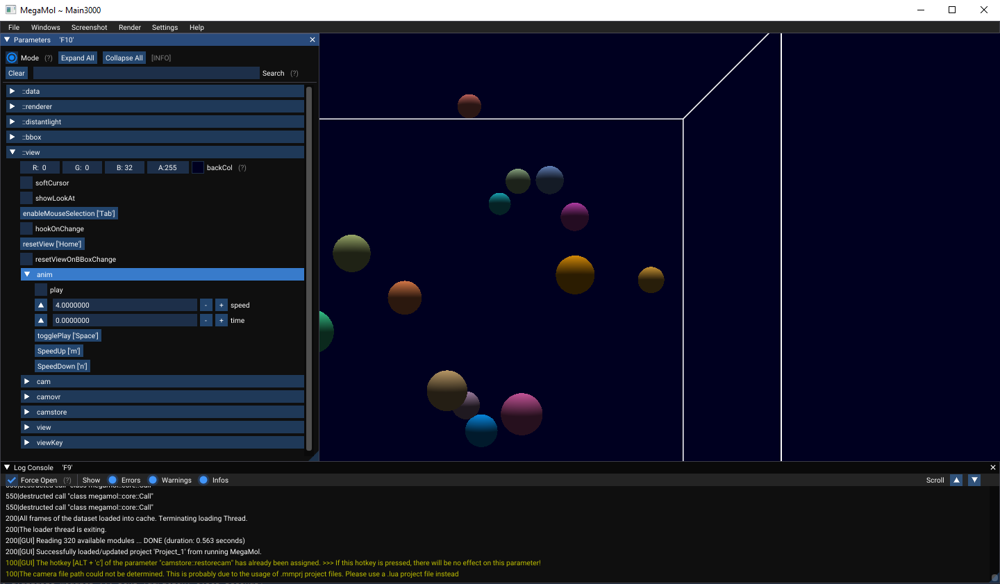

# MegaMol Manual

<!-- TOC -->

## Contents

- [Overview](#overview)
- [Installation and Setup](#installation-and-setup)
    - [Building from Source](#building-from-source)
        - [Microsoft Windows](#microsoft-windows)
        - [Linux (Ubuntu)](#linux-ubuntu)
    - [Command Line Arguments](#command-line-arguments)
    - [Configuration File](#configuration-file)
        - [General Settings](#general-settings)
        - [Logging](#logging)
        - [Application, Shaders and Resources](#application-shaders-and-resources)
        - [Plugins](#plugins)
        - [Global Settings](#global-settings)
    - [Test Installation](#test-installation)
        - [Examples](#examples)
- [Viewing Data Sets](#viewing-data-sets)
    - [Modules, Views and Calls](#modules-views-and-calls)
        - [Modules and Calls](#modules-and-calls)
        - [Views](#views)
    - [View Interaction](#view-interaction)
- [Project Files](#project-files)
- [Making High-Resolution Screenshots](#making-high-resolution-screenshots)
    - [GUI](#gui)
    - [Project File](#project-file)
        - [Framebuffer Size](#framebuffer-size)
    - [ScreenShooter Module](#screenshooter-module)
- [Making Simple Videos](#making-simple-videos)
- [Reproducibility](#reproducibility)

<!-- TODO
- [Jobs](#jobs)
    - [Job Instance](#job-instance)
    - [Converting to MMPLD](#converting-to-mmpld)
-->

<!-- /TOC -->


<!-- ###################################################################### -->
-----
## Overview

MegaMol is a visualization middleware used to visualize point-based molecular datasets.
The MegaMol project was started in the Collaborative Research Center 716, subproject D.3, at the Visualization Research Center (VISUS), University of Stuttgart, Germany.
Today, it is governed by a number of teams at the TU Dresden and the University of Stuttgart.

The goal of the project is to provide a software base for visualization research and to provide a stable environment to deploy newest visualization prototypes to application domain researchers. MegaMol is not a visualization tool. MegaMol is a platform for visualization research.
Visit the project [website](https://megamol.org/ "MegaMol Homepage") for downloads and more information.

**If you faced any trouble during installation or if you have any further questions concerning MegaMol, we encourage you to contact the developer team by opening an [issue](https://github.com/UniStuttgart-VISUS/megamol/issues/new) on github!**


<!-- ###################################################################### -->
-----
## Installation and Setup

This chapter discusses installation and setup of MegaMol from source code.
MegaMol targets Microsoft Windows (Windows 7 or newer, x64) and Linux (x64) as supported environments.
Currently, Ubuntu is used as Linux distribution for development.
Further platforms are not considered during the development.
While MegaMol might work on further platforms, the development team will currently not grant any support for problems with these environments.

<!-- ---------------------------------------------------------------------- -->
### Building from Source

It is recommended to use the current [main branch](https://github.com/UniStuttgart-VISUS/megamol/tree/master).

**Note**: 
The *OSPRay plugin* is currently disabled by default. 
See the plugins' [readme](https://github.com/UniStuttgart-VISUS/megamol/blob/master/plugins/OSPRay_plugin/Readme.md) for additional instructions on how to enable it.

<!-- ---------------------------------------------------------------------- -->
#### Microsoft Windows

1. You have to install [CMake](https://cmake.org/), and load the `CMakeLists.txt` present in the root directory of the repository.
2. Create a new `build` directory.
3. As generator, it is recommended to use the latest version of [Visual Studio](https://visualstudio.microsoft.com/downloads/) (Community Edition is free to use) with default native compilers and for the platform x64.
4. If you want to download prebuild binaries for required third party libraries enable the option `MEGAMOL_VCPKG_DOWNLOAD_CACHE` before configure. Otherwise, libraries will be built during configure.
5. Next, click `Configure` a few times (until all red entries disappear).
6. Change the `CMAKE_INSTALL_PREFIX` in order to change the destination directory of the installed files and configure once more.
7. Then click `Generate` to generate the build files.
8. The configuration creates a `megamol.sln` file inside the build directory.
9. Open the `megamol.sln` file with *Visual Studio*.
10. Use the `ALL_BUILD` target to build MegaMol.
11. Afterwards, use the `INSTALL` target to create your MegaMol installation.
12. The binary `megamol.exe` is located in the default installation path `../megamol/build/install/bin`.


*Screenshot of `cmake-gui` after generating build files.*

<!-- ---------------------------------------------------------------------- -->
#### Linux (Ubuntu, Debian)

Megamol requires a C++17 compiler.
Our CI pipeline tests the build with gcc-11 and clang-14 on Ubuntu 22.04.

1. Install the necessary build tools and compilers, as well as CMake and git:

    `sudo apt install build-essential cmake cmake-curses-gui git`

2. As prerequisites, following packages from the repository are required:

    `$ sudo apt install curl zip unzip tar xorg-dev libgl1-mesa-dev libglu1-mesa-dev`

    - Hint: You can optionally install `libboost-stacktrace-dev` to enable stacktrace printout for KHR debug messages.

3. First, download the source code from GitHub (use current master branch):

    `$ git clone https://github.com/UniStuttgart-VISUS/megamol.git`  
    `$ cd megamol`

4. Create a build directory and switch to it:

    `$ mkdir build && cd build`

5. Start the ncurses gui for cmake:

    `$ ccmake ..`

    - Configure the project repeatedly using `c` (and `e`) until no more changes are marked. 
    - Change the `CMAKE_INSTALL_PREFIX` in order to change the destination directory of the installed files.
    - Then hit `g` to generate the build files.

6. On the console prompt, start the building:

    `$ make && make install`

    - Hint: Use the `-j` option for `make` to run the build in parallel threads.

7. The binary `megamol` is located in the default installation path `megamol/build/install/bin`.

<!-- ---------------------------------------------------------------------- -->
### Command Line Arguments

Providing additional command line arguments allow individual configuration of global MegaMol behavior and settings.  
<!-- INFO: The command line arguments are only read and interpreted by the `frontend`. -->

The following command line arguments are available:

```
    megamol.exe [OPTION...] <additional project files>

      --host arg      address of lua host server, default:
                      tcp://127.0.0.1:33333
      --example       load minimal test spheres example project
      --khrdebug      enable OpenGL KHR debug messages
      --vsync         enable VSync in OpenGL window
      --window arg    set the window size and position, accepted format:
                      WIDTHxHEIGHT[+POSX+POSY]
      --fullscreen    open maximized window
      --nodecoration  open window without decorations
      --topmost       open window that stays on top of all others
      --nocursor      do not show mouse cursor inside window
      --hidden        do not show the window
      --help          print help
```

<!-- ---------------------------------------------------------------------- -->
### Configuration File

After successfully compiling and installing MegaMol, you should have all executable files inside your `bin` directory (default: `../megamol/build/install/bin`). 
<!-- INFO: The configuration file is only read and interpreted by the MegaMol `core`. -->
In the `bin` directory, you can find the default configuration file `megamolconfig.lua`:  

```lua
    -- Standard MegaMol Configuration File --
    print("Standard MegaMol Configuration:")

    basePath = "C:/megamol/build/install/"

    mmSetLogLevel("*") -- LogLevel: None=0,Error=1,Warn=100,INFO=200,ALL=*
    mmSetEchoLevel("*")
    -- mmSetLogFile("")
    mmSetAppDir(basePath .. "bin")
    mmAddShaderDir(basePath .. "share/shaders")
    mmAddResourceDir(basePath .. "share/shaders")
    mmAddResourceDir(basePath .. "share/resources")
    mmPluginLoaderInfo(basePath .. "bin", "*.mmplg", "include")

    computer = mmGetMachineName()

    mmSetConfigValue("*-window",    "x5y35w1280h720")
    mmSetConfigValue("consolegui",  "on")
    mmSetConfigValue("topmost",     "off")
    mmSetConfigValue("fullscreen",  "off")
    mmSetConfigValue("vsync",       "off")
    mmSetConfigValue("useKHRdebug", "off")
    mmSetConfigValue("arcball",     "off")
```

The following paragraphs explain the essential steps of configuring MegaMol in more detail.

<!-- ---------------------------------------------------------------------- -->
#### General Settings

Locate line 3 containing the variable `basePath`.
Both relative and absolute path should work here fine.
This path is set automatically and always has to fit the currently used execution path!
```lua
    basePath = "C:/megamol/build/install/"
```

<!-- ---------------------------------------------------------------------- -->
#### Logging

Line 4-6 configures the logging mechanism of MegaMol.
Adjusting the value of *EchoLevel* changes the amount of log information printed on the console. 
Specifying a log file and the level informs MegaMol to write a log file and print the messages of the requested level into that file. 
The *LogLevel* is a numeric value.
All messages with lower numeric values will be printed (or saved).
The asterisk `*` stands for the highest numeric value, thus printing all messages.
```lua
    mmSetLogLevel('*') -- LogLevel: None=0,Error=1,Warn=100,INFO=200,ALL=*
    mmSetEchoLevel('*')
    -- mmSetLogFile("")
```

<!-- ---------------------------------------------------------------------- -->
#### Application, Shaders and Resources

Line 7-10 define the application, shader and resource directories:
```lua
    mmSetAppDir(basePath .. "bin")
    mmAddShaderDir(basePath .. "share/shaders")
    mmAddResourceDir(basePath .. "share/shaders")
    mmAddResourceDir(basePath .. "share/resources")
```
The *Add...Dir* commands set the paths for the respective resources.

<!-- ---------------------------------------------------------------------- -->
#### Plugins

Since we switched to static linking of plugin libraries into the MegaMol binary, the configuration of `mmPluginLoaderInfo` is ***DEPRECATED*** and no longer required.

<!-- DEPRECATED

Extend the configuration if you introduce new plugins into your installation.
Although there are different ways to specify the plugins to be loaded, the tags in the example configuration file are the most secure way. 
Each `mmPluginLoaderInfo` tag requires three attributes:

- `path` should be the path to find the plugin. The example configuration file assumes to find the plugins in the same directory as the MegaMol executable (which is the
case for Windows installations.
  On Linux systems, you need to change this path, e.g. to `../../lib/megamol`.
- `name` is the file name of the plugin.
- `action` refers to an internal parameter of MegaMol and should always be `include`.

Rendering modules from plugins require shader codes to function.
MegaMol searches these codes in all registered shader directories.
To register a shader directory, add a corresponding tag to the configuration file.
```lua
    mmPluginLoaderInfo(basePath .. "bin", "*.mmplg", "include")
```
-->

<!-- ---------------------------------------------------------------------- -->
#### Global Settings

The configuration file also specifies global settings variables which can modify the behavior of different modules.

- The following settings variable activates (or deactivates) the *arcball* (orbiting) camera behavior. Set this option to `on` in order to use the *arcball* camera navigation.
```lua
    mmSetConfigValue("arcball",     "off")
```

All other configuration options are ***DEPRECATED*** and have currently no effect!

<!-- DEPRECATED

- In line 14 the variable `*-window` is set.
    This variable specifies the default position and size for all rendering windows MegaMol will create. 
    The asterisk represents any window name.
    If you set a variable with a specific name, windows with exactly this name will respect the settings variable. 
    For example, `test-window` will specify the value for the window created by the view instance test.
    The value itself contains five variables:
    - The first two variables are prefixed with `x` and `y` and specify the location of the window in screen pixel coordinates.
    - The second two variables are prefixed with `w` and `h` and specify the size of the client area of the window in pixels.
    - The last optional variable `nd` (stands for **n**o **d**ecorations) will remove all window decorations, buttons, and border from the created window. 
    This variable allows us to create borderless windows filling the complete screen for full-screen rendering.
```lua
    mmSetConfigValue("*-window",    "x5y35w1280h720")
```

*DEPRECATED:*

- This variable defines whether the GUI is show or not.
```lua
    mmSetConfigValue("consolegui",  "on")
```

*DEPRECATED:*

- Show MegaMol window on top of other windows or not.
```lua    
    mmSetConfigValue("topmost",     "off")
```

*DEPRECATED:*

- Show MegMol window in full screen mode or not.
```lua    
    mmSetConfigValue("fullscreen",  "off")
```

*DEPRECATED:*

- Enable or disable VSync (vertical synchronization).
```lua    
    mmSetConfigValue("vsync",       "off")
```

*DEPRECATED:*

- Defines wether the OpenGL Debug Output (KHR extension)[https://www.khronos.org/opengl/wiki/Debug_Output] is used or not.
```lua    
    mmSetConfigValue("useKHRdebug", "off")
```
--> 

This concludes the information on building and the options on how to configure MegaMol.
Test your installation following the description in the following section.


<!-- ###################################################################### -->
-----
## Test Installation

In order to test the installation, simply run the frontend executable.  
Open a console (e.g *Linux Terminal* or *Windows Powershell*) and change your working directory to the MegaMol install directory containing the `bin` folder (default: `../megamol/build/install/bin`) and execute the MegaMol binary:

**Windows:**
```
    > megamol.exe
```

**Linux:**

```
    $ ./megamol
```

MegaMol should start and print several messages to the console and an empty rendering window should appear.
You can either check the console log messages or the messages printed in the *Log Console* window.
The leading number of each line is the log level.
There should be no error messages (log level **1**).
Some warnings (log level **100**) might occur but are *normal* and indicate no failed installation or execution.  

<!-- ---------------------------------------------------------------------- -->
### Examples

The [example project script files](https://github.com/UniStuttgart-VISUS/megamol-examples) are automatically available in the `examples` directory, which is installed next to the `bin` directory.

For a better test, you should invoke MegaMol loading an example project script requesting a simple rendering. 
Then you can be sure that the graphics drivers, graphics libraries, and shader codes are correctly found and are working. 
To do this, try:

**Linux:**

    $ ./megamol ../examples/testspheres.lua

**Windows:**

    > megamol.exe ..\examples\testspheres.lua

MegaMol should now open a rendering window showing a generated dataset with several colored spheres and the outline of the bounding box. 
Hitting the `space` key starts and stops the animation playback.
In the GUI window *Parameters* you can find all available parameters of the running MegaMol instance grouped by the modules.
For example, you can find the parameter `speed` in the group `inst::view::anim`. 
With this parameter, you can adjust the playback speed of the animation.
In the parameter group `anim` of the `view` module you can adjust the animation speed.  

Alternatively, you can also open an empty MegaMol rendering window and load the above example project script file via the menu `File / Load Project`.  

All available options provided via the graphical user interface are described separately in the readme file of the [GUI Service](../frontend/services/gui).


*Screenshot of MegaMol running the test spheres instance.*


<!-- ###################################################################### -->
-----
## MegaMol Graph

In this chapter, we show the operating principle of MegaMol which is required to creating own custom projects for MegaMol.

<!-- ---------------------------------------------------------------------- -->
### Modules, Views and Calls

The runtime functionality of MegaMol is constructed by *modules* and *calls*. 
These two types of objects are instantiated at runtime, interconnected and build the *module call graph*. 
The figure given below, shows an example module call graph containing a *view*, the rendering content of a window, a *renderer*, a *data source*, and some modules providing additional information for the renderer. 
The modules are interconnected by the *call* objects. 
The connection endpoints at the modules are *CallerSlots* (outgoing, located on the right side of modules) or *CalleeSlots* (incoming, located on the left side of modules) shown as circled dots.

The module call graph follows the pull pattern. 
This means that modules request function invocation by other modules. 
For example, the *view* module needs to update the window content. 
The *view* module thus invokes the *renderer* module to provide a new rendering. 
The *renderer* calls the data source if new data is available or to provide the old cached data.

Left-most module view of class `View3D_2` represents the rendering content of a window. 
The center module renderer of class `BoundingBoxRenderer` and `SphererRenderer` are called subsequently by the window using the corresponding call of type `CallRenderer3D_2`. 
The right modules provide data and additional information for the renderer, namely a color map transfer function and a clipping plane. 

  

*Example module call graph.*

<!-- ---------------------------------------------------------------------- -->
#### Modules and Calls

*Modules* are the functional entities of MegaMol. 
They provide several programmatic access points, the *slots*. 
Two types of these slots are shown in the above figure of an example graph as circled dots.

*CalleeSlots* are access points of modules, through which these can be called to perform a function. 
For example, modules of class `SphererRenderer` provide a CalleeSlot `rendering` through which the rendering function can be invoked. 
The counterparts are CallerSlots which are outgoing access points. 
These allow modules to call other modules. 
View modules of class `View3D_2` provide a corresponding slot `rendering` to call a connected renderer.
These two types of slots are connected using objects of *call* classes. 
Both *CalleeSlots* and *CallerSlots* specify types of calls they are compatible with. 
In the case of the above examples of renderings-relates slots, this is the type `CallRender3D_2`.

*Calls* should be lightweight. 
They are thin interfaces meant for data transport. 
For example, data to be visualized is loaded by data source modules. 
In the example graph figure the module *data* of class *MMPLDDataSource* loads a specified data set into main memory and provides the data through its *CalleeSlot*. 
The data is accessed through a *MultiParticleDataCall*. 
The call, however, does not copy the data but provides access to the data in terms of memory pointers, and metadata. 
This avoidance of copy operations is most important and one of the core design ideas of MegaMol.

*Parameter Slots* are the third type of slots. 
These are access points to exposed parameters controlling the functionality. 
Such parameters are automatically included in the frontend’s GUI. 
An example of such parameters is the setup of the virtual camera in modules of type `View3D_2` or the dataset file name in data source modules.  

The *module call graph* is configured for MegaMol using a project file. 
These files define modules and interconnecting calls for different instance specifications. 

<!-- TODO: UPDATE or DEPERCATED

There are two types of instances:
Views (see section [Views](#views)) and jobs (see section [Jobs](#jobs)). 
The starting command line of the console frontend loads project files and requests instantiation of views and jobs.

-->

<!-- ---------------------------------------------------------------------- -->
#### Views 

*Views* are one of the two instance types MegaMol can run. 
They are specified by the corresponding tag in a MegaMol project file (see section [Project Files](#project-files)). 
When a view is instantiated, a corresponding namespace will be created, and all modules instantiated as part of the view will be created inside this namespace. 

<!-- DEPRECATED

For example, the project file seen in next section ([Project Files](#project-files)) defines the module data as part of the view dataview. 
If this view is instantiated by the command line note (note that files might need some path adjustments):

    $ ./megamol.sh -p ../docs/samples/projects/pdbcartoonview.mmprj -i pdbcartoonview pv --paramfile ../docs/samples/projects/pdbmolview02.param -v ::pdbdata::pdbFilename ../docs/samples/sampledata/1m40_sim.pdb -v ::pdbdata::xtcFilename ../docs/samples/sampledata/1m40_100frames.xtc

Then the module will be created with the full name `::inst::data`. 
Correspondingly, its parameter slot `filename` can be globally addressed by `::inst::data::filename`. 
This allows for the instantiation of several independent view instances. 
For each view instance, a rendering window will be created. 
To provide the content for the rendering window, each view instance description needs to provide a *default view*, usually via the `viewmod` attribute of the view tag in the MegaMol project file. 
The value of this attribute is the name for the view module to be called by the window management code. 
This module class must be implemented by deriving from `::megamol::core::view::AbstractView`. 
Typically, you use `View3D` or `View2D`.
MegaMol provides some internal description of views which can be instantiated without loading a project file first. 
The view description *TestSpheres* used in section [Test](#test-installation) is one example of such a built-in description.
-->

<!-- ---------------------------------------------------------------------- -->
### View Interaction

The primary interaction with a view is controlling the camera with mouse and keyboard. 
The keyboard mapping is implemented by button parameters of the view module, also available in the GUI. 
Most parameters can be found in the sub-namespace `viewKey` inside the view name, e.g. `RotLeft`. 
The corresponding parameter button in the GUI also shows the associated hotkey.
In the configuration file `megamolconfig.lua` the camera behaviour can be change be switching the *arcball* option on or off.

<!-- TODO: 
UPDATE 
-->
Some useful controls assuming the *arcball* option is set to **on**:

- Hitting *Home* (aka *Pos1*) is associated with the button *resetView*. This function resets the view to default.
- Hold the *Left Mouse Button* and move your mouse to rotate the view around the look-at point. 
    The look-at point initially is placed in the center of the bounding box of the data set.
- Hold *Shift* while holding and dragging the *Left Mouse Button* rolls the camera around the viewing direction.
- Hold *Control* while holding and dragging the *Left Mouse Button* rotates the camera around its center point.
- Hold *Alt* while holding and dragging the *Left Mouse Button* moves the camera orthogonally to the viewing direction.
- Hold the *Middle Mouse Button* and move your mouse up or down to zoom the view by move the camera forwards or backwards. 
    Note that if you zoom in too much, parts of the data set will be clipped by the near-clipping plane.
- Hold *Alt* while holding and dragging the *Middle Mouse Button* zoom the view by changing the opening angle of the camera.
- Hold *Control* while holding and dragging the *Middle Mouse Button* moves the look-at point forwards or backwards, changing the center of the corresponding rotation. 
    Use the parameter `showLookAt` of the view to visualize the look-at point for better adjustment.


<!-- ###################################################################### -->
-----
## Project Files

Project files are [`lua`](https://www.lua.org/) scripts using special custom functions to define any module graph for MegaMol.
Some predefined example project script files are available in the `examples` directory, which is installed next to the `bin` directory.
Here you can see the example project script `..\examples\testspheres.lua`:

```lua
    mmCreateView("testspheres", "View3D_2","::view")

    mmCreateModule("BoundingBoxRenderer","::bbox")
    mmCreateModule("DistantLight","::distantlight")
    mmCreateModule("SphereRenderer","::renderer")
    mmCreateModule("TestSpheresDataSource", "::data")

    mmSetParamValue("::renderer::renderMode", [=[Simple]=])

    mmCreateCall("CallRender3D_2", "::view::rendering", "::bbox::rendering")
    mmCreateCall("CallRender3D_2","::bbox::chainRendering","::renderer::rendering")
    mmCreateCall("MultiParticleDataCall", "::renderer::getData", "::data::getData")
    mmCreateCall("CallLight","::renderer::lights","::distantlight::deployLightSlot")
```

Project files can easily be created using the built in *Configurator*.
It can be opened via the menu `Windows / Configurator`.
You can either edit the currently running MegaMol graph (which might be empty) or you can create a new project starting a module graph by adding the main view module `View3D_2`.
A detailed description of the configurator can be found in the readme file of the [GUI Service](../frontend/services/gui#configurator).

<!-- TODO:
Add more ... ?
-->

<!-- ###################################################################### -->
-----
## Making High-Resolution Screenshots

### GUI

The GUI menu option `Screenshot` (hotkey `F2`) provides a basic screenshot functionality using the current viewport size. 
If screenshots are taken consecutively, the given file name is prepended by an incrementing suffix. 
This way, no new file name has to be set after each screenshot.  

### Project File

Within the LUA project file a screenshot can be triggered using the command `mmScreenShot("screenshot_filename.png")`.

The following example shows how to take screenshots of various time steps:

```lua
for i=0,1 do
    mmSetParamValue("::View3D_2_1::anim::time", tostring(i))
    mmRenderNextFrame()
    mmScreenShot("screenshot_timestep_" .. string.format("%04d",i) .. ".png")
end
```
#### Framebuffer Size

The actual framebuffer size to use for a screenshot can be set in the following ways:

**LUA Project File:** 
`mmSetFramebufferSize(width, height)`  
e.g. mmSetFramebufferSize(100, 100).

**CLI Option:** 
`--window wxh+x+y`  
 e.g. ./megamol --window 100x100 for a window of size 100 x 100 pixels. 
 Also see help output: `./megamol -h`

### ScreenShooter Module

Offering more flexible options and special functions to create high-resolution screenshots of any rendering, you can add the `ScreenShooter` module to you project.
The corresponding settings can be found in the modules parameters provided in the GUI (see figure of `ScreenShooter` parameters below).

In order to connect the `ScreenShooter` with your *view*, you need to set the <!-- **instance name** or the --> **module name** of your view module in the corresponding variable `::screenshooter::view` (e.g. to `::View3D_2_1`). 
When making single screenshots, set the option `makeAnim` in the group `::screenshooter::anim` to `disabled`, as shown in the figure. 
Ignore the remaining options in that group. 
These options will be explained in section [Making Simple Videos](#making-simple-videos), as they are used to produce videos.

The parameters `imgWidth` and `imgHeight` specify the size of the screenshot to be rendered. 
These values are not limited to the window size and can be, in theory, arbitrarily large. 
If these values are getting large, the image can be rendered in several tiles, i.e., sub-images. 
The size for these tiles is specified by `tileWidth` and `tileHeight`. 
However, many renderers have problems with producing these tiled images. 
It is, thus, recommended to set `tileWidth` and `tileHeight` to be at least as large as `imgWidth` and `imgHeight`. 
The values for `tileWidth` and `tileHeight` are limited by the maximum texture size, maximum frame buffer object size and graphics memory size of your graphics card. 
Thus, these values are often limited.
The parameter file name specifies the path to the image file to be created. 
MegaMol only creates PNG files. 
Hit the button trigger to have MegaMol create the requested screenshot.


<!-- ###################################################################### -->
-----
## Making Simple Videos

MegaMol cannot create video files directly. 
However, MegaMol can create a sequence of screenshots of a time-dependent data set showing the different points-in-time. 
This functionality is provided and further described in the [*Cinematic* plugin](../plugins/cinematic#usage).

<!-- DEPRECATED 

Adjust the parameters in the group `::screenshooter::anim` in addition to the parameters for simple screenshots ([ScreenShots](#makescreenshot)).
Enable the option `makeAnim` to make a screenshot sequence.

The parameters `from` and `to` specify the time codes to start and end the animation. 
The parameter `step` specifies the time code increment between two screenshots.
For example, if you specify `from=0`, `to=100`, and `step= 10` (assuming the dataset stores enough time frames), 11 screenshots will be created and stored. 
These will show the data set at times 0, 10, 20, ... , 90, and 100. 
The screenshot files names will be extended by an increasing number: e.g. `test.00000.png`, `test.00001.png`, `test.00002.png`, ...
This sequence of image files can then be merged to produce a video file, e.g. using avconv:

    $ avconv -r 30 -i test.%05d.png test.mp4

**KNOWN BUG**: 
Several renderers will request the best data they can get. 
As usually data is loaded asynchronously, the correct data is often not available yet, and the best data is the data from a slightly wrong time. 
While this is not a big deal for viewing data, it is fatal when rendering images for videos. 
Many renderers thus expose a parameter `forceTime`, or with a similar name. 
Set this parameter to `true` and the renderer will always show the correct data. 
It will need to wait if the correct data is not available, yet, which can reduce the overall performance.

-->

<!-- ###################################################################### -->
<!-- TODO: UPDATE or DEPRECATED
## Jobs

This chapter discusses the job concept available in MegaMol. 
Especially, how jobs can be used for data conversion. 
Examples are based on the project script files available in the installed `examples` directory.

### Job Instance

Jobs are the second type of instances available at the MegaMol runtime (compare view instances in section [Views](#views)). 
The primary difference is the `<job>` tag as primary instance tag. 
Similarly, to the viewmod attribute, the `<job>` tag specifies a jobmod module as entry module.

```xml
    <job name="convjob" jobmod="job">
```

One significant limitation of this release is that the MegaMol Configurator is only able to edit view instance descriptions, see section [Configurator](#configurator). 
If you want graphical assistance in creating a job description, the recommended way is to create a view instance description with all required modules and calls. 
Use a `DataWriterJob` module as an entry point. 
Save the corresponding project file and edit it manually with a text editor. 
Replace the `<view>` tags with the similarly behaving `<job>` tags and adjust the corresponding attributes.

### Converting to MMPLD

The MegaMol Particle List Data file format (MMPLD) is a very fast loading binary memory dump of MegaMol meant for small and mid-sized datasets (1-10 mio. particles). MegaMol can convert most of its supported file formats to MMPLD file format. More precisely, all file formats which are loaded by a MegaMol module supporting the `MultiParticleDataCall` can be converted to MMPLD. For this, specify a converter job using a `DataWriterJob` module and a `MMPLDWriter` module. The content of the project file `makemmpld.mmprj` which can be used to convert data into the MMPLD file format, is shown below.

```xml
    <?xml version="1.0" encoding="utf-8"?>
    <MegaMol type="project" version="1.3">

    <job name="convjob" jobmod="job">
        <module class="SIFFDataSource" name="data" />

        <module class="DataWriterJob" name="job" />
        <module class="MMPLDWriter" name="writer" />
        <call class="DataWriterCtrlCall" from="job::writer" to="writer::control" />
        <call class="MultiParticleDataCall" from="writer::data" to="data::getdata" />

            </job>
    </MegaMol>
```

The entry module for data conversion is of class `DataWriterJob`, see line 11. This job module controls writing several files into a new data set. The output is implemented in corresponding write modules, like the `MMPLDWriter`, see line 12. This writer module is then connected to a module providing the data. In the simplest scenario, this is directly a data loader module. The above example selects one module from several options, in the same way the data viewing project does (see section [Project Files](#project-files)). The job is instantiated similarly using the command line. The paths for `makemmpld.mmprj` and `inputfile.siff` might need to be adjusted:

    $ mmconsole -p makemmpld.mmprj -i convjob j -v j::data::filename inputfile.siff -v j::writer::filename outputfile.mmpld

The input file name and output file name are explicitly specified using the -v arguments. 
The job execution starts immediately. 
After data is written, MegaMol terminates itself. 

To convert from other file formats, for which a corresponding loader does exist, you should be able to adjust this project file.

--> 

<!-- ###################################################################### -->
-----
## Reproducibility

MegaMol stores the active project and all parameter settings in the EXIF field of the saved screenshots. 
Please note that this field currently contains a simple zero-terminated string with the LUA code required to reproduce the state when the screenshot is taken, and **not** valid EXIF data. Such a project can be restored by simply loading the PNG file:

    $ megamol.exe <something>.png

Also note that only Views with direct access to camera parameters (like `View3D_2`) can be properly restored.
