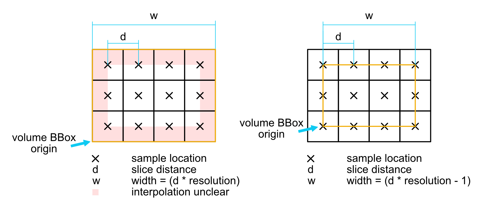

# A note on addressing volumetric data in MegaMol

Since there are many ways of considering volumetric data, this document shall define the generally valid way of treating a volume in MegaMol, be it in shaders or in software.

Consider the following picture:

On the left, the samples for each voxel cell all cover that same world space. Trilinear interpolation being what it is, this would require some border color or other strategy to give meaningful results for sampling (u,v) = (0,0). However, world space size of the volume bounding box is intuitively
>`bbox_width = slice_distance * resolution`

On the right, you see the most common variant used in volume rendering, and also (hopefully everywhere) in MegaMol. Here, the bounding box geometry carries texture coordinates

> `[1/resolution, 1-1/resolution]`

With this approach, the border of the volume is defined reliably by the outermost voxels: the bounding box origin gets exactly the value in the first voxel, and no interpolation occurs. This helps if you want to brick a volume, for example. However, since you lose half a voxel at each end, the bounding box of the volume geometry is **only**
> `bbox_width = slice_distance * (resolution `**-1**`)`
