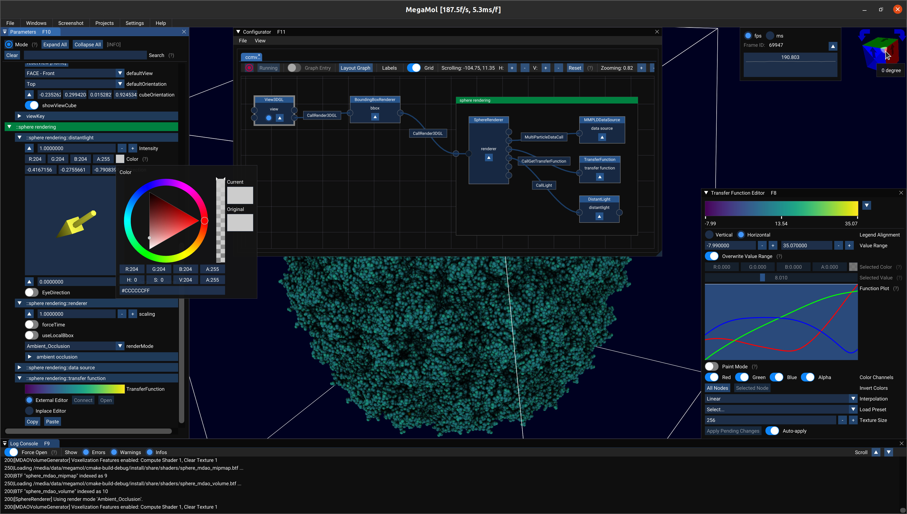
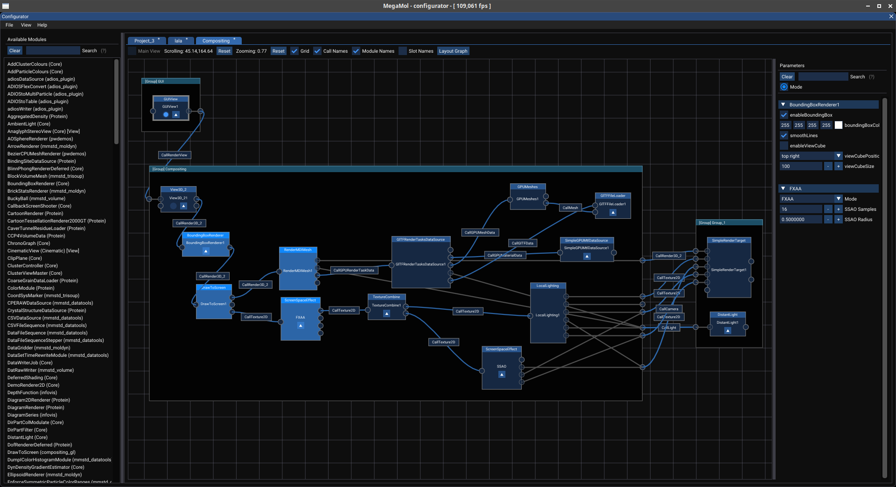
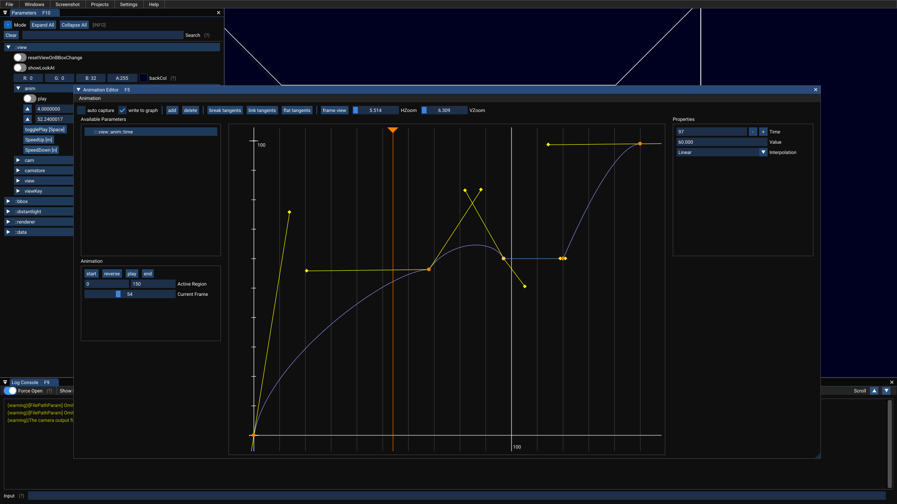
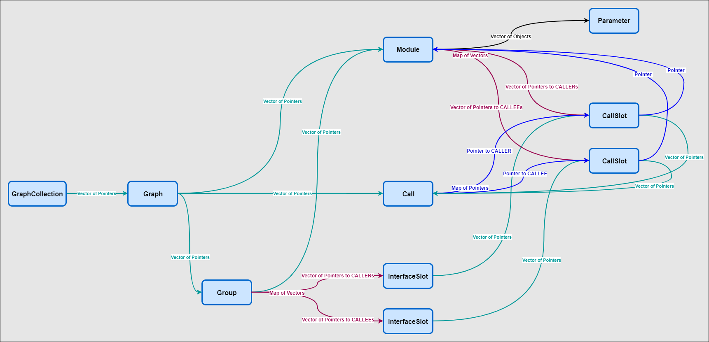

# MegaMol: GUI

This is the service that provides the GUI for MegaMol.



<!-- TOC -->
## Contents
- [MegaMol: GUI](#megamol-gui)
  - [Contents](#contents)
  - [Graphical User Interface (GUI)](#graphical-user-interface-gui)
    - [Main Menu](#main-menu)
    - [Configurator](#configurator)
      - [Main Menu](#main-menu-1)
      - [*Module Stock List* Sidebar](#module-stock-list-sidebar)
      - [*Module Parameters* Sidebar](#module-parameters-sidebar)
      - [Project Menu Bar](#project-menu-bar)
      - [Project Graph](#project-graph)
        - [Modules](#modules)
        - [Calls](#calls)
        - [Call Slots](#call-slots)
        - [Module Groups](#module-groups)
          - [Module Group Interface Slots](#module-group-interface-slots)
    - [Hotkey Overview](#hotkey-overview)
    - [Animation Editor](#animation-editor)
      - [Menu](#menu)
      - [Toolbar](#toolbar)
      - [Available Parameters](#available-parameters)
      - [Animation](#animation)
      - [Graph](#graph)
      - [Key Properties](#key-properties)
  - [Modules](#modules-1)
    - [OverlayRenderer](#overlayrenderer)
      - [Parameters](#parameters)
  - [Information for Developers](#information-for-developers)
    - [Using ImGui in Modules](#using-imgui-in-modules)
    - [New Parameter Widgets](#new-parameter-widgets)
      - [How to add a new parameter widget](#how-to-add-a-new-parameter-widget)
      - [How to add a new parameter group widget](#how-to-add-a-new-parameter-group-widget)
  - [GUI Window/PopUp/Notification for Frontend Service](#gui-windowpopupnotification-for-frontend-service)
    - [GUI Window](#gui-window)
    - [GUI PopUp](#gui-popup)
    - [GUI Notification](#gui-notification)
    - [Default GUI State](#default-gui-state)
    - [Graph Data Structure](#graph-data-structure)
<!-- /TOC -->

---

## Graphical User Interface (GUI)

The GUI of MegaMol is based on [Dear ImGui](https://github.com/ocornut/imgui) *Version 1.82 (Docking Branch)*.  

See the *Bug and Feature Tracker* [#539](https://github.com/UniStuttgart-VISUS/megamol/issues/539) for current work in progress. 

**NOTE**
* Hotkeys use the key mapping of the US keyboard layout. Other keyboard layouts are currently not considered or recognized. Consider possible transposed `z` and `y` which are used in `undo` and `redo` hotkeys on text input.
* Parameter values in the lua command `mmSetParamValue` must have the value enclosed in `[=[`and `]=]` delimiters. String delimiters `"` for parameter values are not supported any more.

### Main Menu

The main menu provides the following options:
(Assigned hotkeys are given in brackets.)

* **`File`**
    * **`Load Project`** (`Ctrl + l`) Load project from file (lua).
    * **`Save Project`** (`Ctrl + s`) Save the current project to file (lua). *If you want to save the current **GUI state**, check the option `Save GUI state` in the file dialog!* (corresponding LUA option: `mmSetGUIState(>JSON String>)/mmgetGUIState()`)
    * **`Exit`** (`Alt + F4`) End the program.
* **`Windows`** 
    * **`Menu`** (`F12`) Show/Hide the menu.
    * **`Configurator`** (`F11`) Show/Hide the configurator window. See detailed description below.
    * **`Parameters`** (`F10`) Show/Hide the parameter window. *In order to enable more options to change the parameters appearance (widget), you can switch the `Mode` from **Basic** to **Expert**.*
    * **`Log Console`** (`F9`) Show/Hide the log console window. In order to prevent automatically showing the log console on errors and warning, disable the `Force Open` option.
    * **`Transfer Function Editor`** (`F8`) Show/Hide the transfer function editor. You have to `Apply` changes in order to take effect.
    * **`Performance Metrics`** (`F7`) Show/Hide the performance metrics window showing the fps or ms. 
    * **`Hotkey Editor`** (`F6`) Show/Hide the hotkey editor window. 
    * **`Show/Hide All Windows`** (`Ctrl + g`) Show/Hide all GUI windows (corresponding LUA/CLI option: `mmSetGUIVisible(<bool>)/mmGetGUIVisible()`/ `guishow`).
    * **`Windows Docking Preset`** Load the docking preset for all windows.
* **`Screenshot`** 
    * **`Select Filename`** (`megamol_screenshot.png`) Open file dialog for choosing file name for screenshot. Current filename is shown in menu. After each screenshot triggering a incrementing suffix (`_1`) is appended to the initially given filename. This way the file name does not have to be changed for each screenshot.
    * **`Trigger`** (`F2`) Trigger screenshot.
* **`Projects`** 
    * *`<Names of currently opened projects>`* Click circle button to run stopped project.
      * **`Toggle Graph Entry`** (`F3`) Toggle between available graph entries. After toggling graph entry, intermediate state disables all graph entries.
* **`Settings`**    
    * **`Style`** Select predefined GUI Style (ImGui Dark Colors, ImGui Light Colors, Corporate Gray, Corporate White).
    * **`Font`** Select predefined GUI Style.
        * `Select Available Font` Choose among preloaded fonts.
        * `Load font from file` Load new font from TTF-file (se provided fonts in /share/resources/fonts/) in any desired size.  
    * **`Scale`** Select fixed GUI scaling (100%, 150%, 200%, 250%, 300%). Support for high DPI displays. (corresponding LUA/CLI option: `mmSetGUIScale(<float>)/mmGetGUIScale()` / `guiscale`)
* **`Help`**
    * **`About`**: Some information and links concerning the currently running MegaMol.

### Configurator

The project configurator is part of the GUI and can be opened via the main menu: `Windows`/`Configurator`.  



#### Main Menu

* **`File`**
    * **`New Project`** Create new empty project.
    * **`Open Project`** Open existing project in new tab.
    * **`Add Project`** Open existing project and add to currently selected project.
    * **`Save Project`** (`Ctrl + Shift + s`) Save the project of the currently selected tab to file (.lua)
* **`View`**
    * **`Modules Sidebar`** Show/Hide sidebar with module stock list.
    * **`Parameter Sidebar`** Show/Hide sidebar with parameters of currently selected module.
    *MegaMol has to be configured with CMake option ENABLE_PROFILING set to `true` in order to enable the following menu option:*
    * **`Profiling Bar`** Show/Hide profiling bar. 

#### *Module Stock List* Sidebar

* Search for Module (`Ctrl + Shift + m`)
* Add Module from Stock List to Graph
    * `Double Left Click` on Module in Stock List
    * `Right Click` on Module in Stock List - Context Menu: Add
    
#### *Module Parameters* Sidebar

* Search for Parameter (`Ctrl + Shift + p`)
        
#### Project Menu Bar

* `Running` Indicated if project is currently running. There is always exactly one project that is set running. 
* `Graph Entry` Select `View` module to set or unset view module as graph entry
* `Layout Graph` Apply simple layout of the project graph.
    * `Modules`
        * `Name` Show/Hide module names
        * `Slot` Show/Hide slot names
    * `Calls`
        * `Name` Show/Hide call names
        * `Slot` Show/Hide connected slot names
* `Labels` Show/Hide slot names.
* `Grid` Show/Hide grid.
* Scrolling `Reset`
* Zooming `Reset`

#### Project Graph 
*(= Node-Link-Diagram)*

* Spawn *Module Stock List* in pop-up window at mouse position.
    * `Ctrl + Shift + m`
    * `Double Left Click`    
* Sidebar Splitter Collapsing/Expansion
    * `Double Right Click` on Splitter
* Graph Zooming
    * `Mouse Wheel`
* Graph Scrolling
    * `Middle Mouse Button`
* Multiple Selection of Modules
    * Drag & Drop with `Left Mouse Button` (start outside of any module). Each module partially overlapped by the frame will be selected.
    * Hold `Shift` + `Left Click` on modules you additionally want to select/deselect to/from current selection.

##### Modules
* Main View `Radio Button`: Toggle main view flag (only available for view modules).
* Parameter `Arrow Button`: Show/Hide *Module Parameters* in small window stuck to the module.
* Context Menu (`Right Click`)
    * Delete (Alternative: Select with `Left Click` an press `Delete`)
    * Layout (Only available when multiple modules are selected)
    * Rename
    * Add to Group
        * New
        * *Select from list of existing groups*
    * Remove from Group

##### Calls
* Context Menu (`Right Click`)
    * Coloring: Select `Default`or `SetMap2` color table for call curve coloring.
    * Delete (Alternative: Select with `Left Click` an press `Delete`)
* Call Creation
    * Drag and Drop from Call Slot to another highlighted compatible Call Slot.

##### Call Slots
* Add Call Slot to existing Interface Slot
    * Drag and Drop from Call Slot to another highlighted compatible Interface Slot.
* `Double Left Click` Show *Module Stock List* in pop-up window.
* Context Menu (`Right Click`)    
    * Create new Interface Slot
    * Remove from Interface Slot

##### Module Groups
Modules can be bundled in groups. 
This allows a minimized (collapsed) view of large module groups inside the configurator. 
Grouped modules can be reused when stored separately. 
Module groups can be added to any other projects.
Module groups are stored in project files using the already available module namespace (which is currently unused in the core). 

* `Double Left Click` Toggle between expanded and collapsed view.
* Context Menu (`Right Click`)
    * Collapse View / Expand View
    * Layout 
    * Rename      
    * Delete (Alternative: Select with `Left Click` an press `Delete`)           

###### Module Group Interface Slots

Call slots of modules, which are part of a group, can be added to the group interface. 
This generates new interface slot which allow outgoing calls. 
Interface slots are automatically generated if required.
Additionally, call slots can be added to the groups interface via the context menu of the call slots.
Caller interface slots (on the right side of a group) allow the bundling of more than one connection to the same callee slot of another module. 
Add a call slot to an existing interface slot via drag and drop (compatible call slots are highlighted if an interface slot is hovered).
Callee interface slots (on the left side of a group) allow only one connected call slot.
Interface slots are stored in project files as part of the configurators state parameter.  

### Hotkey Overview

The following hotkeys are used in the GUI:

**Global *(in class GUIManager)*:**
* Trigger Screenshot:        **`F2`**
* Toggle Graph Entry:        **`F3`**
* Show/hide Windows:         **`F6-F11`**
* Show/hide Menu:            **`F12`**
* Show/hide GUI:             **`Ctrl  + g`**
* Search Parameter:          **`Ctrl  + p`**
* Save Running Project:      **`Ctrl  + s`**
* Quit Program:              **`Alt   + F4`**

**Configurator *(in class Configurator)*:**
* Search Module:             **`Ctrl + Shift + m`**
* Search Parameter:          **`Ctrl + Shift + p`**
* Save Edited Project:       **`Ctrl + Shift + s`**

**Graph *(in class Graph)*:**
* Delete Graph Item:         **`Entf`**
* Selection, Drag & Drop:    **`Left Mouse Button`**
* Context Menu:              **`Right Mouse Button`**
* Zooming:                   **`Mouse Wheel`**
* Scrolling:                 **`Middle Mouse Button`**

### Animation Editor
The animation editor is part of the GUI and can be opened via the main menu: `Windows`/`Animation Editor`.


#### Menu
Here you can clear, load, and save the current animation.

#### Toolbar
**auto capture** watches the MegaMol graph for changes and automatically inserts keys at the current frame. This currently works only for FloatParam and IntParam (treated the same way) as well as EnumParam, FlexEnumParam, StringParam, and FilePathParam (also treated the same way).

**write to graph** when scrubbing with the play head/current frame, interpolate all values for all parameters and write them back to the running MegaMol graph

**add** adds a key at the current frame for the selected parameter, interpolating the neighboring values

**delete** removes the currently selected key

**break tangents** unlinks the incoming/outgoing tangent of the currently selected key, so they can be manipulated separately

**link tangents** links the tangents of the currently selected key, setting the outgoing one to the inverse of the incoming one

**flat tangents** sets tangents of (-1,0) and (1,0) for the currently selected key

#### Available Parameters
This subwindow lists all parameters that currently have keys. You can add parameters by capturing their values. Click the names to select them and bring them up in the graph view.

#### Animation
General control of the current animation. Here you can find the transport buttons, start and end of the active region (that will be used when playing and rendering) and an active frame slider synchronized to the play head indicator in the graph.

#### Graph
In the middle you can see and manipulate the keys of the currently selected animations. You can click to select and drag around keys and their tangents, depending on the interpolation type (which can be set per key), this will change the resulting value curve.

String parameters will not generate a curve, but disconnected keys. You can edit single keys to send the corresponding strings to the graph.

#### Key Properties
Here you can modify key properties depending on the animated parameter. Interpolation is currently only offered for numeric parameters.

## Modules

Additional modules provided by the GUI:

### OverlayRenderer

The `OverlayRenderer` is a rendering module which provides overlay rendering like textures, text, parameter values and transport control icons. Prepend the `OverlayRenderer` module any other existing 3D renderer module you want to have an overlay for. 

#### Parameters

(The values in brackets indicate the default values.)

* `mode` (`Texture`): Overlay mode.
* `anchor` (`Left Top`): Anchor of overlay.
* `position_offset` (`0.0`): Custom relative position offset in respect to selected anchor.
* `texture::file_name` (` `): The file name of the texture.
* `texture::relative_width` (`25.0`): Relative screen space width of texture.
* `transport_ctrl::color` (`0.5f, 0.75f, 0.75f`): Color of transport ctrl icons.
* `transport_ctrl::duration` (`3.0`): Duration transport ctrl icons are shown after value changes. Value of zero means showing transport ctrl icons permanently.
* `transport_ctrl::fast_speed` (`5.0`): Define factor of default speed for fast transport ctrl icon threshold.
* `transport_ctrl::value_scaling` (`10.0`): Define factor of default speed for ultra-fast transport ctrl icon threshold.
* `transport_ctrl::speed_parameter_name` (` `): The full parameter name for the animation speed, e.g. *::Project_1::View3D_21::anim::speed*.
* `transport_ctrl::time_parameter_name` (` `): The full parameter name for the animation time, e.g. *::Project_1::View3D_21::anim::time*.
* `parameter::prefix` (` `): The parameter value prefix.
* `parameter::sufix` (` `): The parameter value suffix.
* `parameter::name` (` `): The full parameter name, e.g. *::Project_1::View3D_21::cam::position*. Supported parameter types: float, int, Vector2f/3f/4f.
* `label::text` (` `): The displayed text.
* `font::name` (`Roboto Sans`): The font name.
* `font::size` (`20.0`): The font size.
* `font::color` (`0.5f, 0.5f, 0.5f`): The font color.

---

## Information for Developers

### Using ImGui in Modules

If you want to use ImGui in your module you just have to apply the following steps:

**1)** Add imgui as external dependency to your plugin's `CMakeLists.txt`:
```cmake
megamol_plugin(...
    ...
  DEPENDS_EXTERNALS
    imgui
```
**2)** Include the following ImGui headers in your modules's header:
```c++
#include <imgui.h>
#include <imgui_internal.h>
```
**3)** Before calling any ImGui function check for active ImGui context and valid scope:
```c++
bool valid_imgui_scope = ((ImGui::GetCurrentContext() != nullptr) ? (ImGui::GetCurrentContext()->WithinFrameScope) : (false));
if (!valid_imgui_scope) return;
```
**4)** Then call your own ImGui stuff... See DearImGui: [https://github.com/ocornut/imgui](https://github.com/ocornut/imgui)

### New Parameter Widgets

Parameter widgets can be defined for the `local` or the `global` scope. The widgets of the local scope are shown inside the parameter list in the `All Parameters` window. The global scope of a parameter widget can contain arbitrary ImGui code.
There are widgets for the basic parameter types defined in `gui/src/graph/Parameter.h`and there are group widgets bundling parameters of the same namespace in `gui/src/graph/ParameterGroups.h`. The parameters namespace is a prefix in the parameters, name delimited with `::`. The presentation of a parameter (group) can be changed by switching to `expert` mode in the `All Parameters` window an clicking on the 'circle button'.

#### How to add a new parameter widget

In order to add a new custom widget for a basic parameter type, the following steps are required:

* Add a new `Presentation` to `core/include/mmcore/param/AbstractParamPresentation.h` and add a human readable name to the `presentation_name_map` in the ctor.
* Add the new `Presentation` to the `compatible` presentation of a specific `ParamType` in `AbstractParamPresentation::InitPresentation()`.
* Add a new function implementing the new widget in `local` and/or `global` scope to the class `ParameterPresentation` of the pattern `widget_<NEW_WIDGET_NAME>(...)`.
    This function must return true if the parameters value has been modified!
* Register this new function in the parameter type map in `ParameterPresentation::present_parameter()` for the respective parameter type(s) - for details see existing code.

#### How to add a new parameter group widget

In order to add a new custom widget for a group of parameters sharing the same namespace within a module, the following steps are required:

* Add a new `ParamType` for new widget group in `core/include/mmcore/param/AbstractParamPresentation.h`.
* Add a new `Presentation` for new widget group in `core/include/mmcore/param/AbstractParamPresentation.h` and add a human readable name to the `presentation_name_map` in the ctor.
* Add a new case for the `ParamType`  in `AbstractParamPresentation::InitPresentation()` and add the new `Presentation` to its `compatible` presentation.
* Add a new function implementing the new group widget in `LOCAL` and/or `GLOBAL` scope to the class `ParameterGroups`. 
The function should be named like: `void draw_group_widget_<NEW_WIDGET_NAME>(...)`. See existing functions for the required signature.
* Add a new function checking for the expected and required parameters. 
The function should be named like: `bool check_group_widget_<NEW_WIDGET_NAME>(..)`. See existing functions for the required signature.
* Add a new group widget data set of the type `GroupWidgetData` in the ctor and register above functions as callbacks. 
* Identification of parameter widget groups. Currently by name of namespace and name and type of expected parameters.

## GUI Window/PopUp/Notification for Frontend Service

In order to register a GUI window, popup or notification within a frontend service, the following steps are required:

- In the **frontend service source file (.cpp)** add the following header:

        #include "GUIRegisterWindow.h"

-  In the **init()** function add `"GUIRegisterWindow"` to `m_requestedResourcesNames` array.

### GUI Window
- (Optional) In the **frontend service header file (.h)** add a variable for one time window setup:

        bool m_setup_window_once = true;

- Since the registration of a GUI window is only required once, add the following code to the **setRequestedResources()** function. 
    *Adjust the index in `resources`!*

        auto &gui_window_request_resource = resources[0].getResource<megamol::frontend_resources::GUIRegisterWindow>();
        gui_window_request_resource.register_window("TEST Window", [&](megamol::gui::WindowConfiguration::Basic &win_config) {
            if (m_setup_window_once) {
                win_config.flags = ImGuiWindowFlags_None;
                win_config.size = ImVec2(300.0f, 300.0f);
                win_config.reset_pos_size = true;

                m_setup_window_once = false;
            }

            // Put your window content here ...
            ImGui::TextUnformatted("Hello World ...");
        });

### GUI PopUp

- In the **frontend service header file (.h)** add a variable for opening the popup. If this variable is set to `true`, the popup is opened.

        std::shared_ptr<bool> gui_open_popup;

- Since the registration of a GUI popup is only required once, add the following code to the **setRequestedResources()** function. 
    *Adjust the index in `resources`!*

        auto &gui_window_request_resource = resources[0].getResource<megamol::frontend_resources::GUIRegisterWindow>();
        gui_window_request_resource.register_popup("<PopUp Title", std::weak_ptr<bool>(gui_open_popup), [&]() {

### GUI Notification

- In the **frontend service header file (.h)** add a variable for opening the popup. If this variable is set to `true`, the popup is opened.

        std::shared_ptr<bool> gui_open_notification;

- Since the registration of a GUI notification is only required once, add the following code to the **setRequestedResources()** function. 
    *Adjust the index in `resources`!*

        auto &gui_window_request_resource = resources[0].getResource<megamol::frontend_resources::GUIRegisterWindow>();
        gui_window_request_resource.register_notification("<Notification Title>", std::weak_ptr<bool>(gui_open_notification), "<Notification Message>");
    
  **NOTE:** The notification is also printed to the console. If the GUI resource is not available, there will be no console output of this message!

### Default GUI State 

This is the default GUI state stored as JSON string in the lua project file:

```lua
mmSetGUIVisible(true)
mmSetGUIScale(1.000000)
mmSetGUIState([=[{"ConfiguratorState":{"module_list_sidebar_width":250.0,"show_module_list_sidebar":false},"GUIState":{"font_file_name":"D:/03_megamol/master/build/install/bin/../share/resources/fonts/Roboto-Regular.ttf","font_size":12,"imgui_settings":"[Window][Configurator     F11]\nCollapsed=0\nDockId=0x00000004\n\n[Window][Parameters     F10]\nPos=0,18\nSize=479,781\nCollapsed=0\nDockId=0x00000003,0\n\n[Window][Log Console     F9]\nPos=0,801\nSize=1920,260\nCollapsed=0\nDockId=0x00000002,0\n\n[Window][DockSpaceViewport_11111111]\nPos=0,18\nSize=1920,1043\nCollapsed=0\n\n[Window][Debug##Default]\nPos=60,60\nSize=400,400\nCollapsed=0\n\n[Window][###fbw24927]\nPos=760,280\nSize=400,500\nCollapsed=0\n\n[Docking][Data]\nDockSpace     ID=0x8B93E3BD Window=0xA787BDB4 Pos=0,18 Size=1920,1043 Split=Y\n  DockNode    ID=0x00000001 Parent=0x8B93E3BD SizeRef=1920,794 Split=X\n    DockNode  ID=0x00000003 Parent=0x00000001 SizeRef=479,794 Selected=0x75D4D3D8\n    DockNode  ID=0x00000004 Parent=0x00000001 SizeRef=1439,794 CentralNode=1\n  DockNode    ID=0x00000002 Parent=0x8B93E3BD SizeRef=1920,265 Selected=0xE0B4A65C\n\n","menu_visible":true,"style":2},"GraphStates":{"Project":{"call_coloring":false,"canvas_scrolling":[0.0,0.0],"canvas_zooming":1.0,"param_extended_mode":false,"parameter_sidebar_width":300.0,"profiling_bar_height":300.0,"project_name":"Project_1","show_call_label":true,"show_call_slots_label":false,"show_grid":false,"show_module_label":true,"show_parameter_sidebar":false,"show_profiling_bar":false,"show_slot_label":false}},"WindowConfigurations":{"Configurator":{"win_callback":6,"win_collapsed":false,"win_flags":1032,"win_hotkey":[300,0],"win_position":[0.0,0.0],"win_reset_position":[0.0,0.0],"win_reset_size":[750.0,500.0],"win_show":false,"win_size":[750.0,500.0]},"Hotkey Editor":{"hotkey_list":[[{"key":293,"mods":4,"name":"_hotkey_gui_exit","parent":"","parent_type":2}],[{"key":83,"mods":2,"name":"_hotkey_gui_save_project","parent":"","parent_type":2}],[{"key":76,"mods":2,"name":"_hotkey_gui_load_project","parent":"","parent_type":2}],[{"key":301,"mods":0,"name":"_hotkey_gui_menu","parent":"","parent_type":2}],[{"key":292,"mods":0,"name":"_hotkey_gui_toggle_graph_entry","parent":"","parent_type":2}],[{"key":291,"mods":0,"name":"_hotkey_gui_trigger_screenshot","parent":"","parent_type":2}],[{"key":71,"mods":2,"name":"_hotkey_gui_show-hide","parent":"","parent_type":2}],[{"key":300,"mods":0,"name":"_hotkey_gui_window_Configurator","parent":"17030246060415721360","parent_type":3}],[{"key":77,"mods":3,"name":"_hotkey_gui_configurator_module_search","parent":"","parent_type":4}],[{"key":80,"mods":3,"name":"_hotkey_gui_configurator_param_search","parent":"","parent_type":4}],[{"key":261,"mods":0,"name":"_hotkey_gui_configurator_delete_graph_entry","parent":"","parent_type":4}],[{"key":83,"mods":3,"name":"_hotkey_gui_configurator_save_project","parent":"","parent_type":4}],[{"key":299,"mods":0,"name":"_hotkey_gui_window_Parameters","parent":"2021973547876601465","parent_type":3}],[{"key":80,"mods":2,"name":"_hotkey_gui_parameterlist_param_search","parent":"","parent_type":4}],[{"key":298,"mods":0,"name":"_hotkey_gui_window_Log Console","parent":"3923344468212134616","parent_type":3}],[{"key":297,"mods":0,"name":"_hotkey_gui_window_Transfer Function Editor","parent":"6166565350214160899","parent_type":3}],[{"key":296,"mods":0,"name":"_hotkey_gui_window_Performance Metrics","parent":"4920642770320252208","parent_type":3}],[{"key":295,"mods":0,"name":"_hotkey_gui_window_Hotkey Editor","parent":"529232018636216348","parent_type":3}]],"win_callback":4,"win_collapsed":false,"win_flags":0,"win_hotkey":[295,0],"win_position":[0.0,0.0],"win_reset_position":[0.0,0.0],"win_reset_size":[0.0,0.0],"win_show":false,"win_size":[0.0,0.0]},"Log Console":{"log_force_open":true,"log_level":100,"win_callback":7,"win_collapsed":false,"win_flags":3072,"win_hotkey":[298,0],"win_position":[0.0,801.0],"win_reset_position":[0.0,0.0],"win_reset_size":[500.0,50.0],"win_show":true,"win_size":[1920.0,260.0]},"Parameters":{"param_extended_mode":false,"param_modules_list":[],"win_callback":1,"win_collapsed":false,"win_flags":8,"win_hotkey":[299,0],"win_position":[0.0,18.0],"win_reset_position":[0.0,0.0],"win_reset_size":[400.0,500.0],"win_show":true,"win_size":[479.0,781.0]},"Performance Metrics":{"fpsms_max_value_count":20,"fpsms_mode":0,"fpsms_refresh_rate":2.0,"fpsms_show_options":false,"win_callback":3,"win_collapsed":false,"win_flags":2097217,"win_hotkey":[296,0],"win_position":[0.0,0.0],"win_reset_position":[0.0,0.0],"win_reset_size":[0.0,0.0],"win_show":false,"win_size":[0.0,0.0]},"Transfer Function Editor":{"tfe_active_param":"","tfe_view_minimized":false,"tfe_view_vertical":false,"win_callback":5,"win_collapsed":false,"win_flags":64,"win_hotkey":[297,0],"win_position":[0.0,0.0],"win_reset_position":[0.0,0.0],"win_reset_size":[0.0,0.0],"win_show":false,"win_size":[0.0,0.0]}}}]=])
```

### Graph Data Structure


