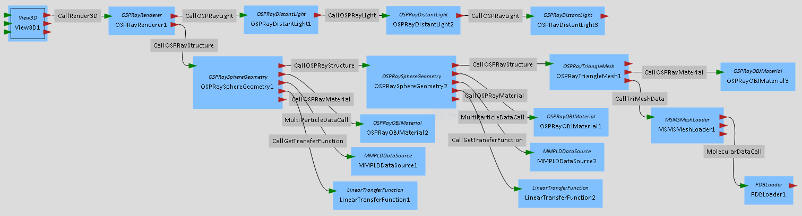

# OSPRay plugin
[OSPRay](http://ospray.org) is a CPU ray tracing engine and is one project of the Software Defined Disualization (SDVis) open source initiative of Intel (http://sdvis.org/).
It builds on top of the high-performance ray tracing kernels of [Embree](https://embree.github.io/) and the [ISPC](https://ispc.github.io/) SPMD compiler.

In this plugin, most of the functionality of OSPRay is covered and can be used via MegaMol modules and MegaMol calls.
This plugin supports the chain paradigm that allows lights and structures to be stacked arbitrarily.
The figure below shows a common OSPRay module graph in MegaMol.

## Building
[OSPRay](http://ospray.org) is not included in this package, however it is required for this plugin to build.

Step 1: Get and build OSPRay. Follow the instructions on the OSPRay website (http://ospray.org) or the OSPRay GitHub page (https://github.com/ospray/ospray). Make sure `OSPRAY_INSTALL_DEPENDENCIES` is enabled, otherwise Embree and TBB DLLs will not be installed and unavailable for the plugin.

Step 2: Make sure you enable the plugin in CMake. Either use `-DBUILD_OSPRAY_PLUGIN` as configuration argument or use the graphical user interface `ccmake`.

If OSPRay is not automatically found set the appropriate `ospray_DIR`. Hint: The CMake configuration files of OSPRay are usually found in a subdirectory of the `lib` install directory.

## Modules

As seen in the figure above, the OSPRay plugin has three different kinds of modules: `OSPRayStructure`, `OSPRayLight`, and  `OSPRayMaterial`.
While these three modules are processing the actual data and several parameters, main module of this plugin is the `OSPRayRenderer` that communicats to OSPRay via its API.
