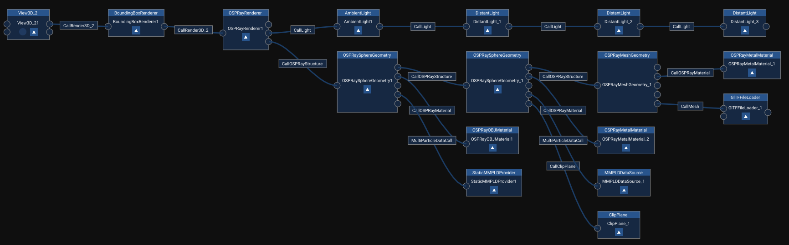

# MegaMol Plugin: OSPRay

[OSPRay](http://ospray.org) is a CPU ray tracing engine and is one project of the Software Defined Visualization (SDVis) open source initiative of Intel (http://sdvis.org/).
It builds on top of the high-performance ray tracing kernels of [Embree](https://embree.github.io/) and the [ISPC](https://ispc.github.io/) SPMD compiler.

In this plugin, most of the functionality of OSPRay is covered and can be used via MegaMol modules and MegaMol calls.
This plugin supports the chain paradigm that allows lights and structures to be stacked arbitrarily.
The figure below shows a common OSPRay module call graph in MegaMol.

## Building

[OSPRay](http://ospray.org) is not included in this package, however it is required for this plugin to be build.
The currently supported OSPRay versions are **2.4** and **2.5**.
In order to get all dependencies installed at once, we strongly recommend to build [OSPRay](https://www.ospray.org/downloads.html) following the **CMake Superbuild** instructions.
The current dependencies are: [rekcommon](https://github.com/ospray/rkcommon), [openvkl](https://www.openvkl.org/), [ISPC](https://ispc.github.io/), [TBB](https://www.threadingbuildingblocks.org/) ([oneTBB](https://github.com/oneapi-src/oneTBB)), and [Embree](https://embree.github.io/).
*Installing the precompiled binaries is not sufficient!*

- Step 1: **OSPRay:** 
    - Download the source code to a new folder `git clone https://github.com/ospray/ospray.git ospray` and configure OSPRay with CMake using the CMake file located in `../scripts/superbuild`. 
    - In order to speed up the build process, uncheck the option `BUILD_EMBREE_FROM_SOURCE` since the binary version of Embree is sufficient. 
    - Build OSPRay following further instructions for the CMake Superbuild.

- Step 2: **MegaMol:** 
    - Make sure you enable the plugin in CMake by checking the option `BUILD_OSPRAY_PLUGIN_PLUGIN`.
    Either use `-DBUILD_OSPRAY_PLUGIN_PLUGIN` as configuration argument or use the graphical user interface `ccmake`.
    - If OSPRay is not automatically found during configuration of MegaMol, set the appropriate `ospray_DIR`.  
    *Hint:* The CMake configuration files of OSPRay are usually found in a subdirectory of the install directory: `../build/install/ospray/lib/cmake/...`
    - CMake subsequently asks for the build files of the following dependencies:
        - rkcommon: `../build/install/rkcommon/lib/cmake/...`
        - TBB root directory: `../build/install/tbb`
    - Build and install MegaMol. 
    - In order to test OSPRay, start MegaMol using the example project file `..build/install/examples/testspheres_ospray_megamol.lua`.  
    *Note:* On Linux, you have to run MegaMol using the `megamol.sh` script in order to additionally set the required path to the shared libraries of OSPRay.

## Modules

As seen in the figure above, the OSPRay plugin has three different kinds of modules: `OSPRayStructure`, `OSPRayLight`, and  `OSPRayMaterial`.
While these three modules are processing the actual data and several parameters, main module of this plugin is the `OSPRayRenderer` that communicats to OSPRay via its API.
