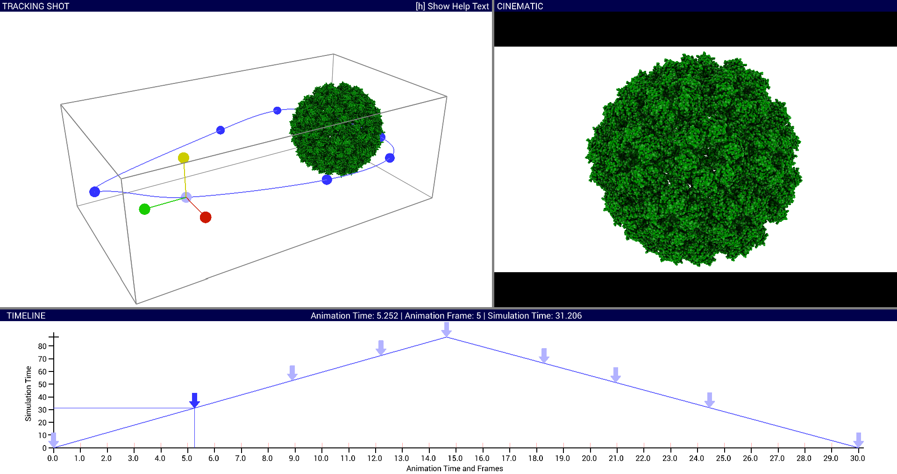
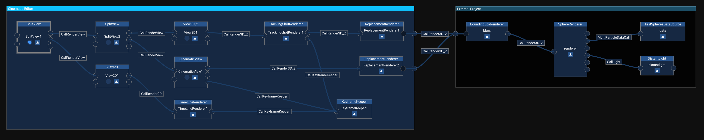

# MegaMol Plugin: "Cinematic"

This plugin allows the video rendering (separate file per frame) of any rendering output in MegaMol.
By defining fixed keyframes for desired camera positions and specific animation times, arbitrary tracking shots can be created.

--- 

## Module Descriptions
This plugin provides the modules `KeyframeKeeper`,  `TrackingShotRenderer`, `CinematicView`, `TimeLineRenderer` and `ReplacementRenderer`.

#### KeyframeKeeper:

This module maintains the keyframes and their properties centralised. 
The modules `TrackingShotRenderer`, `CinematicView` and `TimeLineRenderer` have to be connected with the same `KeyframeKeeper` (see module call graph below).

#### TrackingShotRenderer:

This module shows the spatial position of the defined keyframes and the resulting tracking shot. 
It allows the direct selection of keyframes by left mouse button. 
The position and direction of the camera parameters of a keyframe can be altered by drag & drop with left mouse button on shown manipulators.
There are two modes for showing differnt manipulators for a selected keyframe.

#### CinematicView:

This module provides the preview of the final view to be rendered.
Here a desired camera view can be chosen.
The desired view can be applied to an existing selected keyframe or a new keyframe.
By running the animation as preview one can audit the final view of the video.
The complete final video is defined by the resolution and the number of frames per second and can be rendered to png files.

#### TimeLineRenderer:

This module shows the temporal position of the keyframes on the animation time axis and the simulation time axis in an two-dimensional diagram.
The keyframes can be selected (left mouse button) or they can be shifted along the simulation or animation time axis per drag and drop (right mouse button).
The time axes can be zoomed (middle mouse button) and shifted (right mouse button) independently at the current mouse position.

#### ReplacementRenderer:

This module offers replacement rendering for models with performance too low for interactivly creating the tracking shot. 
Therefore only a coloured bounding box of the model is drawn.

--- 

## Parameters

The module `KeyframeKeeper` exposes the following parameters:
(The values in brackets indicate the default values.)

* `applyKeyframe` (Assigned key: `CTRL+a`): Apply current settings to selected or new keyframe.
* `undoChanges` (Assigned key: `CTRL+z`): Undo keyframe changes.
* `redoChanges` (Assigned key: `CTRL+y`): Redo keyframe changes.
* `deleteKeyframe` (Assigned key: `CTRL+d`): Deletes the currently selected keyframe.
* `maxAnimTime` (`1.0`): The total timespan of the animation.
* `snapAnimFrames` (Assigned key: `CTRL+f`): Snap animation time of all keyframes to fixed frames.
* `snapSimFrames` (Assigned key: `CTRL+g`): Snap simulation time of all keyframes to integer simulation frames.
* `linearizeSimTime` (Assigned key: `CTRL+t`): Linearize simulation time between two keyframes between currently selected keyframe and subsequently selected keyframe.
* `interpolTangent` (`0.5`): Length of keyframe tangets affecting curvature of interpolation spline.
* `editSelected::animTime` (`1.0`): Edit animation time of the selected keyframe.
* `editSelected::simTime` (`1.0`): Edit simulation time of the selected keyframe.
* `editSelected::positionVector`: Edit the position vector of the selected keyframe.
* `editSelected::lookAtVector`: Edit the 'look at' vector of the selected keyframe.
* `editSelected::resetLookAt` (Assigned key: `CTRL+l`): Reset the 'look at' vector of the selected keyframe to the center of the model boundng box.
* `editSelected::upVector`:  Edit up vector direction relative to 'look at' vector of the selected keyframe.
* `editSelected::apertureAngle`: Edit aperture angle of the selected keyframe.
* `storage::filename`:  The name of the file to load or save keyframes. 
* `storage::save` (Assigned key: `CTRL+s`): Save keyframes to file.
* `storage::load` (Assigned key: `CTRL+l`): Load keyframes from file.

The module `TrackingShotRenderer` exposes the following parameters:
(The values in brackets indicate the default values.)

* `splineSubdivision` (`20`): Amount of interpolation steps between keyframes.          
* `helpText` (Assigned key: `CTRL+h`): Show/hide help text for key assignments.
* `manipulators::toggleVisibleGroup` (Assigned key: `CTRL+q`): Toggle visibility of different manipulator groups.  
* `manipulators::visibleGroup`: Select visible manipulator group.  
* `manipulators::showOutsideBBox` (Assigned key: `CTRL+w`): Show manipulators always outside of model bounding box.

The module `CinematicView` exposes the following parameters:
(The values in brackets indicate the default values.)

* `cinematic::renderAnim` (Assigned key: `CTRL+r`): Toggle rendering of complete animation to png files.   
   Whenever rendering is begun a new folder holding the frame image files (png) is generated.
* `cinematic::playPreview` (Assigned key: `CTRL+space`): Toggle playing animation as preview.
* `cinematic::skyboxSide` (`NONE`): Select the skybox side.
* `cinematic::cubeMode` (`false`): Activate mode that renders the bounding box side selected with `skyboxSide`.
* `cinematic::cinematicWidth` (`1920`): The width resolution of the cinematic view to render.
* `cinematic::cinematicHeight`(`1080`): The height resolution of the cinematic view to render.
* `cinematic::fps` (`24`): The frames per second the animation should be rendered.
* `cinematic::firstRender` (`0`): Set first frame number to start rendering with.
* `cinematic::lastRender` (): Set last frame number to end rendering with.
* `cinematic::delayFirstFrame` (`10.0`): Delay (in seconds) to wait until first frame is ready and rendering to file is started.
* `cinematic::frameFolder` Specify folder where the frame files should be stored.
* `cinematic::addSBSideToName` (`false`): If true, adds the value of `skyboxSide` to the filename of the written image.
* `cinematic::stereo_eye` (`Left`) Eye position (for stereo view).
* `cinematic::stereo_projection` (`Mono Perspective`) Camera projection.

The module `TimeLineRenderer` exposes the following parameters:
(The values in brackets indicate the default values.)

* `gotoRightFrame` (Assigned key: `right arrow`): Move to right animation time frame.
* `gotoLeftFrame` (Assigned key: `left arrow`): Move to left animation time frame.
* `resetAxes` (Assigned key: `CTRL+x`): Reset all shifted and scaled time axes.

The module `ReplacementRenderer` exposes the following parameters:
(The values in brackets indicate the default values.)

* `alpha` (`0.75`): The alpha value of the replacement rendering.
* `hotkeyAssignment` (` `): Choose hotkey for replacement rendering button `toggleReplacement`.
* `toggleReplacement` (Assigned key: ` `): Toggle replacement rendering. Hotkey can be chosen from list offered by `hotkeyAssignment` parameter. 
* `replacement` (`false`): Show/hide replacement rendering for chained renderer (coloured bounding box).

---

## How to use the modules

The modules should be connected as shown in the module call graph below. 
The yellow-tagged renderer module and the data source module can be replaced by any other suitable modules. 
Note: The renderer module has to be connected to the `TrackingShotRenderer` as well as to the `CinematicView`.
For simplification the preferred way of adding the cinematic graph to a new project is to use the predefined cinematic module call graph via the `examples/cinematic/cinematic_editor.lua` project (see example below).

### Example

In order to run the example change to the `bin` folder of the megamol executables in a shell and start the program with the following command:
*Under Windows:* `.\mmconsole.exe -p ../examples/cinematic/cinematic_editor.lua`   
*Under Linux:* `./megamol.sh -p ../examples/cinematic/cinematic_editor.lua`

#### How it works
In the `cinematic_editor.lua` project file the testsphere project `examples/testsphere.lua` is automatically appended to the cinematic module graph (see yellow modules in graph above). 
Additionally the corresponding keyframe file for the testsphere project `examples/cinematic/cinematic_keyframes.kf` is loaded. 
Any other `lua` project file can be included by changing the appropriate line in `cinematic_editor.lua`. 
The keyframe file can be set to the empty string for the initial loading of a new project and can be set to a newly created keyframe file later.
