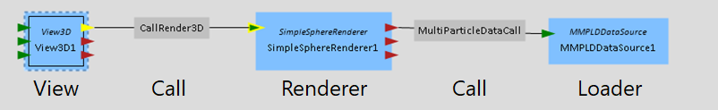
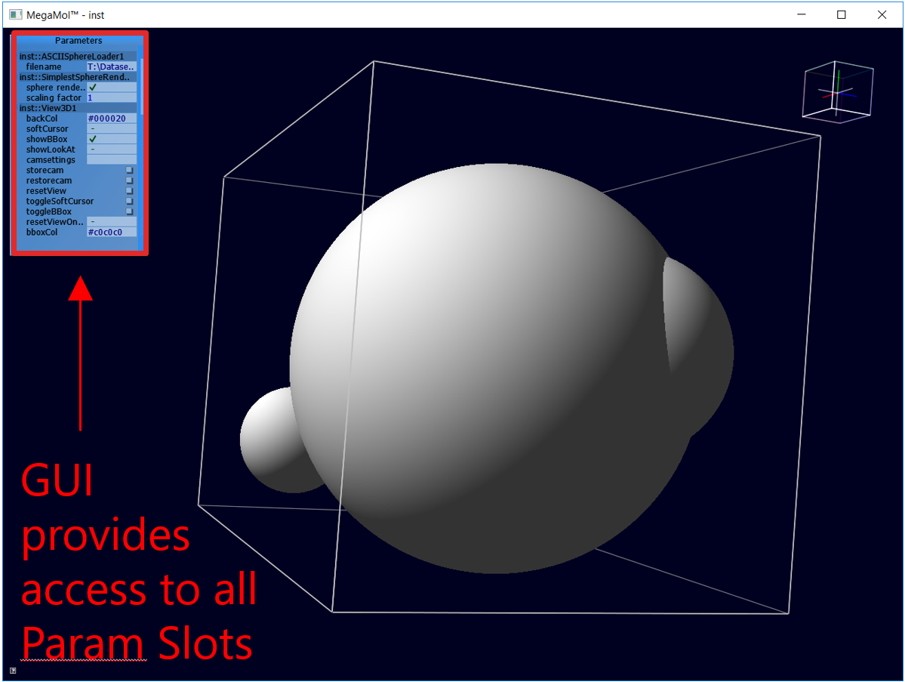
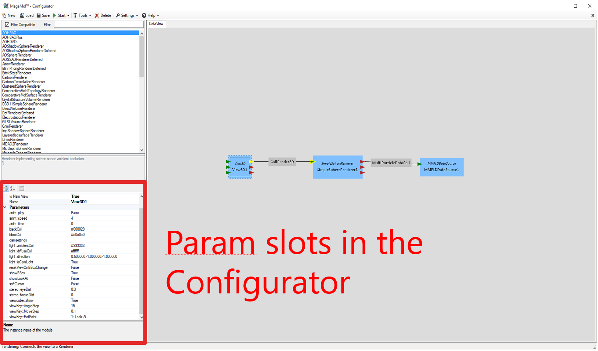
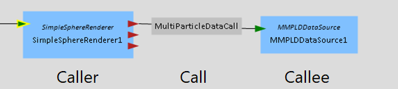
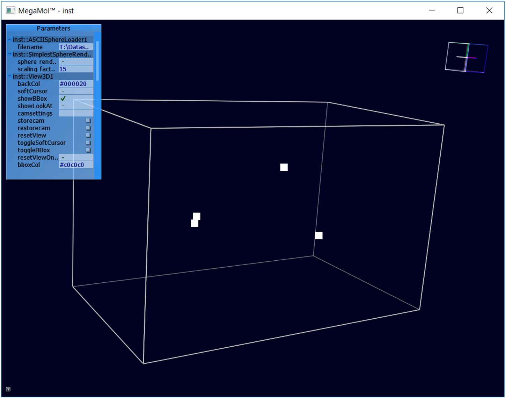
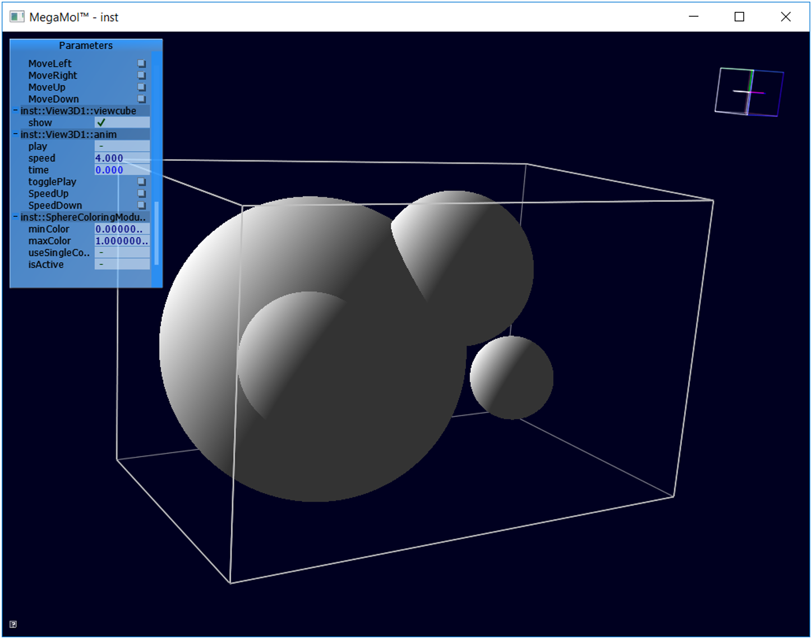
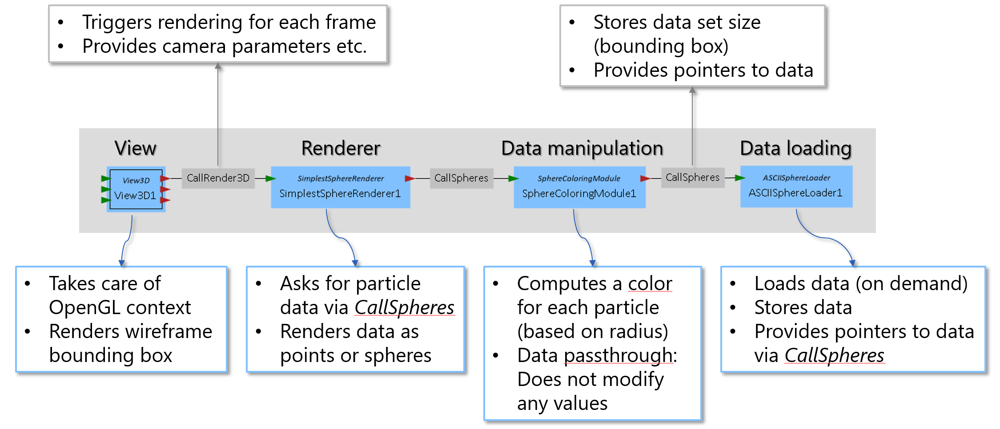

## megamol101
The megamol101 plugin provides provides some basic examples how to write your own MegaMol modules.

### Content

1. [Design Principles](#design-principles)
2. [Modules](#modules)
3. [Data Loading Example](#data-loading-example)
   1. [Parameter Slots](#parameter-slots)
   2. [Data Loading](#data-loading)
   3. [Module Connection](#module-connection)
4. [Calls](#calls)
5. [Renderer](#renderer)
6. [Data Manipulation](#data-manipulation)
7. [Building this Plugin](#building-this-plugin)
8. [Summary](#summary)
9. [Example Data](#example-data)

---

## Design Principles

MegaMol is mainly designed to be a rapid prototyping tool for new visualization algorithms

* Thin abstraction layer above OpenGL

* Collection of helper functions for fast software development

* Collection of re-usable components (Modules) and interfaces (Calls)

* Guidelines that make software development easier/more structured

A minimal MegaMol program usually consists of **loader**, a **renderer** and a **view**



* Loaders read and store data

* The data remains in the loader

  * No local copies of the data for each module

  * Calls pass pointers/references to the data to other modules

    :arrow_forward:*zero copy paradigm* (no memore overhead, no copy overhead)

* Ideally, the data is stored in memory so that it can be rendered with zero overhead

  * GPU/OpenGL-friendly data structures
  * Data loaded from disk has (potentially) to be converted


## Modules

* The Loader and the Renderer are Modules

* A Module is derived form the base class ``megamol::core::Module`` which has (at least to provide)

  * A unique name for the class (text string)

  * A human-readable description (text string)

  * The availability (bool)

    * Can be conditional, i. e. tests whether all requirements are met

  * create/release routines (similar to constructor/destructor)

    :arrow_forward: Higher-level Modules might require additional routines

The ``ASCIISphereLoader`` is an example for a data loader module. A header of such a module class typically looks like this, including the previously mentioned methods:

```cpp
class ASCIISphereLoader : public core::Module {
public:

    // Constructor
    ASCIISphereLoader();

    // Destructor
    virtual ~ASCIISphereLoader();

    // Returns the name of the module. Has to be unique!
    static const char *ClassName() {
        return "ASCIISphereLoader";
    }

    // Returns a human-readable description of the module.
    static const char *Description() {
        return "Loads sphere data from a csv file that contains one sphere per line.";
    }

    // Answers whether this module is available on the current system, returns 'true' if the module is available, 'false' otherwise.
    static bool IsAvailable() {
        return true;
    }

private:

    // Implementation of 'Create' (called after constructor, loads shaders etc.) ‚ returns 'true' on success, 'false' otherwise.
    virtual bool create();

    // Implementation of 'Release'. Should free all the memory used by member variables (called by destructor).
    virtual void release();

    [...]
};
```


## Data Loading Example

Example code can be found in ``src/ASCIISphereLoader.h`` and `src/ASCIISphereLoader.cpp`. The given example loads a csv file format:

* Four floating point values per line, seperated by `,`
* Comments have to start with a `#`
  * Can be at the end of a line...
  * ... or in their own line

* All other lines get ignored (but will potentially throw error/warning messages)

An example for valid and invalid lines is shown in the following:

:white_check_mark: `# this is a comment`

:white_check_mark: `1.0, 5.0, 2.5, 3.75`

:white_check_mark: `4.2, 1.8, 2.0, 0.4 # some information`

:x: `4.5, 2.3, 1.0 #text`

All valid lines containing values are interpreted as spheres. The have one three-dimensional position and a radius. The value order is x, y, z, r. 

To load the data, several steps are necessary:

    1. Read an input filename from the GUI
    2. Read the data from the now known file from disk
    3. Pass the read data to other Modules

For the first step we need a mechanism to read input from the GUI or config files. We call this mechanism a parameter slot

### Parameter Slots

Parameter Slots are responsible for passing data from the user to the application. This either happens at startup via the Configurator or at runtime using again the Configurator or the GUI.

* To use parameter slots, use ``#include "mmcore/param/ParamSlot.h"``
* Parameter Slots have to be initialized in the initializer list in the Module's constructor.

Example:

 From ``src/ASCIISphereLoader.h``:

```cpp
core::param::ParamSlot filenameSlot;
```

From ``src/ASCIISphereLoader.cpp``:

```cpp
ASCIISphereLoader::ASCIISphereLoader() : core::Module(),
    filenameSlot("filename", "The path to the file that contains the data") {
        
    //…
    this->filenameSlot.SetParameter(new core::param::FilePathParam(""));
    this->MakeSlotAvailable(&this->filenameSlot);
    //…
}
```

Besides the shown ``FilePathParam`` many other parameter types are possible:

* Boolean values (true, false) (``BoolParam``)
* Scalar values (``FloatParam``, ``IntParam``)
* Vectors (``Vector2fParam``, ``Vector3fParam``, ``Vector4fparam``)
* Text strings (``StringParam``)
* Buttons (``ButtonParam``)
* And some others ...

Every possible parameter type has its own include file. Initial values have to be set via ``.SetParameter(...)`` . The parameters only appear in the Graphical User Interface as well as in the Configurator when ``this->MakeSlotAvailable(...)`` is called for the ParamSlot.

In the following, we give a short guidance where the parameter slots can be found: 



### Data Loading

Since we are now able to transfer user input to the application, the data can be loaded. How this is done depends on the developer's preference.  The developer has to make sure that the loaded data is stored until it is no longer needed by any other module.

* Loader Modules usually provide a hash value (64 bit Integer)
  * Hash value of zero usually means that nothing has happened yet
  * Hash only changes if the data has changed

If something goes wrong during the loading process, the logging class ``vislib/sys/Log.h`` may be helpful to notify the user.

A high-level view of the data loading process may then look like this:

From ``src/ASCIISphereLoader.cpp``:

```cpp
if (this->filenameSlot.IsDirty()) {
    this->filenameSlot.ResetDirty();
    this->spheres.clear(); // std::vector<float>
    this->bbox.Set(-1.0f, -1.0f, -1.0f, 1.0f, 1.0f, 1.0f);
    bool retval = false;

    try {
        // load the data from file
        retval = this->load(this->filenameSlot
                  .Param<core::param::FilePathParam>()->Value());
    } catch (vislib::Exception ex) {
        // a known vislib exception was raised
        vislib::sys::Log::DefaultLog.WriteMsg(vislib::sys::Log::LEVEL_ERROR,
            "Unexpected exception: %s at (%s, %d)\n", ex.GetMsgA(), ex.GetFile(),                    ex.GetLine());
        retval = false;
    } catch (...) {
        // an unknown exception was raised
        vislib::sys::Log::DefaultLog.WriteMsg(vislib::sys::Log::LEVEL_ERROR,
            "Unexpected exception: unkown exception\n");
        retval = false;
    }
    this->datahash++;
}
```

At first, it is checked whether the user changed the file name. If yes, the loading is started. After the loading process, the data hash is incremented to reflect a change in the data. The above example also shows how the exception handling and logging features can be used. For the following, we assume that the method ``this->load(...)`` performs the actual loading of the file and writes all data to ``this->spheres``.

After the data is loaded, it can be transferred to other modules via Caller Slots and Callee Slots.


### Module Connection

The address of the loaded data has to be passed to other modules via Calls. These are connected via Caller Slots / Callee Slots. In the configurator these are depicted via red and green arrows:



For each Callee slot, the hosting Module can provide callback functions. The following code links the right side of the Call to the CalleeSlot in the data loader ``ASCIISphereLoader``:

```cpp
ASCIISphereLoader::ASCIISphereLoader(): core::Module(),
    getDataSlot("getdata", "The slot publishing the loaded data") {

    this->getDataSlot.SetCallback(CallSpheres::ClassName(), "GetData",                                                   &ASCIISphereLoader::getDataCallback);
    this->getDataSlot.SetCallback(CallSpheres::ClassName(), "GetExtent",
                                  &ASCIISphereLoader::getExtentCallback);
    this->MakeSlotAvailable(&this->getDataSlot);

    [...]
}

```

This example exposes the two functions ``GetData`` and ``GetExtent``. These are linked to the local function callbacks ``ASCIISphereLoader::getDataCallback`` and ``ASCIISphereLoader::getExtentCallback``. Each call is executed with a specific intent. When ``GetExtent`` is called, the module on the other side of the call wants to know the bounding box and other metadata.  ``GetData`` on the other hand requests the actual read data. ``GetData`` and ``GetExtent`` are the typical intents that are available for most modules.


Once the right side of the call is handled in code, we have to have a look at the left side: the Renderer. This module requests data via the call and therefore provides a CallerSlot. In the ``SimplestSphereRenderer`` this looks like the following:

```cpp
SimplestSphereRenderer::SimplestSphereRenderer(): core::view::Renderer3DModule(),
    sphereDataSlot("inData", "The input data slot for sphere data.") {

    this->sphereDataSlot.SetCompatibleCall<CallSpheresDescription>();
    this->MakeSlotAvailable(&this->sphereDataSlot);
}
```

Once the call is connected, the callback functions are called the following way:

```cpp
CallSpheres* cs = this->sphereDataSlot.CallAs<CallSpheres>();
if((*cs)(1)) { /** do something */ }
if((*cs)(0)) { /** do something */ }
```

This kind of calling poses one problem: the programmer needs to memorize/look up the number of the intent/callback function. Therefore, one should provide named constants:

```cpp
if((*cs)(CallSpheres::CallForGetExtent)) { /** do something */ }
if((*cs)(CallSpehres::CallForGetData)) { /** do something */ }
```

Now, since we are able to connect both sides of the Call, we will have a look at the Call itself.


## Calls

An example for a call is given in ``src/CallSpheres.cpp`` and ``src/CallSpheres.h``. Calls provided an abstraction for the data transfer between modules. As stated earlier, this follows a zero copy paradigm. This means, that only pointers to already existing data are transferred.

* Calls are derived from one of several abstract Call classes.
* Calls have to provide two additional functions
  1. ``FunctionCount() // returns the number of available callback functions``
  2. ``FunctionName(unsigned int idx) // returns the names of the callbacks``

It is typically a good idea to override the assignment operator, especially if you plan to implement data manipulation modules in the future.  In ``src/CallSpheres.h`` the abovementioned functions look like this (the comments show the content of the functions below):

```cpp
static unsigned int FunctionCount() {
    // return 2
    return core::AbstractGetData3DCall::FunctionCount();
}

static const char * FunctionName(unsigned int idx) {
    //switch (idx) {
    //    case 0: return "GetData";
    //    case 1: return "GetExtent";
    //}
    return core::AbstractGetData3DCall::FunctionName(idx);
}
```

Additionally, each Call should have a description typedef outside of the class definition. For ``CallSpheres`` it looks like this:

```cpp
typedef megamol::core::factories::CallAutoDescription<CallSpheres> CallSpheresDescription;
```

The rest of the call consists mainly of getter and setter functions for the transported data.


## Renderer

The main visualization modules are the Renderers. In our example, this is represented by ```src/SimplestSphereRenderer.h``` and ``src/SimplestSphereRenderer.cpp``. Renderers receive the rendered data through a Call. They are controlled by a View Module using a special Call.

Renderes should provide two specific callbacks

* ``GetExtents(...)``
  * Reports the size of the rendered data set to the View
* ``GetCapabilities(...)`` 
  * Reports the capabilities of the Renderer to the View
  * Is the Renderer able to light a scene or to animate it?

The ``GetExtents`` method of the ``SimplestSphereRenderer`` then looks like this:

```cpp
bool SimplestSphereRenderer::GetExtents(core::Call& call) {
    core::view::CallRender3D *cr3d = dynamic_cast<core::view::CallRender3D*>(&call);
    if (cr3d == nullptr) return false;

    CallSpheres *cs = this->sphereDataSlot.CallAs<CallSpheres>();
    if (cs == nullptr) return false;
    if (!(*cs)(CallSpheres::CallForGetExtent)) return false;

    float scale;
    if (!vislib::math::IsEqual(cs->AccessBoundingBoxes()
                                           .ObjectSpaceBBox().LongestEdge(), 0.0f)) {
        scale = 10.0f / cs->AccessBoundingBoxes().ObjectSpaceBBox().LongestEdge();
    } else {
        scale = 1.0f;
    }

    cr3d->AccessBoundingBoxes() = cs->AccessBoundingBoxes();
    cr3d->AccessBoundingBoxes().MakeScaledWorld(scale);
    cr3d->SetTimeFramesCount(cs->FrameCount());

    return true;
}
```

The method requests the bounding box from the data loader and transfers this information to the View. During this process, the data is rescaled to a bounding box with edge length 10. This rescaling process happens in a lot of other modules. However, we plan to remove the necessity of the rescaling in the future.

The ``GetCapabilites`` method of the ``SimplestSphereRenderer`` looks like this:

```cpp
bool SimplestSphereRenderer::GetCapabilities(core::Call& call) {
    core::view::CallRender3D *cr3d = dynamic_cast<core::view::CallRender3D*>(&call);
    if (cr3d == nullptr) return false;

    cr3d->SetCapabilities(core::view::CallRender3D::CAP_RENDER
                | core::view::CallRender3D::CAP_LIGHTING
                | core::view::CallRender3D::CAP_ANIMATION);

    return true;
}
```

This method simply tells the connected View that the Renderer is able to render, light and animate the scene. Additional required methods of a Renderer are:

* ``create(...)``
  * Method usually used for shader loading and compilation
  * Several helper methods available via vislib
* ``release(...)``
  * Method used for deallocation of allocated resources
  * Gets called by teh destructor
* ``Render(...)``
  * The main part of the rendering happens here

As stated, most of the shader creation and compilation should happen in the create method. In our example this looks like the following, including error handling:

```cpp
auto const shader_options =
    core::utility::make_path_shader_options(frontend_resources.get<megamol::frontend_resources::RuntimeConfig>());

try {
    simpleShader = core::utility::make_glowl_shader("simplePoints", shader_options,
        "megamol101_gl/simple_points.vert.glsl", "megamol101_gl/simple_points.frag.glsl");
} catch (std::exception& e) {
    Log::DefaultLog.WriteError(("SimplestSphereRenderer: " + std::string(e.what())).c_str());
    return false;
}
```

TODO outdated use new shaderfactory:
~~GLSL shader programs can be stored in simple text files or so called ``.btf`` files. ``.btf`` files are XML-based and allow the programmer to stitch together parts of shader programs to create new ones. Via vislib, all kinds of possible shader pipelines are supported:~~

* ~~Vertex + Fragment Shader~~
* ~~Geometry Shader~~
* ~~Tessellation Shader~~
* ~~Compute Shader~~

~~The example in ``SimplestSphereRenderer`` uses a boolean Parameter Slot to switch between two different shader programs that are stored in ``Shaders/simplePoints.bft`` and ``Shaders/prettyPoints.btf`` respectively. Changing the slot value switches between the rendering of simple, unshaded points, or lit spheres:~~



The rendering code looks the same in both cases, only the used shader varies.


## Data Manipulation

You have the possibility to write Modules that just manipulate the incoming data. In our example, ``SphereColoringModule`` is such a Module. This module adds a colors to each read sphere, based on the radius. Since the main part of the data has not to be touched, most of the Module is written in a pass-through kind of manner:

From ``src/SphereColoringModule.cpp``:

```cpp
bool SphereColoringModule::getExtentCallback(core::Call& call) {
    CallSpheres* csOut = dynamic_cast<CallSpheres*>(&call);
    if (csOut == nullptr) return false;

    CallSpheres* csIn = this->inSlot.CallAs<CallSpheres>();
    if (csIn == nullptr) return false;

    if (!(*csIn)(CallSpheres::CallForGetExtent)) return false;

    bool slotsDirty = this->areSlotsDirty();
    if (lastHash != csIn->DataHash() || slotsDirty) {
        lastHash = csIn->DataHash();
        if (slotsDirty) hashOffset++;
        resetDirtySlots();
        isDirty = true;
    }

    csOut->operator=(*csIn); // deep copy
    csOut->SetDataHash(csOut->DataHash() + hashOffset);

    return true;
}
```

The code just copies the incoming Call from the right to the left. Additionally, it modifies the hash value. The ``GetData`` callback on the other hand adds colors to the call:

```cpp
bool SphereColoringModule::getDataCallback(core::Call& call) {
    CallSpheres* csOut = dynamic_cast<CallSpheres*>(&call);
    if (csOut == nullptr) return false;

    CallSpheres* csIn = this->inSlot.CallAs<CallSpheres>();
    if (csIn == nullptr) return false;

    if (!(*csIn)(CallSpheres::CallForGetData)) return false;

    csOut->operator=(*csIn); // deep copy

    if (isDirty) {
        modifyColors(csOut);
    }

    csOut->SetDataHash(csOut->DataHash() + hashOffset);

    return true;
}
```

The For details how the colors are added to the Call, please consider the provided files. 


## Summary

A summary of the whole pipeline provided by this plugin is shown in the following figure:




## Building this Plugin

This plugin is switched off by default. If you want to use the plugin, please turn it on during the CMAKE configuration process. This plugin has no additional dependencies


## Example Data

This plugin comes with example data. It can be found in the [example data repository](https://github.com/UniStuttgart-VISUS/megamol-examples). ``dataexample.csv`` is mainly there to test some of the warnings the ``ASCIISphereLoader`` is able to throw. ``1m40.csv`` is the csv-version of ``1M40`` which can be found in the ``sampledata`` folder in the repository.

