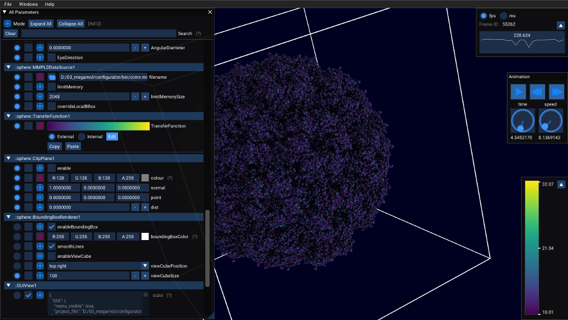
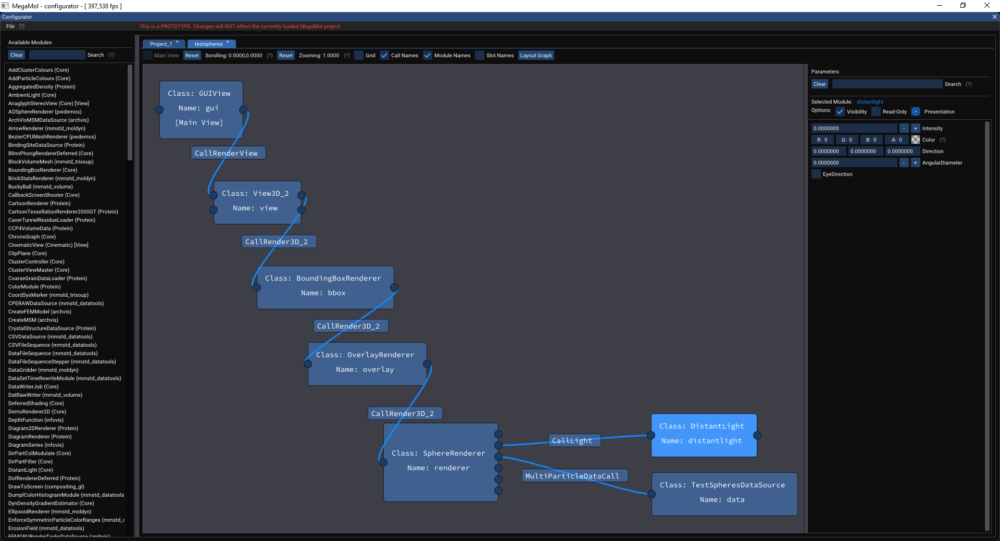
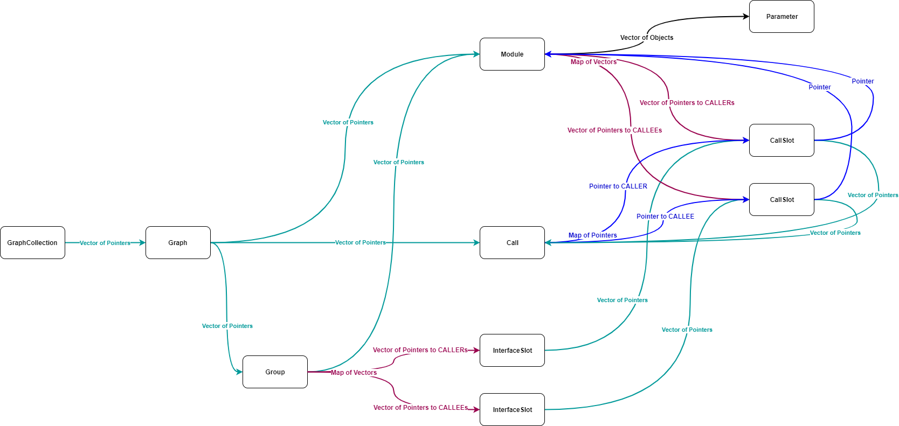
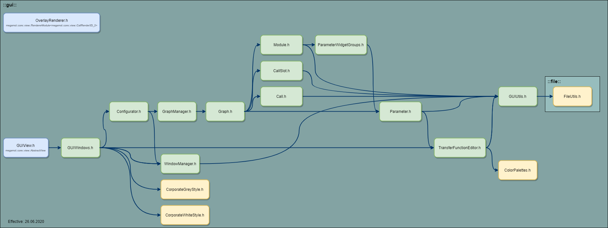

# MegaMol GUI Plugin

This is the plugin providing the GUI for MegaMol.



---

## Modules

### GUIView

The `GUIView` is a view module which implements a `megamol::core::view::AbstractView`. The `GUIView` provides the complete GUI for MegaMol. Use the `GUIView` module as the main view module of your MegaMol project. 

#### Menu

The menu of the main window of the `GUIView` provides the following options:
(Assigned hotkeys are given in brackets.)

* `File`
    * `Save Project` (`Ctrl + s`) Save the current project to a file (lua).
    * `Exit` (`Alt + F4`) End the program.
* `Windows` 
    * `Menu` (`F12`) Show/Hide the configurator window.
    * `All Parameters` (`(Shift +)* F11`) Show/Hide the main window.
    * `Performance Metrics` (`(Shift +)* F10`) Show/Hide the performance metrics window showing the fps or ms.
    * `Font Settings` (`(Shift +)* F9`) Show/Hide the font settings window.    
    * `Transfer Function Editor` (`(Shift +)* F8`)Show/Hide the transfer function editor.
    * `Configurator` (`(Shift +)* F7`) Show/Hide the configurator window.
* `Help`: Some information and links concerning the currently running MegaMol.

*Use `Shift` for resetting the window to fit the currrent viewport.

**NOTE**
* Hotkeys use the key mapping of the US keyboard layout. Other keyboard layouts are currently not considerd or recognised. Consider possible transposed `z` and `y` which are used in `undo` and `redo` hotkeys on text input.

#### Parameters

(The values in brackets indicate the default values.)

* `style` (`Dark Colors`): Color style, theme.
* `state` (` `): Current state of all windows. Automatically updated.

---

### OverlayRenderer

The `OverlayRenderer` is a rendering module which implements a `megamol::core::view::RendererModule<megamol::core::view::CallRender3D_2>`. The `OverlayRenderer` provides overlay rendering like textures, text, parameter values and transport control icons. Prepend the `OverlayRenderer` module any other existing 3D renderer module you want to have an overlay for. 

#### Parameters

(The values in brackets indicate the default values.)

* `mode` (`Texture`): Overlay mode.
* `anchor` (`Left Top`): Anchor of overlay.
* `position_offset` (`0.0`): Custom relative position offset in respect to selected anchor.
* `texture::file_name` (` `): The file name of the texture.
* `texture::relative_width` (`25.0`): Relative screen space width of texture.
* `transport_ctrl::color` (`0.5f, 0.75f, 0.75f`): Color of transpctrl icons.
* `transport_ctrl::duration` (`3.0`): Duration transport ctrl icons are shown after value changes. Value of zero means showing transport ctrl icons permanently.
* `transport_ctrl::fast_speed` (`5.0`): Define factor of default speed for fast transport ctrl icon threshold.
* `transport_ctrl::value_scaling` (`10.0`): Define factor of default speed for ultra fast transport ctrl icon threshold.
* `transport_ctrl::speed_parameter_name` (` `): The full parameter name for the animation speed, e.g. *::Project_1::View3D_21::anim::speed*.
* `transport_ctrl::time_parameter_name` (` `): The full parameter name for the animation time, e.g. *::Project_1::View3D_21::anim::time*.
* `parameter::prefix` (` `): The parameter value prefix.
* `parameter::sufix` (` `): The parameter value sufix.
* `parameter::name` (` `): The full parameter name, e.g. *::Project_1::View3D_21::cam::position*. Supported parameter types: float, int, Vector2f/3f/4f.
* `label::text` (` `): The displayed text.
* `font::name` (`Roboto Sans`): The font name.
* `font::size` (`20.0`): The font size.
* `font::color` (`0.5f, 0.5f, 0.5f`): The font color.

---

## Configurator

The configurator is part of the GUI and can be opened via the GUI menu: `Windows`/`Configurator`.\
**Any changes applied in the configurator will not affect the currently loaded MegaMol project.**\
In order to start the configurator automatically, you can use the project  `/examples/configurator.lua`.

        mmCreateView("configurator","GUIView","::gui")
        mmSetParamValue("::gui::autostart_configurator",[=[true]=])
        
See bug and feature tracker [#539](https://github.com/UniStuttgart-VISUS/megamol/issues/539) for current work in progress.

**NOTE**
* In order to create a vaild project file which can be loaded successfully afterwards, it is necessary to define one view module as `main view`. A `main view` defines the entry point of the project.
* Parameter values in the lua command `mmSetParamValue` must have the value enclosed in `[=[`and `]=]` delimiters. String delimiters `"` for parameter values are not supported any more.



#### Main Menu

* `File`
    * `Load` 
        * `New` Load new empty project containing only a `GUIView` as starting point.
        * `File` Load existing project from a file.
        * `Running` Load currently running project.
    * `Add` 
        * `File` Add existing project from a file to currently selected project.
        * `Running` Add currently running project to currently selected project.
    * `Save Project` (`Ctrl + Shift + s`) Save the project of the currently selected tab to a file (lua).
* `View`
    * `Modules Sidebar`  Show/Hide sidebar with module stock list.
    * `Parameter Sidebar` Show/Hide sidebar with parameters of currently selected module.
* `Help` Link to this Readme.

#### Project Menu

* `Main View` Change main view state of currently selected view module.
* `Reset Scrolling` Reset scrolling.
* `Reset Zooming` Reset zooming.
* `Grid` Show/Hide grid.
* `Call Names`Show/Hide call names.
* `Module Names` Show/Hide module names and other decoration.
* `Slot Names` Show/Hide slot names.
* `Layout Graph` Simple layouting of project graph.

#### *Module Stock List* Sidebar

* Search for Module (`Ctrl + Shift + m`)
* Add Module from Stock List to Graph
    * `Double Left Click` on Module in Stock List
    * `Right Click` on Module in Stock List - Context Menu: Add
    
#### *Module Parameters* Sidebar

* Search for Parameter (`Ctrl + Shift + p`)
        
#### Project Graph

* Call Creation
    * Drag and Drop from Call Slot to other highlighted compatible Call Slot.
* Add Call Slot to existing Interface Slot
    * Drag and Drop from Call Slot to other highlighted compatible Interface Slot. 
* Spawn *Module Stock List* in pop-up window at mouse position.
    * `Ctrl + Shift + m`
    * `Double Left Click`    
* Sidebar Splitter Collapsing/Expansion
    * `Double Right Click` on Splitter
* Graph Zooming
    * `Mouse Wheel`
* Graph Scrolling
    * `Middle Mouse Button`
* Multiple Selection of Modules
    * Drag & Drop with `Left Mouse Button` (start outside of any module). Each module partially overlapped by the frame will be selected.
    * Hold `Shift` + `Left Click` on modules you additionally want to select/deselect to/from current selection.
* `Module`
    * Main View `Radio Button`: Toggle main view flag (only available for view modules).
    * Parameter `Arrow Button`: Show/Hide *Module Parameters* in small window sticked to module.
    * Context Menu (`Right Click`)
        * Delete (Alternative: Select with `Left Click` an press `Delete`)
        * Layout (Only available when multiple modules are selected)
        * Rename
        * Add to Group
            * New
            * *Select from list of existing groups*
        * Remove from Group
* `Call`
    * Context Menu (`Right Click`)
        * Delete (Alternative: Select with `Left Click` an press `Delete`)
* Call `Slot` 
    * `Double Left Click` Show *Module Stock List* in pop-up window.
    * Context Menu (`Right Click`)    
        * Create new Interface Slot
        * Remove from Interface Slot
* `Group`(-Header)
    * `Double Left Click` Toggle between expanded and collapsed view.
    * Context Menu (`Right Click`)
        * Collapse View / Expand View
        * Layout 
        * Rename      
        * Delete (Alternative: Select with `Left Click` an press `Delete`)
* Drop File to Load/Add Project
    * Drag file in a file browser and drop it inside the MegaMol window. The configurator windows must be open and focused.\
        **NOTE** 
        * Successfully testet using Windows10 and (X)Ubuntu with "Nautilus" file browser as drag source of the files. Failed using (X)Ubuntu with "Thunar" file browser. File drop is currently unimplemented in glfw for "Wayland" (e.g. Fedora).

#### Module Groups

Modules can be bundled in groups. 
This allows a minimized (collapsed) view of large module groups inside the configurator. 
Grouped modules can be reused when stored separately. 
Module groups can be added to any other projects.
Module groups are stored in project files using the already available module namespace (which is currently unused in the core). 

#### Group Interface Slots

Call slots of modules, which are part of a group, can be added to the group interface. 
This generates new interface slot which allow outgoing calls. 
Interface slots are automatically genereated if required.
Additionally call slots can be added to the groups interface via the context menu of the call slots.
Caller interaface slots (on the right side of a group) allow the bundling of more than one connection to the same callee slot of another module. 
Add a call slot to an existing interface slot via drag and drop (compatible call slots are highlighted if an interface slot is hoverd).
Callee interface slots (on the left side of a group) allow only one connected call slot.
Interface slots are stored in project files as part of the configurators state parameter.                       

---

## Developers

### New Parameter Widgets

Parameter widgets can be defined for the `local` or the `global` scope. The widgets of the local scope are shown inside the parameter list in the `All Parameters` window. The global scope of a parameter widget can contain arbitrary ImGui code.
There are widgets for the basic parameter types defined in `gui/src/graph/Parameter.h`and there are group widgets bundling parameters of the same namespace in `gui/src/graph/ParameterGroups.h`. The parameters namespace is a prefix in the parameters, name delimited with `::`. The presentation of a parameter (group) can be changed by switching to `expert` mode in the `All Parameters` window an clicking on the 'circle button'.

#### How to add a new parameter widget

In order to add a new custom widget for a basic parameter type, the following steps are required:

* Add a new `Presentation` to `core/include/mmcore/param/AbstractParamPresentation.h` and add a human readable name to the `presentation_name_map` in the ctor.
* Add the new `Presentation` to the `compatible` presentation of a specific `ParamType` in `AbstractParamPresentation::InitPresentation()`.
* Add a new function implementing the new widget in `local` and/or `global` scope to the class `ParameterPresentation` of the pattern `widget_<NEW_WIDGET_NAME>(...)`.
    This function must return true if the parameters value has been modified!
* Register this new function in the parameter type map in `ParameterPresentation::present_parameter()` for the respective parameter type(s) - for details see existing code.

#### How to add a new parameter group widget

In order to add a new custom widget for a group of parameters sharing the same namespace within a module, the following steps are required:

* Add a new `ParamType` for new widget group in `core/include/mmcore/param/AbstractParamPresentation.h`.
* Add a new `Presentation` for new widget group in `core/include/mmcore/param/AbstractParamPresentation.h` and add a human readable name to the `presentation_name_map` in the ctor.
* Add a new case for the `ParamType`  in `AbstractParamPresentation::InitPresentation()` and add the new `Presentation` to its `compatible` presentation.
* Add a new function implementing the new group widget in `local` and/or `global` scope to the class `ParameterGroups`. The function must have the following signature:
    `void group_widget_<NEW_WIDGET_NAME>(ParamPtrVectorType& params, param::AbstractParamPresentation::Presentation presentation)`
* Add a new group widget data set of the type `GroupWidgetData` in the ctor and register above function as callback. 
* (WIP: Identification of parameter widget groups. Currently by name of namespace and number of parameter types of group.)

#### Default gui state 

```lua
mmSetParamValue("::gui::state",[=[{
  "GUI": {
    "menu_visible": true,
    "project_file": ""
  },
  "Parameters": {
    "::gui::autostart_configurator": {
      "gui_presentation_mode": 2,
      "gui_read-only": false,
      "gui_visibility": true
    },
    "::gui::configurator::state": {
      "gui_presentation_mode": 2,
      "gui_read-only": true,
      "gui_visibility": false
    },
    "::gui::state": {
      "gui_presentation_mode": 2,
      "gui_read-only": true,
      "gui_visibility": false
    },
    "::gui::style": {
      "gui_presentation_mode": 2,
      "gui_read-only": false,
      "gui_visibility": true
    }
  },
  "WindowConfigurations": {
    "All Parameters": {
      "font_name": "",
      "ms_max_history_count": 20,
      "ms_mode": 0,
      "ms_refresh_rate": 2.0,
      "ms_show_options": false,
      "param_extended_mode": false,
      "param_module_filter": 0,
      "param_modules_list": [],
      "param_show_hotkeys": false,
      "tfe_active_param": "",
      "tfe_view_minimized": false,
      "tfe_view_vertical": false,
      "win_callback": 1,
      "win_flags": 40,
      "win_hotkey": [
        300,
        0
      ],
      "win_position": [
        0.0,
        18.0
      ],
      "win_reset_position": [
        0.0,
        0.0
      ],
      "win_reset_size": [
        400.0,
        600.0
      ],
      "win_show": true,
      "win_size": [
        400.0,
        600.0
      ],
      "win_soft_reset": false
    },
    "Configurator": {
      "font_name": "",
      "ms_max_history_count": 20,
      "ms_mode": 0,
      "ms_refresh_rate": 2.0,
      "ms_show_options": false,
      "param_extended_mode": false,
      "param_module_filter": 0,
      "param_modules_list": [],
      "param_show_hotkeys": false,
      "tfe_active_param": "",
      "tfe_view_minimized": false,
      "tfe_view_vertical": false,
      "win_callback": 6,
      "win_flags": 1064,
      "win_hotkey": [
        296,
        0
      ],
      "win_position": [
        0.0,
        0.0
      ],
      "win_reset_position": [
        0.0,
        0.0
      ],
      "win_reset_size": [
        800.0,
        600.0
      ],
      "win_show": false,
      "win_size": [
        800.0,
        600.0
      ],
      "win_soft_reset": true
    },
    "Font Settings": {
      "font_name": "",
      "ms_max_history_count": 20,
      "ms_mode": 0,
      "ms_refresh_rate": 2.0,
      "ms_show_options": false,
      "param_extended_mode": false,
      "param_module_filter": 0,
      "param_modules_list": [],
      "param_show_hotkeys": false,
      "tfe_active_param": "",
      "tfe_view_minimized": false,
      "tfe_view_vertical": false,
      "win_callback": 4,
      "win_flags": 96,
      "win_hotkey": [
        298,
        0
      ],
      "win_position": [
        0.0,
        0.0
      ],
      "win_reset_position": [
        0.0,
        0.0
      ],
      "win_reset_size": [
        400.0,
        600.0
      ],
      "win_show": false,
      "win_size": [
        400.0,
        600.0
      ],
      "win_soft_reset": true
    },
    "Performance Metrics": {
      "font_name": "",
      "ms_max_history_count": 20,
      "ms_mode": 0,
      "ms_refresh_rate": 2.0,
      "ms_show_options": false,
      "param_extended_mode": false,
      "param_module_filter": 0,
      "param_modules_list": [],
      "param_show_hotkeys": false,
      "tfe_active_param": "",
      "tfe_view_minimized": false,
      "tfe_view_vertical": false,
      "win_callback": 3,
      "win_flags": 97,
      "win_hotkey": [
        299,
        0
      ],
      "win_position": [
        0.0,
        0.0
      ],
      "win_reset_position": [
        0.0,
        0.0
      ],
      "win_reset_size": [
        400.0,
        600.0
      ],
      "win_show": false,
      "win_size": [
        400.0,
        600.0
      ],
      "win_soft_reset": true
    },
    "Transfer Function Editor": {
      "font_name": "",
      "ms_max_history_count": 20,
      "ms_mode": 0,
      "ms_refresh_rate": 2.0,
      "ms_show_options": false,
      "param_extended_mode": false,
      "param_module_filter": 0,
      "param_modules_list": [],
      "param_show_hotkeys": false,
      "tfe_active_param": "",
      "tfe_view_minimized": false,
      "tfe_view_vertical": false,
      "win_callback": 5,
      "win_flags": 96,
      "win_hotkey": [
        297,
        0
      ],
      "win_position": [
        0.0,
        0.0
      ],
      "win_reset_position": [
        0.0,
        0.0
      ],
      "win_reset_size": [
        400.0,
        600.0
      ],
      "win_show": false,
      "win_size": [
        400.0,
        600.0
      ],
      "win_soft_reset": true
    }
  }
}]=])
```

#### GUI Graph Structure



#### Plugin Class Dependencies


