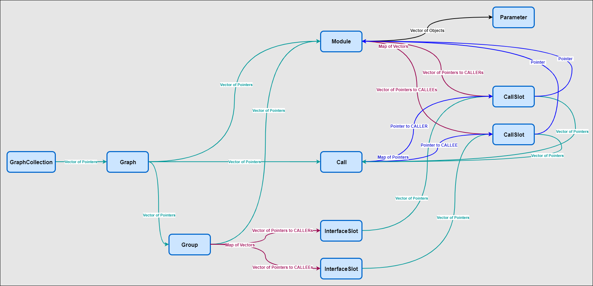

# MegaMol GUI Plugin

This is the plugin providing the GUI for MegaMol.

**!!! The following description ONLY refers to the use of the new MegaMol frontend provided via megamol.exe / megamol.sh !!!**

See bug and feature tracker [#539](https://github.com/UniStuttgart-VISUS/megamol/issues/539) for current work in progress.


---

## 1) Graphical User Interface (GUI)

The GUI of MegaMol is based on [Dear ImGui](https://github.com/ocornut/imgui).

**NOTE**
* Hotkeys use the key mapping of the US keyboard layout. Other keyboard layouts are currently not considerd or recognised. Consider possible transposed `z` and `y` which are used in `undo` and `redo` hotkeys on text input.
* Parameter values in the lua command `mmSetParamValue` must have the value enclosed in `[=[`and `]=]` delimiters. String delimiters `"` for parameter values are not supported any more.

### [1] Main Menu

The main menu provides the following options:
(Assigned hotkeys are given in brackets.)

* `File`
    * `Load Project` (`Ctrl + l`) Load project from file (lua).
    * `Save Project` (`Ctrl + s`) Save the current project to file (lua).
    * `Exit` (`Alt + F4`) End the program.
* `Windows` 
    * `Menu` (`F12`) Show/Hide the configurator window.
    * `All Parameters` (`F11`) Show/Hide the main window.
    * `Performance Metrics` (`F10`) Show/Hide the performance metrics window showing the fps or ms.
    * `Font Settings` (`F9`) Show/Hide the font settings window.    
    * `Transfer Function Editor` (`F8`)Show/Hide the transfer function editor.
    * `Configurator` (`F7`) Show/Hide the configurator window.
    * `Log Console` (`F6`) Show/Hide the log console window.  
    --
    * `Reset Size and Position` (`F4`) Reset size and position of windows to lie within current viewport.
* `Screenshot` 
    * `Select Filename` (`megamol_screenshot.png`) Open file dialog for choosing filename for screenshot. Current filename is shown in menu.
    * `Trigger` (`F2`) Trigger screenshot.
* `Render`  
    * `Toggle Main Views` (`F3`) Toggle between available main views. After toggling last main view intermediate state disables all mai views.
* `Settings`    
    * `Style` Select predefined GUI Style.
* `Help`
    * `About`: Some information and links concerning the currently running MegaMol.

### [2] Configurator

The configurator is part of the GUI and can be opened via the main menu: `Windows`/`Configurator`.  


#### Main Menu

* `File`
    * `New Project` 
    * `Load Project` 
        * `File` Load existing project from a file.
        * `Running` Load currently running project.
    * `Add Project` 
        * `File` Add existing project from a file to currently selected project.
        * `Running` Add currently running project to currently selected project.
    * `Save Project` (`Ctrl + Shift + s`) Save the project of the currently selected tab to file (lua).
* `View`
    * `Modules Sidebar`  Show/Hide sidebar with module stock list.
    * `Parameter Sidebar` Show/Hide sidebar with parameters of currently selected module.

#### *Module Stock List* Sidebar

* Search for Module (`Ctrl + Shift + m`)
* Add Module from Stock List to Graph
    * `Double Left Click` on Module in Stock List
    * `Right Click` on Module in Stock List - Context Menu: Add
    
#### *Module Parameters* Sidebar

* Search for Parameter (`Ctrl + Shift + p`)
        
#### Project Tab 

##### Menu Bar

* `Main View` Change main view state of currently selected view module.
* `Reset Scrolling` Reset scrolling.
* `Reset Zooming` Reset zooming.
* `Grid` Show/Hide grid.
* `Call Names`Show/Hide call names.
* `Module Names` Show/Hide module names and other decoration.
* `Slot Names` Show/Hide slot names.
* `Layout Graph` Simple layouting of project graph.

##### Graph

* Call Creation
    * Drag and Drop from Call Slot to other highlighted compatible Call Slot.
* Add Call Slot to existing Interface Slot
    * Drag and Drop from Call Slot to other highlighted compatible Interface Slot. 
* Spawn *Module Stock List* in pop-up window at mouse position.
    * `Ctrl + Shift + m`
    * `Double Left Click`    
* Sidebar Splitter Collapsing/Expansion
    * `Double Right Click` on Splitter
* Graph Zooming
    * `Mouse Wheel`
* Graph Scrolling
    * `Middle Mouse Button`
* Multiple Selection of Modules
    * Drag & Drop with `Left Mouse Button` (start outside of any module). Each module partially overlapped by the frame will be selected.
    * Hold `Shift` + `Left Click` on modules you additionally want to select/deselect to/from current selection.
* `Module`
    * Main View `Radio Button`: Toggle main view flag (only available for view modules).
    * Parameter `Arrow Button`: Show/Hide *Module Parameters* in small window sticked to module.
    * Context Menu (`Right Click`)
        * Delete (Alternative: Select with `Left Click` an press `Delete`)
        * Layout (Only available when multiple modules are selected)
        * Rename
        * Add to Group
            * New
            * *Select from list of existing groups*
        * Remove from Group
* `Call`
    * Context Menu (`Right Click`)
        * Delete (Alternative: Select with `Left Click` an press `Delete`)
* `Call Slot` 
    * `Double Left Click` Show *Module Stock List* in pop-up window.
    * Context Menu (`Right Click`)    
        * Create new Interface Slot
        * Remove from Interface Slot
* `Group`(-Header)
    * `Double Left Click` Toggle between expanded and collapsed view.
    * Context Menu (`Right Click`)
        * Collapse View / Expand View
        * Layout 
        * Rename      
        * Delete (Alternative: Select with `Left Click` an press `Delete`)

##### Module Groups

Modules can be bundled in groups. 
This allows a minimized (collapsed) view of large module groups inside the configurator. 
Grouped modules can be reused when stored separately. 
Module groups can be added to any other projects.
Module groups are stored in project files using the already available module namespace (which is currently unused in the core). 

##### Module Group Interface Slots

Call slots of modules, which are part of a group, can be added to the group interface. 
This generates new interface slot which allow outgoing calls. 
Interface slots are automatically generated if required.
Additionally call slots can be added to the groups interface via the context menu of the call slots.
Caller interaface slots (on the right side of a group) allow the bundling of more than one connection to the same callee slot of another module. 
Add a call slot to an existing interface slot via drag and drop (compatible call slots are highlighted if an interface slot is hoverd).
Callee interface slots (on the left side of a group) allow only one connected call slot.
Interface slots are stored in project files as part of the configurators state parameter.                       

---

## 2) Modules

Additonal modules provided by the GUI plugin:

### [1] GUIView

The GUIView module is deprecated. It was required for using the GUI with the former MegaMol frontend provided by mmconsole.exe / mmconsole.sh.

### [2] OverlayRenderer

The `OverlayRenderer` is a rendering module which implements a `megamol::core::view::RendererModule<megamol::core::view::CallRender3D_2>`. The `OverlayRenderer` provides overlay rendering like textures, text, parameter values and transport control icons. Prepend the `OverlayRenderer` module any other existing 3D renderer module you want to have an overlay for. 

#### Parameters

(The values in brackets indicate the default values.)

* `mode` (`Texture`): Overlay mode.
* `anchor` (`Left Top`): Anchor of overlay.
* `position_offset` (`0.0`): Custom relative position offset in respect to selected anchor.
* `texture::file_name` (` `): The file name of the texture.
* `texture::relative_width` (`25.0`): Relative screen space width of texture.
* `transport_ctrl::color` (`0.5f, 0.75f, 0.75f`): Color of transpctrl icons.
* `transport_ctrl::duration` (`3.0`): Duration transport ctrl icons are shown after value changes. Value of zero means showing transport ctrl icons permanently.
* `transport_ctrl::fast_speed` (`5.0`): Define factor of default speed for fast transport ctrl icon threshold.
* `transport_ctrl::value_scaling` (`10.0`): Define factor of default speed for ultra fast transport ctrl icon threshold.
* `transport_ctrl::speed_parameter_name` (` `): The full parameter name for the animation speed, e.g. *::Project_1::View3D_21::anim::speed*.
* `transport_ctrl::time_parameter_name` (` `): The full parameter name for the animation time, e.g. *::Project_1::View3D_21::anim::time*.
* `parameter::prefix` (` `): The parameter value prefix.
* `parameter::sufix` (` `): The parameter value sufix.
* `parameter::name` (` `): The full parameter name, e.g. *::Project_1::View3D_21::cam::position*. Supported parameter types: float, int, Vector2f/3f/4f.
* `label::text` (` `): The displayed text.
* `font::name` (`Roboto Sans`): The font name.
* `font::size` (`20.0`): The font size.
* `font::color` (`0.5f, 0.5f, 0.5f`): The font color.

---

## 3) Information for Developers

### [1] New Parameter Widgets

Parameter widgets can be defined for the `local` or the `global` scope. The widgets of the local scope are shown inside the parameter list in the `All Parameters` window. The global scope of a parameter widget can contain arbitrary ImGui code.
There are widgets for the basic parameter types defined in `gui/src/graph/Parameter.h`and there are group widgets bundling parameters of the same namespace in `gui/src/graph/ParameterGroups.h`. The parameters namespace is a prefix in the parameters, name delimited with `::`. The presentation of a parameter (group) can be changed by switching to `expert` mode in the `All Parameters` window an clicking on the 'circle button'.

#### How to add a new parameter widget

In order to add a new custom widget for a basic parameter type, the following steps are required:

* Add a new `Presentation` to `core/include/mmcore/param/AbstractParamPresentation.h` and add a human readable name to the `presentation_name_map` in the ctor.
* Add the new `Presentation` to the `compatible` presentation of a specific `ParamType` in `AbstractParamPresentation::InitPresentation()`.
* Add a new function implementing the new widget in `local` and/or `global` scope to the class `ParameterPresentation` of the pattern `widget_<NEW_WIDGET_NAME>(...)`.
    This function must return true if the parameters value has been modified!
* Register this new function in the parameter type map in `ParameterPresentation::present_parameter()` for the respective parameter type(s) - for details see existing code.

#### How to add a new parameter group widget

In order to add a new custom widget for a group of parameters sharing the same namespace within a module, the following steps are required:

* Add a new `ParamType` for new widget group in `core/include/mmcore/param/AbstractParamPresentation.h`.
* Add a new `Presentation` for new widget group in `core/include/mmcore/param/AbstractParamPresentation.h` and add a human readable name to the `presentation_name_map` in the ctor.
* Add a new case for the `ParamType`  in `AbstractParamPresentation::InitPresentation()` and add the new `Presentation` to its `compatible` presentation.
* Add a new function implementing the new group widget in `local` and/or `global` scope to the class `ParameterGroups`. The function must have the following signature:
    `void group_widget_<NEW_WIDGET_NAME>(ParamPtrVectorType& params, param::AbstractParamPresentation::Presentation presentation)`
* Add a new group widget data set of the type `GroupWidgetData` in the ctor and register above function as callback. 
* (WIP: Identification of parameter widget groups. Currently by name of namespace and number of parameter types of group.)

### [2] Default GUI State 

This is the default GUI state stored as JSON string in the lua project file:

```lua
-- <GUI_STATE_JSON>{"ConfiguratorState":{"module_list_sidebar_width":250.0,"show_module_list_sidebar":false},"GUIState":{"menu_visible":true,"style":2},"WindowConfigurations":{"All Parameters":{"font_name":"","log_force_open":true,"log_level":4294967295,"ms_max_history_count":20,"ms_mode":0,"ms_refresh_rate":2.0,"ms_show_options":false,"param_extended_mode":false,"param_module_filter":0,"param_modules_list":[],"param_show_hotkeys":false,"tfe_active_param":"","tfe_view_minimized":false,"tfe_view_vertical":false,"win_callback":1,"win_collapsed":false,"win_flags":8,"win_hotkey":[300,0],"win_position":[0.0,18.0],"win_reset_position":[0.0,0.0],"win_reset_size":[400.0,600.0],"win_show":true,"win_size":[400.0,600.0],"win_soft_reset":false},"Configurator":{"font_name":"","log_force_open":true,"log_level":4294967295,"ms_max_history_count":20,"ms_mode":0,"ms_refresh_rate":2.0,"ms_show_options":false,"param_extended_mode":false,"param_module_filter":0,"param_modules_list":[],"param_show_hotkeys":false,"tfe_active_param":"","tfe_view_minimized":false,"tfe_view_vertical":false,"win_callback":6,"win_collapsed":false,"win_flags":1032,"win_hotkey":[296,0],"win_position":[0.0,0.0],"win_reset_position":[0.0,0.0],"win_reset_size":[800.0,600.0],"win_show":false,"win_size":[800.0,600.0],"win_soft_reset":true},"Font Settings":{"font_name":"","log_force_open":true,"log_level":4294967295,"ms_max_history_count":20,"ms_mode":0,"ms_refresh_rate":2.0,"ms_show_options":false,"param_extended_mode":false,"param_module_filter":0,"param_modules_list":[],"param_show_hotkeys":false,"tfe_active_param":"","tfe_view_minimized":false,"tfe_view_vertical":false,"win_callback":4,"win_collapsed":false,"win_flags":64,"win_hotkey":[298,0],"win_position":[0.0,0.0],"win_reset_position":[0.0,0.0],"win_reset_size":[400.0,600.0],"win_show":false,"win_size":[400.0,600.0],"win_soft_reset":true},"Log Console":{"font_name":"","log_force_open":true,"log_level":4294967295,"ms_max_history_count":20,"ms_mode":0,"ms_refresh_rate":2.0,"ms_show_options":false,"param_extended_mode":false,"param_module_filter":0,"param_modules_list":[],"param_show_hotkeys":false,"tfe_active_param":"","tfe_view_minimized":false,"tfe_view_vertical":false,"win_callback":7,"win_collapsed":false,"win_flags":3072,"win_hotkey":[295,0],"win_position":[0.0,0.0],"win_reset_position":[0.0,0.0],"win_reset_size":[850.0,100.0],"win_show":false,"win_size":[850.0,100.0],"win_soft_reset":true},"Performance Metrics":{"font_name":"","log_force_open":true,"log_level":4294967295,"ms_max_history_count":20,"ms_mode":0,"ms_refresh_rate":2.0,"ms_show_options":false,"param_extended_mode":false,"param_module_filter":0,"param_modules_list":[],"param_show_hotkeys":false,"tfe_active_param":"","tfe_view_minimized":false,"tfe_view_vertical":false,"win_callback":3,"win_collapsed":false,"win_flags":65,"win_hotkey":[299,0],"win_position":[0.0,0.0],"win_reset_position":[0.0,0.0],"win_reset_size":[400.0,600.0],"win_show":false,"win_size":[400.0,600.0],"win_soft_reset":true},"Transfer Function Editor":{"font_name":"","log_force_open":true,"log_level":4294967295,"ms_max_history_count":20,"ms_mode":0,"ms_refresh_rate":2.0,"ms_show_options":false,"param_extended_mode":false,"param_module_filter":0,"param_modules_list":[],"param_show_hotkeys":false,"tfe_active_param":"","tfe_view_minimized":false,"tfe_view_vertical":false,"win_callback":5,"win_collapsed":false,"win_flags":64,"win_hotkey":[297,0],"win_position":[0.0,0.0],"win_reset_position":[0.0,0.0],"win_reset_size":[400.0,600.0],"win_show":false,"win_size":[400.0,600.0],"win_soft_reset":true}}}</GUI_STATE_JSON>
```

### [3] Graph Data Structure



### [4] Class Dependencies


