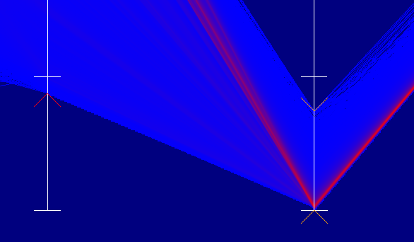

## Infovis
The Infovis plugin provides all kinds of Information Visualization modules, like charts, plots and diagrams. Currently there are still few modules available, so feel free to contribute!

Jump to [Modules](#modules), jump to [Calls](#calls)

## Build
This plugin is switched on by default. It depends on datatools.

---

## Modules

### DiagramSeries

Module that allows the selection of a specific column from a table. Multiple columns can be selected by cascading the module. No copy of the column is kept.

### FlagStorage

This module keeps flag data about some other data source. The idea is to have a synchronized array of uints that say something about the object at the same index in the actual data source. The currently selected flags are `ENABLED` (semantics can be defined by the using module), `FILTERED` (should not be visible or at least de-emphasized), `SELECTED` (the user actively selected it), and `SOFTSELECTED` (passive transitive selection, neighborhood selection, etc.).

### NGParallelCoordinatesRenderer2D

**NOTE:** This renderer **requires** the connection of a `FlagStorage` and a transfer function to work.

A `Renderer2DModule` based on the code written by Alex Panagiotidis. This renderer generates a parallel coordinate plot (PCP) from all columns contained in a `TableDataCall`. The renderer supports 3 modes:
* `DRAW_DISCRETE` for drawing a standard PCP
* `DRAW_CONTINUOUS` for drawing a blended PCP that accumulates the lines into a density, which can the be mapped to color via a connected `CallGetTransferFunction`. 
* `DRAW_HISTOGRAM` is currently *not working*.

The renderer allows interactive filtering per axis by `SHIFT`-dragging the small indicators on each axis. `ALT`-dragging allows re-ordering of the axes. Picking and stroking of the PCP is not completely ported from the old code and thus *not working*.

Additional parameters of interest:

| Parameter    | Default Value | Description                                                            |
|--------------|---------------|------------------------------------------------------------------------|
| sqrtDensity | `true`          | for `DRAW_CONTINUOUS`: map the square root of the density to color, set to `false` for linear mapping |
| drawSelectedItemsSlot      | `true`           | draw/hide selected items |
| drawOtherItemsSlot   | `true`    | draw/hide items that are not selected |

Example screenshot cutout using `DRAW_CONTINUOUS` with filter indicators (small 'hats' on axes):

---

## Calls

### DiagramSeriesCall

This call transports a function pointer that allows pushing a [DiagramSeries](#diagramseries) into a renderer (for example).

### FlagCall

This call should be used to connect any number of modules that need to agree on selection (realizing brushing and linking) to a [FlagStorage](#FlagStorage). The mechanism is currently simple: you can ask the connected Module for a pointer to the current flags (`FlagCall::CallForGetFlags`), or you can ask the Module to replace its storage with the one provided (`FlagCall::CallForsetFlags`). Shared pointers are used, so no explicit ownership of the data itself is required.
