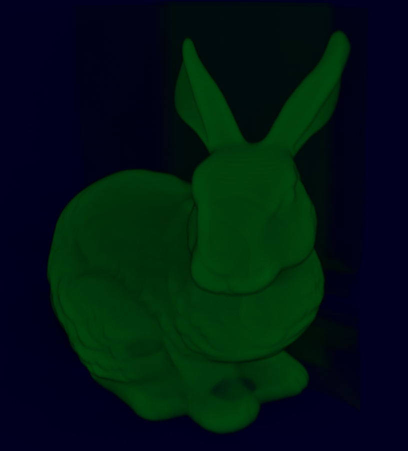

## mmstdvolume
The mmstdvolume plugin provides provides basic volume rendering functionality.

Jump to [Modules](#modules).

## Build
This plugin is switched on by default.

---

## Modules

### RaycastVolumeRenderer

A `Renderer3DModule` that implements a basic, but modern renderer for volume data. Rendering is split into two passes: A Compute Shader performs volume raycasting and writes the output to a 2D texture. The result is then rendered to the currently bound framebuffer (assuming the default output framebuffer to bound) using a screen-filling quad.

The renderer connects to datasources using the `VolumetricDataCall` and to a transfer function using the `CallGetTransferFunction`.

**NOTE:** This renderer **requires** the connection a transfer function to work properly.

The renderer provides the following parameters:

| Parameter    | Default Value | Description                                                            |
|--------------|---------------|------------------------------------------------------------------------|
| rayStepRatio | `1.0`          | Modifies the raycasting step size. Use values below 1.0 to oversample and values greater 1.0 to undersample the volume. |

Example screenshot using the bunny dat-raw volume dataset.

### VolumetricDatasource

