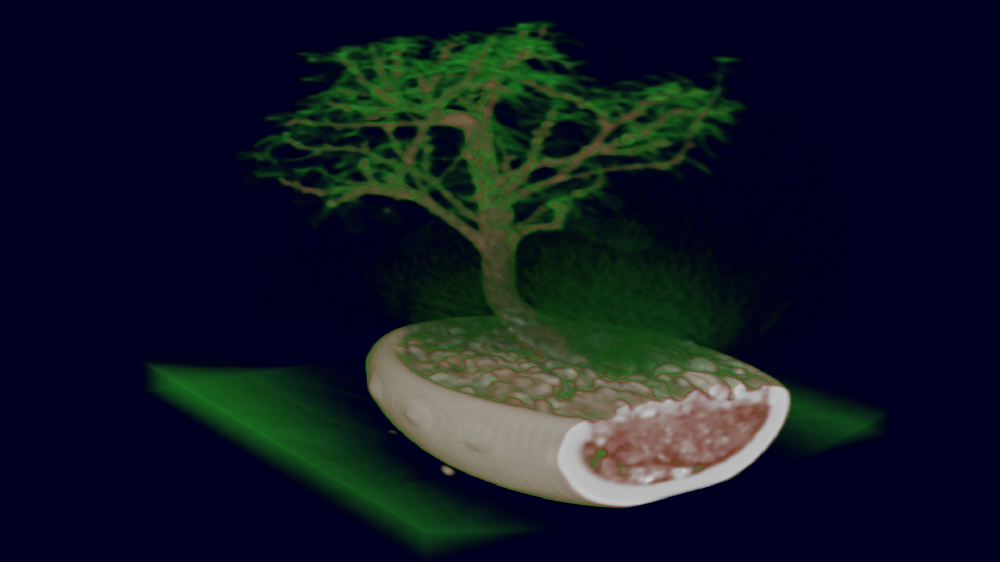
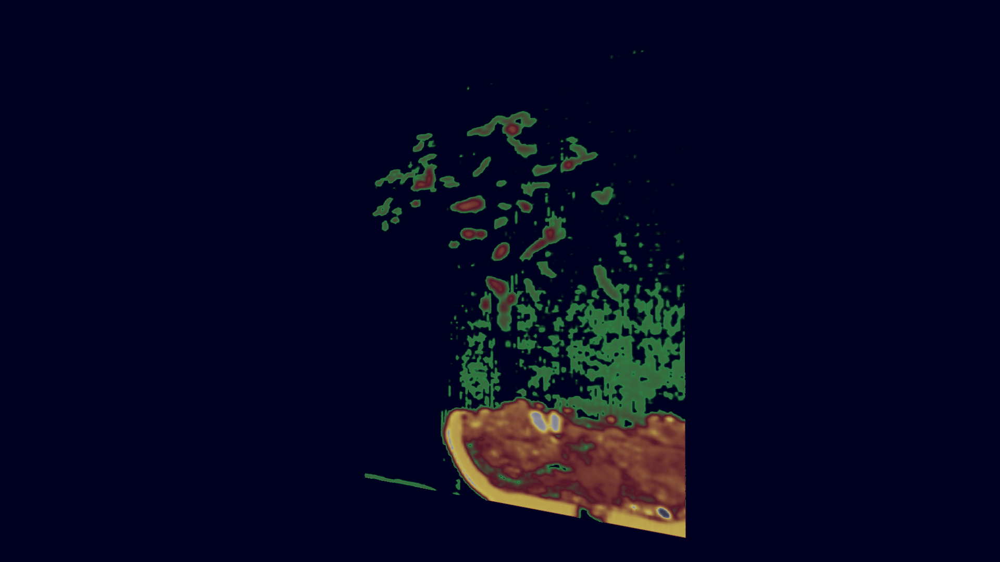
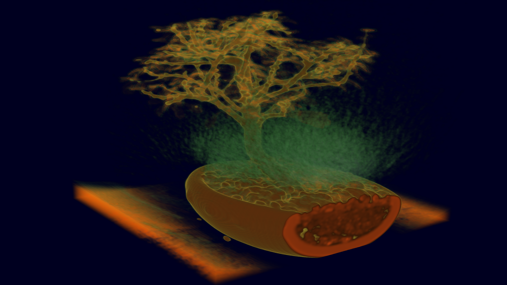

# Volume
This plugin provides basic volume rendering functionality.

 

## Build
This plugin is switched on by default.

## Modules

- [BuckyBall](#BuckyBall)
- [DatRawWriter](#DatRawWriter)
- [RaycastVolumeRenderer](#RaycastVolumeRenderer)
- [VolumeSliceRenderer](#VolumeSliceRenderer)
- [VolumetricDataSource](#VolumetricDataSource)

### BuckyBall

Small generator for an example volume dataset of an icosahedron nested inside a sphere.

The module provides the following output slots:

| Slot                | Type                      | Description                                                | Remark   |
|---------------------|---------------------------|------------------------------------------------------------|----------|
| getData             | `VolumetricDataCall`      | Provides the generated example data                        |          |

### DatRawWriter

Writer for dat-raw files, where the `.dat` file contains meta information and `.raw` contains the raw data.

The renderer provides the following input slots:

| Slot                | Type                      | Description                                                | Remark   |
|---------------------|---------------------------|------------------------------------------------------------|----------|
| data                | `VolumetricDataCall`      | Input data that should be written into files               |          |

The module provides the following output slots:

| Slot                | Type                      | Description                                                | Remark   |
|---------------------|---------------------------|------------------------------------------------------------|----------|
| control             | `DataWriterCtrlCall`      | Call for triggering the write process                      |          |

The module provides the following parameters:

| Parameter      | Default Value | Description                                                            |
|----------------|---------------|------------------------------------------------------------------------|
| filepathPrefix |               | Path to where the `.dat` and `.raw` file which should be stored, providing a filename without extension |
| frameID        | 0             | Set the frame ID for which the data should be requested and stored     |

### RaycastVolumeRenderer

A renderer module that implements a basic, but modern renderer for volume data. Rendering is split into two passes: A compute shader performs volume raycasting and writes the output into a 2D texture. The result is then rendered to the currently bound framebuffer using a screen-filling quad.

The renderer provides the following input slots:

| Slot                | Type                      | Description                                                | Remark   |
|---------------------|---------------------------|------------------------------------------------------------|----------|
| chainRendering      | `CallRender3D_2`          | Connection to another renderer for chaining                | optional |
| lights              | `CallLight`               | Light sources for the illumination of the scene            | ignored  |
| getData             | `VolumetricDataCall`      | Data source, providing a 3D volume                         |          |
| getTransferFunction | `CallGetTransferFunction` | Transfer function to map volume to color and transparency  |          |

The renderer provides the following output slots:

| Slot                | Type                      | Description                                                | Remark   |
|---------------------|---------------------------|------------------------------------------------------------|----------|
| rendering           | `CallRender3D_2`          | Connection to another renderer or a view                   |          |

The renderer provides the following parameters:

| Parameter      | Default Value | Description                                                            |
|----------------|---------------|------------------------------------------------------------------------|
| ray step ratio | `1.0`         | Modifies the raycasting step size. Use values below 1.0 to oversample and values greater 1.0 to undersample the volume |

Example screenshots for the bonsai dat-raw volume dataset using two different transfer functions:

 

### VolumeSliceRenderer

Renderer for visualizing a single slice from within the volume data.

The renderer provides the following input slots:

| Slot                | Type                      | Description                                                | Remark   |
|---------------------|---------------------------|------------------------------------------------------------|----------|
| chainRendering      | `CallRender3D_2`          | Connection to another renderer for chaining                | optional |
| lights              | `CallLight`               | Light sources for the illumination of the scene            | ignored  |
| getVol              | `VolumetricDataCall`      | Data source, providing a 3D volume                         |          |
| gettransferfunction | `CallGetTransferFunction` | Transfer function to map volume to color and transparency  |          |
| getclipplane        | `CallClipPlane`           | Clip plane for defining the slice                          |          |

The renderer provides the following output slots:

| Slot                | Type                      | Description                                                | Remark   |
|---------------------|---------------------------|------------------------------------------------------------|----------|
| rendering           | `CallRender3D_2`          | Connection to another renderer or a view                   |          |

Example screenshots for the bonsai dat-raw volume dataset:

### VolumetricDataSource

Reader for dat-raw files, where the `.dat` file contains meta information and `.raw` contains the raw data.

The module provides the following output slots:

| Slot                | Type                      | Description                                                | Remark   |
|---------------------|---------------------------|------------------------------------------------------------|----------|
| GetData             | `VolumetricDataCall`      | Provides the data read from file                           |          |

The module provides the following parameters:

| Parameter      | Default Value | Description                                                            |
|----------------|---------------|------------------------------------------------------------------------|
| AsyncSleep     | 0             | The time in milliseconds that the loader sleeps between two frames     |
| AsyncWait      | 0             | The time in milliseconds after that the loader wakes itself            |
| Buffers        | 2             | The number of buffers for loading frames asynchronously                |
| FileName       |               | Path to the input `.dat` file which should be read                     |
| LoadAsync      | False         | Start asynchronous loading of frames                                   |
| OutputDataSize | -1: Auto      | Forces the scalar type to the specified size                           |
| OutputDataType | -1: Auto      | Enforces the type of a scalar during loading                           |
