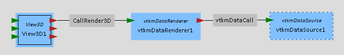

# mmvtkm
This plugin is used to render vtkm data using the vtkm libraries.

## Prerequisits
CMake:  
3.13.1 or above  
Generator: Visual Studio 15 2017 x64

VTKm Version: Release build 1.5.0  
MegaMol Version from 12.08.2019  
Visual Studio Version: Visual Studio Enterprise 2017 Version 15.9.10 or above  

## Build
TODO to run MegaMol with VTKm: 
* turn on the plugin in cmake
* build MegaMol in release mode
* comment out the line "this->DataFile->Stream >> std::ws;" (should be around line 788 in function ReadArray) in ..\vtkm-src\vtkm\io\reader\VTKDataSetReaderBase.h

## TODO
* solve issue with the line in VTKDataSetReaderBase.h
* duel CUDA

## Changelog
#### 23.01.2020
* adapted plugin to also work under linux

#### 01.10.2019
* adapted plugin to new camera

#### 31.08.2019
* fixed issues with inconsistent naming

#### 23.08.2019
* extended cmake to now clone and built vtkm as external project
* the plugin works and can render vtkm data (e.g. the example data grid.vtk provided by vtkm)

#### 09.08.2019
* created the vtkm plugin and removed modules/calls from core
* adapted CMakeList to include headers and libraries automatically
