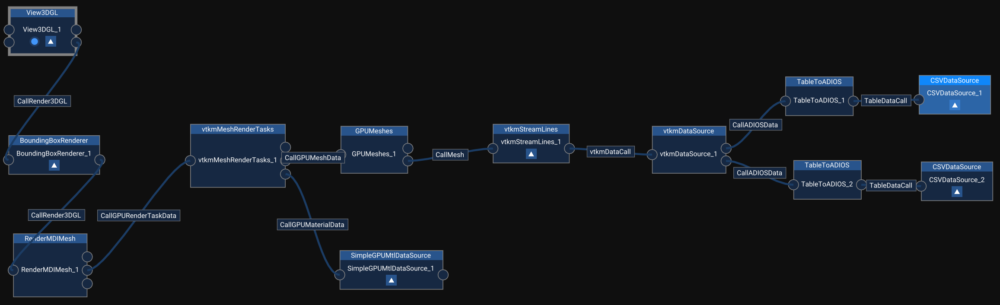
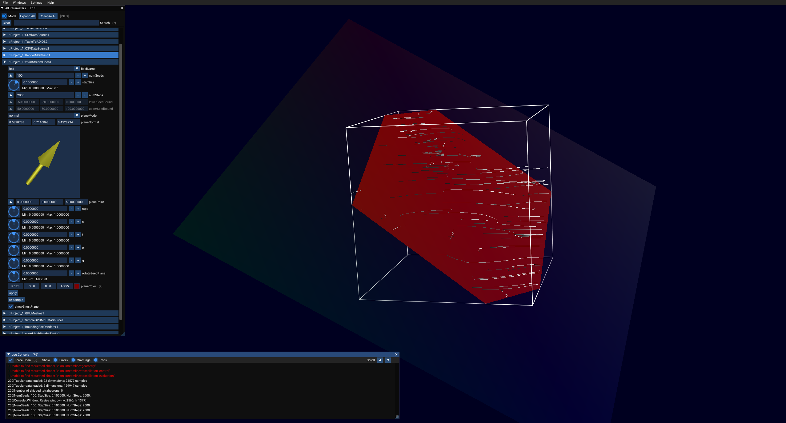

# mmvtkm
This plugin is primarily used to calculate streamlines, in the vtkmStreamLines module, in a vector field which is based on tetrahedron cells. Each tetrahedron of the vector field is built within the vtkmDataSource module after loading the nodes the tetrahedrons consist of. In the upper callslot of the vtkmDataSource, the nodes themselves are loaded, i. e. their labels, coordinates, etc. In the bottom callslot all the information about the tetrahedrons are loaded, i. e. the label of the tetrahedron and the four node labels that represent the tetrahedron. An example module graph can look like the this:

Caution:
The file that contains the data about the nodes (coordinates, hs-values, etc) has to be loaded into the CSVDataSource that is connected to the upper callslot.
The bottom slot is used for the node labels.

## Prerequisits
The build has been tested under:\
Ubuntu Version: Ubuntu 20.04.1 LTS 64-bit\
CMake: 3.16.3\
gcc 9.3.0\
\
Windows: Windows 10 Pro 64-bit \
Version: 10.0.19041 Build 19041 \
Microsoft Visual Studio Enterprise 2017 Version 15.9.22 \
CMake: 3.16.2

## Build
TODO to run MegaMol with VTKm: 
* turn on the adios, mesh, and vtkm plugin
* build MegaMol in release mode
* Only for the FileLoader: comment out the line "this->DataFile->Stream >> std::ws;" (should be around line 788 in function 'ReadArray') in ..\vtkm-src\vtkm\io\reader\VTKDataSetReaderBase.h

## Module Overview
The plugin includes four modules that are briefly described below:

| Module Name      | Funcionality |
| ---------------- | ------------ |
| vtkmDataSource   | This module is required for streamline calculation as it loads the necessary nodes which build the tetrahedrons used in the vector field and also the tetrahedron labels which are used to determine which four nodes represent a tetrahedron. |
| vtkmStreamLines  | Calculates a number of streamlines in a previously loaded vector field. The streamlines are spawned on an interactively changable seed plane. Both the streamlines and the seed plane can be adapted with the provided parameters during runtime. A list of available parameters is given below. |
| vtkmFileLoader   | A very simple module that just loads a single .vtk file and stores it into a vtkm dataset. |
| vtkmDataRenderer | Renders the contents of a vtkm dataset, which e. g. is previously loaded by the vtkmFileLoader. |

## Parameter Overview
Here is a quick overview of available parameters:

### vtkmStreamLines
| Parameter Name | Funcionality |
| -------------- | ------------ |
| fieldName      | Specifies the vector field which is used for the streamline calculation. |
| numSeeds       | Specifies the number of streamlines to be calculated. |
| stepSize       | Specifies the streamline integration stepsize. |
| numSteps       | Specifies the number of integration steps. |
| planeMode      | There a two modes: normal and parameter. Normal: The seed plane is represented by a plane point 'planePoint' and a plane normal 'planeNormal' which represents the orientation of the seed plane. The yellow arrow can be moved by the user. Parameter: The seed plane is represented by three points: an 'origin' and two connection points, 'Connection1' and 'Connection2'. The plane is then bounded by these three points and a fourth point that results from adding the vector '(Connection1 - Origin)' to Connection2. |
| planeColor     | Specifies the color of the seed plane. |
| planeAlpha     | Specifices the alpha value of the seed plane. |
| apply          | Needs to be pressed to enforce changes made on parameters. |
| re-sample      | Pressing this button results in re-sampling the current streamlines. |

\
When running the project, it first takes a bit of time to load all necessary data and calculating the streamlines. After successfully loading and calculating, a screen similar to the screenshot below should be shown (depending on the given data of course). 

## Known Issues
* Executing projects under ubuntu that use the vtkmFileLoader will fail with the following error: symbol lookup error: install/lib/libmmvtkm.mmplg: undefined symbol: _ZN4vtkm4cont5TimerC1Ev.

## Changelog
####
* restructured plugin into 4 modules
    * vtkmDataSource: used for building tetrahedron vector fields from a node and a label file
    * vtkmStreamLines: calculates streamlines in the vector field coming from the vtkmDataSource
    * vtkmFileLoader: loads a .vtk file's content into a vtkm DataSet
    * vtkmDataRenderer: renders the DataSet content loaded by the vtkmFileLoader
* reverted to vtkm version 1.4.0

#### 23.01.2020
* adapted plugin to also work under linux

#### 01.10.2019
* adapted plugin to new camera

#### 31.08.2019
* fixed issues with inconsistent naming

#### 23.08.2019
* extended cmake to now clone and built vtkm as external project
* the plugin works and can render vtkm data (e.g. the example data grid.vtk provided by vtkm)

#### 09.08.2019
* created the vtkm plugin and removed modules/calls from core
* adapted CMakeList to include headers and libraries automatically
