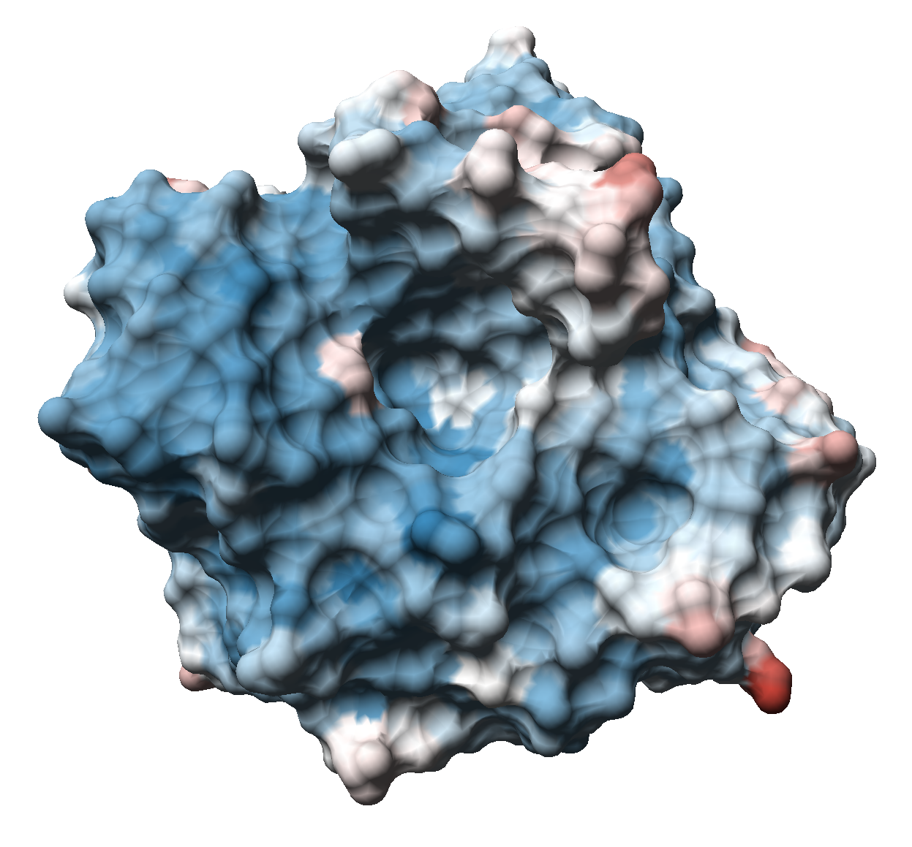

# MolecularMaps

The MolecularMaps plugin provides all modules necessary to produce the Molecular Surface Maps visualization for proteins. This method has been presented in the paper "Molecular Surface Maps" by Krone, Frieß et al. (https://ieeexplore.ieee.org/document/7539285). The idea is to take the surface of a protein, deform it to a sphere and then project the sphere's surface onto a map. An example result can be seen here:  

 

The implementation presented here does several things different than the original one described in the paper. For example, it uses a method of Lindow et al. (https://ieeexplore.ieee.org/document/6064966) to detect tunnels in the protein instead of a Reeb graph approach. This leads to more deterministic results but may fail for very short tunnels.

## General Layout

The typical module layout of the Molecular Surface Maps is shown in the following graph:

The BindingSiteDataSource is not mandatory but can be useful if the user wants to highlight the binding site of the visualized protein. The PDBLoader loads the data from a PDB file and passes it to the MSMSMeshLoader as well as to the MapGenerator. The MapGenerator uses the generated mesh of the MSMSMeshLoader and the input protein data to perform all necessary computations to the get to the map.

## Parameters

Relevant parameters for the use of the modules are:

### PDBLoader

| Name          | Description                |
| ------------- | -------------------------- |
| *pdbFilename* | Path to the input pdb file |

### MSMSMeshLoader

The final coloring of the map is determined in this module. All relevant coloring options are here.

| Name                    | Description                                                  |
| ----------------------- | ------------------------------------------------------------ |
| *color::coloringMode0*  | The first coloring mode                                      |
| *color::coloringMode1*  | The second coloring mode                                     |
| *color::colorWeighting* | Weighting factor to interpolate between the two coloring modes |
| *MSMS_probeRadius*      | The probe radius that is used to generate the surface mesh of the protein |

### BindingSiteDataSource

| Name          | Description                                                  |
| ------------- | ------------------------------------------------------------ |
| *pdbFilename* | Path to the input pdb file. This file should contain the SITE records of the file already loaded into the PDBLoader |

### MapGenerator

| Name                                | Description                                                  |
| :---------------------------------- | :----------------------------------------------------------- |
| *displayMode*                       | Switch between the display of different stages of the visualization |
| *geodesicLines*                     | Toggle for the display of tunnels on the map                 |
| *mirrorMap*                         | Mirrors the map, if necessary                                |
| *probeRadius*                       | The probe radius that is used to generate the surface mesh. This should be the same value as the *MSMS_probeRadius* parameter of the MSMSMeshLoader |
| *grid::toggle lat/lon lines*        | Turns the latidude and longitude lines on or off             |
| *screenshot::Filename for map(PNG)* | The path to the the file the final map image is stored to when the correct button is pressed |
| *screenshot::Store Map to PNG*      | Button parameter (only usable while running) that stores the map to a png image file |

## Build

This plugin depends on Protein_Calls and Geometry_Calls. The plugin is switched OFF by default.

###### Linux

Currently, this plugin is only tested under Windows, so it will not appear in any Linux CMake configuration. If you want to test it there, please modify the plugins CMakeLists.txt file accordingly.

###### Windows

This plugin currently depends on CUDA with version 8 or greater. You have to have CUDA installed on your system in order to make this plugin detectable by CMake. If you have an earlier CUDA version installed, CMake will notify you.
