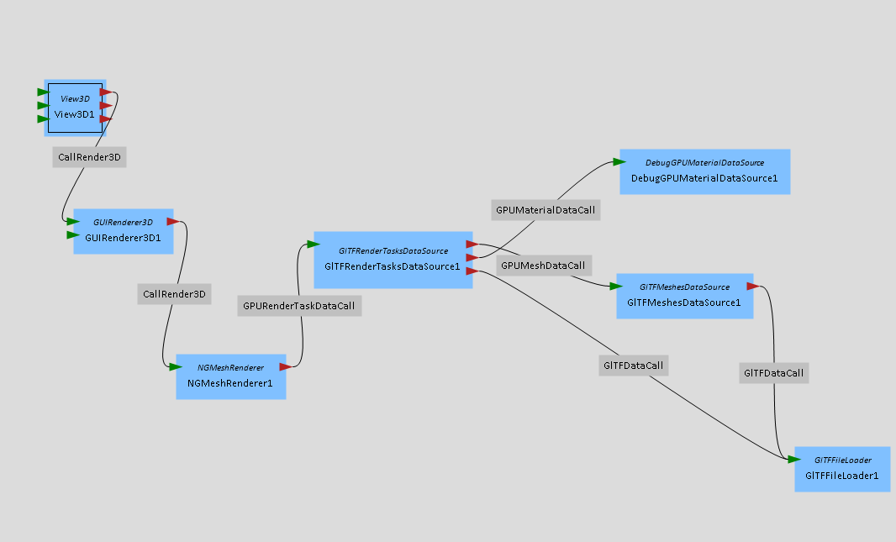

## ngmesh

The ngmesh plugin offers a set of modules and helper classes for modern (OpenGL 4.3+) rendering of mesh data.
At the moment, this plugin is designed for efficient rendering of mesh data and not for ellaborate mesh manipulations (or user comfort).
Modules and classes are designed with the single responsibility principle in mind. Therefore functionality might be split more aggressivly than in other MegaMol plugins.

Jump to [Modules](#modules).

## Build
To build the plugin, switch it on the in cmake.

---

---

## Modules

### NGMeshRenderer

A `Renderer3DModule` that is built around the `glMultiDrawElementsIndirect` draw call and thereby generalised to only executing the shader + resource binding and the draw call. All resources (shaders, meshes, metadata, draw commands) are supplied using the `GPURenderTaskDataCall` and are already uploaded to the GPU by that point.

**NOTE:** Always use this renderer. Don't modify or replace it. Instead write your own GPURenderTaskDataSource (see below) to meet any application specific needs during the data preperation phase.

### GPURenderTaskDataSource

The GPURenderTaskDataSource module is responsible for
If you want to use ng_mesh for a specific application, the GPURenderTaskDataSource is the module that you want to have your own variant of (which should inherit from `AbstractGPURenderTaskDataSource`).

Your GPURenderTaskDataSource should handle two jobs:
1. Gather all required resources and related metadata for rendering. This usually includes mesh data, shader programs and values used as uniform input or buffers by the shaders.
2. Identify all render task, generate draw commands and upload them to the GPU for rendering.

Render tasks are stored using the `GPURenderTaskDataStorage` class. A shared_ptr to an instance of that class is inhereted from `AbstractGPURenderTaskDataSource`.
The GPURenderTaskDataSource module is connected to the `NGMeshRenderer` via the `GPURenderTaskDataCall`. By default, it is also connected to a GPUMaterialDataSource with the `GPUMaterialDataCall` and a GPUMeshDataSource with the `GPUMeshDataCall`.

The `DebugGPURenderTaskDataSource` and `GltfGPURenderTaskDataSource` modules serve as examples for what a GPURenderTaskDataSource could look like.

### GPUMaterialDataSource

The GPUMaterialDataSource module is responsible for loading the shader progams and any additonal data used by the shaders, such as textures and SSBOs. Depending on the needs of your application, it is likely that you will want to have your own variant of this module (which should inherit from `AbstractGPUMaterialDataSource`).

Material data is stored using the `GPUMaterialDataStorage` class. A shared_ptr to an instance of that class is inhereted from `AbstractGPUMaterialDataSource`.
The GPUMaterialDataSource module is connected to a GPURenderTaskDataSource via the `GPUMaterialDataCall`.
In theory, this module could be simplified to handling only shader compiling and linking and GPU buffer upload, while the raw data is supplied via another call by a dedicated IO data loading module.

The `DebugGPUMaterialDataSource` module serves as an examples for what a GPUMaterialDataSource could look like.

### GPUMeshDataSource

The GPUMeshDataSource module is responsible for uploading mesh data to the GPU. Depending on the needs of your application (e.g. mesh file format), it is likely that you will want to have your own variant of this module (which should inherit from `AbstractGPUMeshDataSource`).

Mesh data is stored using the `GPUMeshDataStorage` class. A shared_ptr to an instance of that class is inhereted from `AbstractGPUMeshDataSource`.
The GPUMeshDataSource module is connected to a GPURenderTaskDataSource via the `GPUMeshDataCall`.
It is recommended that this modules only takes care of processing and uploading the mesh data and to handle data IO or generation in a dedicated module that is connected via a call (see gltf example above).

The `GltfGPUMeshesDataSource` module serves as an examples for what a GPUMeshDataSource could look like.

### GltfFileLoader

The GltfFileLoader modules serves as an example of how to load mesh files. Since information from a mesh or scene file is not only of interest to the GPUMeshDataSource module (e.g. the RenderTaskDataSource might need information about scene hierachy and transformations contained in a mesh/scene file), it is recommended to handle file IO in a dedicated module and to connect it to other modules via calls as necessary.

The `GltfFileLoader` is connected to `GltfGPUMeshesDataSource` and `GltfGPURenderTaskDataSource` via the `GltfDataCall`.

## Additional helper classes

### GPURenderTaskDataStorage

### GPUMaterialDataStorage

### GPUMeshDataStorage
