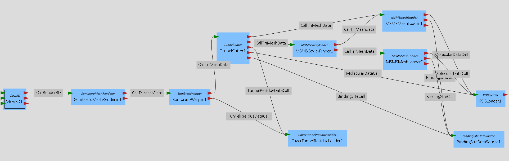

# Protein Plugin

The Protein plugin offers visualization and analysis capabilities for biomolecular data. Most of the methods are directly targeted towards proteins, but may work on DNA or other biomolecular data sets also. 

## Module Overview

This is a quick overview for the more relevant modules and for some special cases

### Data Loading

| Module Name           | Functionality                                                |
| --------------------- | ------------------------------------------------------------ |
| PDBLoader             | Most imporotant data loader of the whole plugin. Loads protein or DNA data stored in the pdb format. Is also capable to load the time series format of the GROMACS software (.xtc) alongside with the pdb data. Additionally it is able to calculate the secondary structure of loaded proteins for later use. |
| BindingSiteDataSource | Loads binding site data stored in the pdb format. Normally when using this loader, a PDBLoader is also needed to load the complete protein data |
| MSMSMeshLoader        | No "real" data loader. It uses incoming protein data to generate a mesh-based surface representation of a given protein. It uses the MSMS Software by Sanner et al. |
| GROLoader             | Loader for the standard GROMACS file format. Has essentially the same capabilities as the PDBLoader, but for .gro files. |

### Rendering

| Module Name                 | Functionality                                                |
| --------------------------- | ------------------------------------------------------------ |
| SimpleMoleculeRenderer      | Renderer able to depict classical protein and DNA representations. This includes the van der Waals surface, ball and stick representations, bond representations and some more. |
| MoleculeCartoonRenderer     | Renderer able to depict protein cartoon renderings in many different coloring modes. |
| CartoonTessellationRenderer | Less powerful but more modern renderer for cartoon renderings using a tessellation-based rendering method. |
| MoleculeSESRenderer         | Renderer able to depict the Solvent Excluded Surface of a biomolecule. |
| SequenceRenderer            | Renderer for the amino acid sequence of a protein.           |

### Data Processing

| Module Name       | Functionality                                                |
| ----------------- | ------------------------------------------------------------ |
| MSMSCavityFinder  | Uses the data of two MSMSMeshloaders to generate the mesh of the cavities of a given biomolecule. The first MSMSMeshLoader needs a small default radius (roughly 2 Angstrom) while the second one needs a big one (roughly 10 Angstroms). |
| MoleculeBallifier | Changes data from a MolecularDataCall to a MultiParticleDataCall. This allows the usage of many other modules of other plugins on protein data. |
| PDBWriter         | Writes preprocessed protein data onto disk using the Protein Data Bank file format. |
| ProteinAligner    | Aligns two given proteins by rotating and translating one of them onto the other. |

### Molecular Sombreros

The "Molecular Sombreros" method creates an abstract visualization of single protein tunnels. To do so it needs a variety of modules. To fully work, this method also needs the protein_cuda plugin.

The most relevant modules are: 

| Module Name              | Functionality                                                |
| ------------------------ | ------------------------------------------------------------ |
| CaverTunnelResidueLoader | Loads tunnel data that comes from the CAVER software. This data is given as spheres representing the tunnel and a list of atoms alongside the tunnel. |
| TunnelCutter             | Based on the loaded tunnel data and a given protein mesh, this cuts the given tunnel out of the mesh. This mesh will then later be warped into the sombrero shape. The "growSize" Parameter is important, as it determines the width of the sombrero brim. |
| SombreroWarper           | This module is not located in this plugin. Instead it resides in the protein_cuda plugin. It warps a given tunnel mesh into a sombrero shape. The user is able to select several radius variants as desired. It puts out two meshes, one for crown and one for the brim |
| SombreroMeshRenderer     | Renders a given sombrero mesh alongside with additional information such as crown and brim radius and a sweatband circle. It is also able to render normal triangular protein meshes as outputted by the MSMSMeshLoader. When connected to a FlagStorage that is connected to another SombreroMeshRenderer, the selection between these renderers can be synced, enabling a brushing and linking approach. |

A working module graph will look like this:

The PDBLoader loads the atom coordinates from the desired protein, the BindingSiteDataSource its relevant binding site. To use the sombreros properly you also need output data from the [CAVER software](https://www.caver.cz/), that used the given protein as input. These results have to be loaded by the CaverTunnelResidueLoader. The selection of the visualized tunnel happens in the CaverTunnelResidueLoader. The MSMSMeshLoaders then generate surface meshes out of the given protein data. The upper one with a smaller probe size (~2 Angstrom) and the lower one with a higher probe size (~10 Angstrom). The MSMSCavityFinder then extracts the cavities of the protein using these two meshes as input. After that, the TunnelCutter cuts the selected tunnel out of the mesh and adds parts of the protein surface to form the brim (So the "brimWidth" parameter should be larger than 0). Finally, the mesh is warped into a sombrero shape by the SombreroWarper. This mesh is rendererd by the SombreroMeshRenderer. Please find a working example of this visualization in the examples repository of MegaMol.

## Dependencies

### Internal

* trisoup_gl
* protein_calls
* geometry_calls

### External

* nanoflann
* chemfiles
